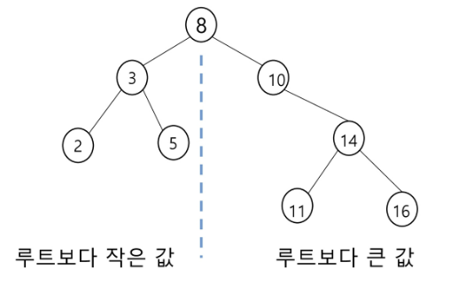

# 트리

## 트리

### 트리의 개념

- 비선형 구조

- 원소들 간에 1:n 관계를 가지는 자료구조

- 원소들 간에 계층관계를 가지는 계층형 자료구조

- 상위 원소에서 하위 원소로 내려가면서 확장되는 트리(나무) 모양의 구조

### 트리의 정의

- 한 개 이상의 노드로 이루어진 유한 집합이며 아래의 조건을 만족한다.
  
  - 노드 중 최상위 노드를 루트(root)라고 한다.
  
  - 나머지 노드들은 n(>=0)개의 분리 집합 T1, ..., Tn으로 분리될 수 있다.

- 이들 T1, ..., Tn은 각각 하나의 트리가 되며(재귀적 정의) 루트의 서브트리(subtree)라고 한다.

## 이진 트리

### 이진 트리

- 모든 노드들이 2개의 서브트리를 갖는 특별한 형태의 트리

- 각 노드가 자식 노드를 최대 2개까지만 가질 수 있는 트리
  
  - 왼쪽 자식 노드(left child node)
  
  - 오른쪽 자식 노드(right child node)

### 이진 트리 - 특성

- 레벨 i에서의 노드의 최대 개수는 2^i개

- 높이가 h인 이진 트리가 가질 수 있는 노드의 최소 개수는 (h+1)개가 되며, 최대 개수는 ((2^(h+1))-1)개

### 이진 트리 - 종류

- 포화 이진 트리(Full Binary Tree)
  
  - 모든 레벨에 노드가 포화상태로 차 있는 이진 트리
  
  - 높이가 h일 때, 최대의 노드 개수인 ((2^(h+1))-1)의 노드를 가진 이진 트리
  
  - 루트를 1번으로 하여 ((2^(h+1))-1)까지 정해진 위치에 대한 노드 번호를 가짐

- 완전 이진 트리(Complete Binary Tree)
  
  - 높이가 h이고 노드 수가 n개일 때(단, h+1 <= n <= (2^(h+1))-1), 포화 이진 트리의 노드 1번부터 n번까지 빈 자리가 없는 이진 트리

- 편향 이진 트리(Skewed Binary Tree)
  
  - 높이 h에 대한 최소 개수의 노드를 가지면서 한쪽 방향의 자식 노드만을 가진 이진 트리
  
  - 왼쪽 편향 이진 트리
  
  - 오른쪽 편향 이진 트리

### 이진 트리 - 순회(traversal)

- 순회(traversal): 트리의 노드를 체계적으로 방문하는 것
  
  - 트리는 비선형구조이기 때문에 선형구조에서와 같이 선후 연결 관계를 알 수 없음에 유의

- 기본적인 순회방법 3가지
  
  - 전위순회(preorder traversal): VLR
    
    - 부모노드 방문 후, 자식노드를 좌우 순서로 방문
  
  - 중위순회(inorder traversal): LVR
    
    - 왼쪽 자식노드, 부모노드, 오른쪽 자식노드 순으로 방문
  
  - 후위순회(postorder traversal): LRV
    
    - 자식노드를 좌우 순서로 방문한 후, 부모노드로 방문

- 전위순회
  
  - 수행 방법
    
    1) 현재 노드 n을 방문하여 처리
    
    2) 현재 노드 n의 왼쪽 서브트리로 이동
    
    3) 현재 노드 n의 오른쪽 서브트리로 이동
    
    ```python
    def preorder(n):        # 전위순회
        if n:
            print(n)        # visit(n)
            preorder(ch1[n])
            preorder(ch2[n])
    ```

- 중위순회
  
  - 수행 방법
    
    1. 현재 노드 n의 왼쪽 서브트리로 이동
    
    2. 현재 노드 n을 방문하여 처리
    
    3. 현재 노드 n의 오른쪽 서브트리로 이동
    
    ```python
    def inorder(n):         # 중위순회
        if n:
            inorder(ch1[n])
            print(n)        # visit(n)
            inorder(ch2[n])
    ```

- 후위순회
  
  - 수행 방법
    
    1. 현재 노드 n의 왼쪽 서브트리로 이동
    
    2. 현재 노드 n의 오른쪽 서브트리로 이동
    
    3. 현재 노드 n을 방문하여 처리
    
    ```python
    def postorder(n):       # 후위순회
        if n:
            postorder(ch1[n])
            postorder(ch2[n])
            print(n)        # visit(n)
    ```

- 전체 식 표시
  
  ```python
  # root 찾기
  def find_root(V):
      for i in range(1, V+1):
          if par[i] == 0: # 부모가 없으면 root
              return i
  
  E = int(input())
  arr = list(map(int, input().split()))
  V = E + 1
  # 부모를 인덱스로 자식 번호 저장
  ch1 = [0] * (V + 1)
  ch2 = [0] * (V + 1)
  # 자식을 인덱스로 부모 번호 저장
  par = [0] * (V + 1)
  for i in range(E):
      p, c = arr[i*2], arr[i*2+1]
      if ch1[p] == 0:     # 아직 자식이 없으면
          ch1[p] = c      # 자식1로 저장
      else:
          ch2[p] = c
      par[c] = p
  
  root = find_root(V)
  preorder(root)
  inorder(root)
  postorder(root)
  ```

### 이진 트리의 표현


### 이진 트리의 표현 - 배열

- 노드 번호의 성질
  
  - 노드 번호가 i인 노드의 부모 노드 번호: (i/2)의 정수 부분
  
  - 노드 번호가 i인 노드의 왼쪽 자식 노드 번호: 2*i
  
  - 노드 번호가 i인 노드의 오른쪽 자식 노드 번호: 2*i + 1
  
  - 레벨 n의 노드 번호 시작 번호: 2^n

- 배열을 이용한 이진 트리의 표현
  
  - 노드 번호를 배열의 인덱스로 사용
  
  - 높이가 h인 이진 트리를 위한 배열의 크기: (2^(h+1)) - 1
  
  - 편향 이진 트리의 경우
    
    

- 배열을 이용한 이진 트리 표현의 단점
  
  - 편향 이진 트리의 경우에 사용하지 않는 배열 원소에 대한 메모리 공간 낭비 발생
  
  - 트리의 중간에 새로운 노드를 삽입하거나 기존의 노드를 삭제할 경우 배열의 크기 변경이 어려워 비효율적

### 이진 트리의 저장

- 부모 번호를 인덱스로 자식 번호를 저장
  
  ```python
  ch1 = [0] * (V + 1)
  ch2 = [0] * (V + 1)
  for i in range(E):
      p, c = arr[i*2], arr[i*2+1]
      if ch1[p] == 0:     # 아직 자식이 없으면
          ch1[p] = c      # 자식1로 저장
      else:
          ch2[p] = c
  ```

- 자식 번호를 인덱스로 부모 번호를 저장
  
  ```python
  par = [0] * (V + 1)
  for i in range(E):
      p, c = arr[i*2], arr[i*2+1]
      par[c] = p
  ```

- 루트 찾기, 조상 찾기
  
  ```python
  def find_root(V):
      for i in range(1, V+1):
          if par[i] == 0: # 부모가 없으면 root
              return i
  ```

## 이진탐색 트리

### 이진 탐색 트리

- 탐색작업을 효율적으로 하기 위한 자료 구조

- 모든 원소는 서로 다른 유일한 키를 가짐

- key(왼쪽 서브트리) < key(루트 노드) < key(오른쪽 서브트리)

- 왼쪽 서브트리와 오른쪽 서브트리도 이진 탐색 트리

- 중위 순회하면 오름차순으로 정렬된 값을 얻을 수 있음



### 이진 탐색 트리 - 연산

- 탐색 연산
  
  - 루트에서 시작
  
  - 탐색할 키 값 x를 루트 노드의 키 값과 비교
    
    - (키 값 x = 루트노드의 키 값)인 경우 : 원하는 원소를 찾았으므로 탐색 연산 성공
    
    - (키 값 x < 루트노드의 키 값)인 경우 : 루트노드의 왼쪽 서브트리에 대해서 탐색 연산 수행
    
    - (키 값 x > 루트노드의 키 값)인 경우 : 루트노드의 오른쪽 서브트리에 대해서 탐색 연산 수행
  
  - 서브트리에 대해서 순환적으로 탐색 연산을 반복

- 삽입 연산
  
  - 먼저 탐색 연산을 수행
    
    - 삽입할 원소와 같은 원소가 트리에 있으면 삽입할 수 없으므로, 같은 원소가 트리에 있는지 탐색하여 확인
    
    - 탐색에서 탐색 실패가 결정되는 위치가 삽입 위치
  
  - 탐색 실패한 위치에 원소를 삽입

- 삭제 연산
  
  - 자식 노드가 없는 경우: 그냥 삭제
  
  - 자식 노드가 하나인 경우: 부모 노드와 자식 노드를 연결시킨 후 삭제
  
  - 자식 노드가 둘인 경우: 왼쪽 서브트리에서 제일 큰 값을 찾아 그 값으로 대체 후 기존 위치를 삭제

### 이진 탐색 트리 - 성능

- 탐색(searching), 삽입(insertion), 삭제(deletion) 시간은 트리의 높이만큼 시간이 걸림
  
  - O(h), h는 BST(Binary Search Tree)의 깊이(height)

- 평균의 경우
  
  - 이진 트리가 균형적으로 생성되어 있는 경우
  
  - O(log n)

- 최악의 경우
  
  - 한쪽으로 치우친 경사 이진트리의 경우
  
  - O(n)
  
  - 순차탐색과 시간복잡도가 같음

- 검색 알고리즘의 비교
  
  - 배열에서의 순차 검색: O(N)
  
  - 정렬된 배열에서의 순차 검색: O(N)
  
  - 정렬된 배열에서의 이진 탐색: O(log N)
    
    - 고정 배열 크기와 삽입, 삭제 시 추가 연산 필요
  
  - 이진 탐색 트리에서의 평균: O(log N)
    
    - 최악의 경우: O(N)
    
    - 완전 이진 트리 또는 균형 트리로 바꿀 수 있다면 최악의 경우를 없앨 수 있음
      
      - 새로운 원소를 삽입할 때 삽입 시간을 줄임
      
      - 평균과 최악의 시간이 긺: O(log N)

## 힙(heap)

### 힙(heap)

- **완전 이진 트리**에 있는 노드 중에서 키 값이 가장 큰 노드나 키 값이 가장 작은 노드를 찾기 위해서 만든 자료구조

- 최대 힙(max heap)
  
  - 키 값이 가장 큰 노드를 찾기 위한 완전 이진 트리
  
  - 부모노드의 키 값 > 자식노드의 키 값
  
  - 루트 노드: 키 값이 가장 큰 노드

- 최소 힙(min heap)
  
  - 키 값이 가장 작은 노드를 찾기 위한 완전 이진 트리
  
  - 부모노드의 키 값 < 자식노드의 키 값
  
  - 루트 노드: 키 값이 가장 작은 노드

### 힙 연산 - 삽입

- 완전 이진 트리를 유지한 상태로 삽입할 자리 확장

- 확장한 자리에 삽입할 원소 저장

- 최대 힙
  
  - (부모노드의 키 값 < 자식노드의 키 값)인 경우
  
  - 부모노드와 자식노드의 자리바꾸기
  
  - 부모노드가 없거나 조건을 만족할 때까지 위의 과정을 반복
    
    ```python
    def enq(n):
        global last
        last += 1       # 마지막 정점 추가
        heap[last] = n  # 마지막 정점에 key 추가
        # 부모가 있고, 부모 < 자식인 경우 자리 교환
        c = last
        p = c // 2      # 완전 이진 트리에서 부모 정점 번호
        while p and heap[p] < heap[c]:
            heap[p], heap[c] = heap[c], heap[p]
            c = p
            p = c // 2
    
    heap = [0] * 100
    last = 0            # 아직 한 개도 들어와있지 않은 상태
    ```

- 최소 힙
  
  - (부모노드의 키 값 > 자식노드의 키 값)인 경우
  
  - 부모노드와 자식노드의 자리바꾸기
  
  - 부모가 없거나 조건을 만족할 때까지 위의 과정을 반복
    
    ```python
    def enq(n):
        global last
        last += 1       # 마지막 정점 추가
        heap[last] = n  # 마지막 정점에 key 추가
        # 부모가 있고, 부모 < 자식인 경우 자리 교환
        c = last
        p = c // 2      # 완전 이진 트리에서 부모 정점 번호
        while p and heap[p] > heap[c]:
            heap[p], heap[c] = heap[c], heap[p]
            c = p
            p = c // 2
    
    heap = [0] * 100
    last = 0            # 아직 한 개도 들어와있지 않은 상태
    ```

### 힙 연산 - 삭제

- 힙에서는 루트 노드의 원소만을 삭제할 수 있음

- 루트 노드의 원소를 삭제하여 반환

- 힙의 종류에 따라 최대값 또는 최소값을 구할 수 있음

- 루트 노드의 원소 삭제

- 마지막 노드를 루트 노드 위치로 옮긴 후 삭제

- 최대 힙
  
  - 자식노드가 존재하고 (부모노드의 키 값 < 자식노드의 키 값)인 경우
  
  - 부모노드와 자식노드의 자리바꾸기
  
  - 자식노드가 없거나 조건을 만족할 때까지 위의 과정을 반복
    
    ```python
    def deq():
        global last
        tmp = heap[1]           # 루트 백업
        heap[1] = heap[last]    # 삭제할 노드의 키를 루트에 복사
        last -= 1               # 마지막 노드 삭제
        p = 1                   # 루트에 옮긴 값을 자식과 비교
        c = p * 2               # 왼쪽 자식
        while c <= last:        # 자식이 하나라도 있으면
            # 오른쪽 자식도 있고, 오른쪽 자식이 더 크면
            if c + 1 <= last and heap[c] < heap[c + 1]:
                c += 1          # 비교 대상을 오른쪽 자식으로 정함
            if heap[p] < heap[c]:   # 자식이 더 크면 최대힙 규칙에 어긋나므로
                heap[p], heap[c] = heap[c], heap[p]
                p = c           # 자식을 새로운 부모로
                c = p * 2       # 왼쪽 자식 번호를 계산
            else:               # 부모가 더 크면
                break           # 비교 중단
        return tmp
    
    heap = [0] * 100
    last = 0                    # 아직 한 개도 들어와있지 않은 상태
    ```

- 최소 힙
  
  - 자식노드가 존재하고 (부모노드의 키 값 > 자식노드의 키 값)인 경우
  
  - 부모노드와 자식노드의 자리바꾸기
  
  - 자식노드가 없거나 조건을 만족할 때까지 위의 과정을 반복
    
    ```python
    def deq():
        global last
        tmp = heap[1]           # 루트 백업
        heap[1] = heap[last]    # 삭제할 노드의 키를 루트에 복사
        last -= 1               # 마지막 노드 삭제
        p = 1                   # 루트에 옮긴 값을 자식과 비교
        c = p * 2               # 왼쪽 자식
        while c <= last:        # 자식이 하나라도 있으면
            # 오른쪽 자식도 있고, 오른쪽 자식이 더 크면
            if c + 1 <= last and heap[c] > heap[c + 1]:
                c += 1          # 비교 대상을 오른쪽 자식으로 정함
            if heap[p] < heap[c]:   # 자식이 더 크면 최대힙 규칙에 어긋나므로
                heap[p], heap[c] = heap[c], heap[p]
                p = c           # 자식을 새로운 부모로
                c = p * 2       # 왼쪽 자식 번호를 계산
            else:               # 부모가 더 크면
                break           # 비교 중단
        return tmp
    
    heap = [0] * 100
    last = 0                    # 아직 한 개도 들어와있지 않은 상태
    ```
