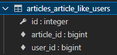
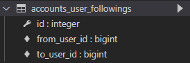

# 데이터베이스 관계

## 다대일 관계

### 다대일 관계

- 관계(Relationship)
  
  - 테이블 간의 상호작용을 기반으로 설정되는 여러 테이블 간의 논리적인 연결

- RDB에서의 관계
  
  - 1 : 1
    
    - One-to-one relationships
    
    - 한 테이블의 레코드 하나가 다른 테이블의 레코드 단 한 개와 관련된 경우
  
  - N : 1
    
    - Many-to-one-relationships
    
    - 한 테이블의 0개 이상의 레코드가 다른 테이블의 레코드 한 개와 관련된 경우
    
    - 기준 테이블에 따라(1:N, One-to-many relationships)라고도 함
  
  - M : N
    
    - Many-to-many relationships
    
    - 한 테이블의 0개 이상의 레코드가 다른 테이블의 0개 이상의 레코드와 관련된 경우
    
    - 양쪽 모두에서 N : 1 관계를 가짐

### Foreign Key

- 개념
  
  - 외래 키(외부 키)
  
  - 관계형 데이터베이스에서 한 테이블의 필드 중 다른 테이블의 행을 식별할 수 있는 키
  
  - 참조하는 테이블에서 1개의 키에 해당하고 이는 참조되는 테이블의 기본 키를 가리킴
  
  - 참조하는 테이블의 행 1개의 값은 참조되는 테이블의 행 값에 대응
    
    - 따라서 참조하는 테이블의 행에는 참조되는 테이블에 나타나지 않는 값을 포함할 수 없음
  
  - 참조하는 테이블 행 여러 개가 참조되는 테이블의 동일한 행을 참조할 수 있음

- 특징
  
  - 키를 사용하여 부모 테이블의 유일한 값을 참조
  
  - 외래 키의 값이 반드시 부모 테이블의 기본 키일 필요는 없지만 유일한 값이어야 함

- 참조 무결성
  
  - 데이터베이스 관계 모델에서 관련된 2개의 테이블 간의 일관성을 의미
  
  - 외래 키가 선언된 테이블의 외래 키 속성(열)의 값은 그 테이블의 부모가 되는 테이블의 기본 키 값으로 존재해야 함

---

## N : 1 (Comment - Article)

- Comment 모델과 Article 모델 간 관계 설정

- 0개 이상의 댓글은 1개의 게시글에 작성될 수 있음

### 모델 관계 설정

- Article의 id를 Comment의 외래 키로 설정

### Django Relationship fields

- OneToOneField()
  
  - A one-to-one relationship

- ForeignKey()
  
  - A many-to-one relationship
  
  - `ForeignKey(to, on_delete, **options)`
    
    - A many-to-one relationship을 담당하는 Django의 모델 필드 클래스
    
    - Django 모델에서 관계형 데이터베이스의 외래 키 속성을 담당

- ManyToManyField()
  
  - A many-to-many relationship

### Comment Model

- Comment 모델 정의
  
  ```python
  # articles/models.py
  
  class Comment(models.Model):
      article = models.ForeignKey(Article, on_delete=models.CASCADE)
      content = models.TextField()
      created_at = models.DateTimeField(auto_now_add=True)
      updated_at = models.DateTimeField(auto_now=True)
  
      def __str__(self):
          return self.content
  ```
  
  - 외래 키 필드는 ForeignKey 클래스를 작성하는 위치와 관계없이 필드의 마지막에 작성됨
  
  - ForeignKey() 클래스의 인스턴스 이름은 참조하는 모델 클래스 이름의 단수형(소문자)으로 작성하는 것을 권장

- ForeignKey arguments - `on_delete`
  
  - 외래 키가 참조하는 객체가 사라졌을 때, 외래 키를 가진 객체를 어떻게 처리할지를 정의
  
  - 데이터 무결성을 위해서 매우 중요한 설정
  
  - on_delete 옵션 값
    
    - CASCADE: 부모 객체가 삭제됐을 때 이를 참조하는 객체도 삭제
    
    - PROTECT, SET_NULL, SET_DEFAULT 등 여러 옵션 값이 존재

- 데이터 무결성
  
  - 데이터의 정확성과 일관성을 유지하고 보증하는 것
  
  - 데이터베이스나 RDBMS의 중요한 기능

- 댓글 생성해보기(shell_plus 실행해서 생성)
  
  - shell_plus 실행
    
    ```
    $ python manage.py shell_plus
    ```
  
  - 댓글 생성
    
    ```shell
    # Comment 클래스의 인스턴스 comment 생성
    comment = Comment()
    
    # 인스턴스 변수 저장
    comment.content = 'first comment'
    
    # DB에 댓글 저장
    comment.save()
    # 위에서 모델을 정의할 때 ForeignKey를 받아와야하는데 값이 없기 때문에 에러남 -> article 생성 후 다시 저장해야 함
    
    # article 생성
    article = Article.objects.create(title='title', content='content')
    
    # ForeignKey 데이터 입력
    comment.article = article
    
    # DB에 댓글 저장 및 확인
    comment.save()
    comment
    ```
  
  - 댓글 속성 값 확인
    
    ```shell
    comment.pk
    comment.content
    comment.article
    comment.article_id  # article_pk는 존재하지 않기 때문에 사용 불가
    comment.article.pk
    comment.article.content
    ```
  
  - 처음부터 에러나지 않게 댓글 생성하기
    
    ```shell
    # article을 함께 입력
    comment = Comment(content='second comment', article=article)
    comment.save()
    ```

### 관계 모델 참조

- **역참조**
  
  - 나를 참조하는(나를 외래 키로 지정한) 테이블을 참조하는 것
  
  - 본인을 외래 키로 참조 중인 다른 테이블에 접근하는 것
  
  - N : 1 관계에서는 1이 N을 참조하는 상황
    
    - 즉, 외래 키를 가지지 않은 1이 외래 키를 가진 N을 참조
  
  ```python
  article.comment_set.method()
  
  # article을 받아온 id의 게시글에 작성된 모든 댓글 조회하기(역참조)
  article.comment_set.all()
  ```
  
  - Article 모델이 Comment 모델을 참조(역참조)할 때 사용하는 매니저
  - article.comment 형식으로는 댓글 객체를 참조할 수 없음
  - Django에서는 comment_set manager를 자동으로 생성해 article.comment_set 형태로 댓글 객체를 참조할 수 있음

- ForeignKey arguments - `related_name`
  
  ```python
  # articles/models.py
  
  class Comment(models.Model):
      article = models.ForeignKey(Article, on_delete=models.CASCADE, related_name='comments')
  ```
  
  - ForeignKey 클래스의 선택 옵션
  
  - 역참조 시 사용하는 매니저 이름(model_set manager)을 변경할 수 있음
  
  - related_name 옵션을 이용하면 기존의 comment_set은 더 이상 사용할 수 없게 되며 위의 코드의 경우 article.comments로 대체됨

### Comment 구현

- `Create`, `Read`, `Delete`

- CREATE
  
  - 사용자로부터 댓글 데이터를 입력 받기 위한 CommentForm 작성
    
    ```python
    # articles/forms.py
    
    from .models import Article, Comment
    
    class CommentForm(forms.ModelForm):
    
        class Meta:
            model = Comment
            # article은 실제 출력화면에서 제외하는 것이 좋음
            # fields = '__all__'
            exclude = ('article',)
    ```
  
  - detail 페이지에서 CommentForm 출력
    
    ```python
    # articles/views.py
    
    from .forms import ArticleForm, CommentForm
    
    def detail(request, pk):
        article = Article.objects.get(pk=pk)
        comment_form = CommentForm()
        context = {
            'article': article,
            'comment_form': comment_form,
        }
        return render(request, 'articles/detail.html', context)
    ```
    
    ```html
    <!-- articles/detail.html -->
    
    
    
    
      ...
      <a href="">뒤로가기</a>
      <hr>
      <form action="#" method="POST">
        
        {{ comment_form }}
        <input type="submit">
      </form>
    
    ```
  
  - CommentForm에서 제외된 외래 키 데이터 받아올 댓글 페이지 생성
    
    - 외래 키 필드는 사용자의 입력으로 받는 것이 아니라 view 함수 내에서 받아 별도로 처리하여 저장
      
      ```python
      # articles/urls.py
      
      urlpatterns = [
          ...,
          path('<int:pk>/comments/', views.comments_create, name='comments_create'),
      ]
      
      # ----------------------------------------------
      
      # articles/views.py
      
      def comments_create(request, pk):
          article = Article.objects.get(pk=pk)
          comment_form = CommentForm(request.POST)
          if comment_form.is_valid():
              # article 객체저장할 타이밍 필요
              # 데이터베이스에 저장하지 않은 상태로 인스턴스를 반환
              comment = comment_form.save(commit=False)
              comment.article = article
              comment.save()
          return redirect('articles:detail', article.pk)
      ```
      
      - save() method
        
        - `save(commit=False)`
          
          - 아직 데이터베이스에 저장되지 않은 인스턴스를 반환
          
          - 저장하기 전 객체에 대한 사용자 지정 처리를 수행할 때 사용
      
      ```html
      <!-- articles/detail.html -->
      
      <form action="" method="POST">
        
        {{ comment_form }}
        <input type="submit">
      </form>
      ```

- READ
  
  - 작성한 댓글 목록 출력
    
    - 특정 article에 있는 모든 댓글을 가져온 후 context에 추가
    
    ```python
    # articles/views.py
    
    from .models import Article
    from .forms import ArticleForm, CommentForm
    
    def detail(request, pk):
        article = Article.objects.get(pk=pk)
        comment_form = CommentForm
        # 역참조
        comments = article.comment_set.all()
        context = {
            'article': article,
            'comment_form': comment_form,
            'comments': comments,
        }
        return render(request, 'articles/detail.html', context)
    ```
    
    - detail 템플릿에서 댓글 목록 출력
    
    ```html
    <!-- articles/detail.html -->
    
    
    
    
      ...
      <a href="">뒤로가기</a>
      <hr>
      <h4>댓글 목록</h4>
      <ul>
        
          <li>{{ comment.content }}</li>
        
      </ul>
      <hr>
      ...
    
    ```

- DELETE
  
  - 첫번째 방법
    
    - article_pk를 comment.article.pk로 받아오는 방법
    
    ```python
    # articles/urls.py
    
    urlpatterns = [
        path('<int:comment_pk>/comments/delete', views.comments_delete, name='comments_delete'),
    ]
    
    # articles/views.py
    
    from .models import Article, Comment
    
    def comments_delete(request, comment_pk):
        comment = Comment.objects.get(pk=comment_pk)
        article_pk = comment.article.pk
        comment.delete()
        return redirect('articles:detail', article_pk)
    ```
  
  - 두 번째 방법
    
    - url 작성 시 article_pk도 함께 variable routing
    
    - 이전 url과의 통일성을 위한다면 이 방법이 더 나음
    
    ```python
    # articles/urls.py
    
    urlpatterns = [
        path('<int:article_pk>/comments/<int:comment_pk>/delete', views.comments_delete, name='comments_delete'),
    ]
    
    # articles/views.py
    
    from .models import Article, Comment
    
    def comments_delete(request, article_pk, comment_pk):
        comment = Comment.objects.get(pk=comment_pk)
        comment.delete()
        return redirect('articles:detail', article_pk)
    ```
  
  - 아래 detail 템플릿은 두가지 방법 모두 동일
    
    ```html
    <!-- articles/detail.html -->
    
    
    
    
      ...
      <h4>댓글 목록</h4>
      <ul>
        
          <li>
            {{ comment.content }}
            <form action="" method="POST">
              
              <input type="submit" value="DELETE">
            </form>
          </li>
        
      </ul>
      <hr>
      ...
    
    ```

### Comment 기타

- 댓글 개수 출력하기
  
  - DTL filter - length
    
    ```html
    {{ comments|length }}
    {{ article.comment_set.all|length }}
    ```
  
  - Queryset API - count()
    
    ```html
    <!-- 주의 count()가 아닌 count -->
    {{ comments.count }}
    {{ article.comment_set.count}
    ```

- 댓글이 없는 경우 대체 컨텐츠 출력하기
  
  - for문에서 empty 이용
    
    ```html
    
      ...
    
      <p>댓글이 없습니다.</p>
    
    ```

---

## N : 1 (Article - User)

- Article 모델과 User 모델 간 관계 설정

- 0개 이상의 게시글은 1개의 회원에 의해 작성될 수 있음

### Referencing the User model

- Django에서 User 모델을 참조하는 방법 2가지
  
  - settings.AUTH_USER_MODEL
    
    - 문자열 반환
    
    - models.py의 모델 필드에서 User 모델을 참조할 때 사용
    
    - models.py에서 get_user_model()을 사용할 수 없는 이유
      
      - Django가 내부적으로 코드를 실행할 때 객체를 만들기 전에 models.py가 먼저 실행됨
      
      - get_user_model()을 쓰면 객체가 반환되므로 models.py가 생성될 수 없기 때문에 settings.AUTH_USER_MODEL 이용
  
  - get_user_model()
    
    - 객체 반환
    
    - models.py가 아닌 다른 모든 곳에서 유저 모델을 참조할 때 사용

### 모델 관계 설정

- Article과 User 간 모델 관계 설정
  
  ```python
  # articles/models.py
  
  from django.conf import settings
  
  class Article(models.Model):
      ...
      user = models.ForeignKey(settings.AUTH_USER_MODEL, on_delete=models.CASCADE)
      ...
  ```

- Migration 진행
  
  - models.py에 변경사항이 있으면 변경 후 migration 꼭 진행하기
  
  - 이전에 작성되었던 데이터가 있는 경우 user 값이 NULL이기 때문에 기본값을 어떻게 설정할 것인지 물어보는 화면이 뜸
  
  - 직접 설정할 수도 있고 models.py에 기본값을 입력할 수도 있음

### CREATE

- ArticleForm
  
  - create 함수에서는 ArticleForm을 활용하는데 models.py에 user을 추가하면서 user 정보가 create.html에 나타남
    
    - 이 정보는 사용자에게 보일 필요가 없음
    
    - ArticleForm의 출력 필드 수정
      
      ```python
      # articles/forms.py
      
      class ArticleForm(forms.ModelForm):
      
          class Meta:
              model = Article
              exclude = ('user',)
      ```

- 외래 키 데이터 누락
  
  - 이 상태로 게시글을 작성하면 `NOT NULL constraint failed` 에러 발생
  
  - user는 NOT NULL 조건을 갖고 있는데 forms.py에서 ```exclude = ('user',)```를 하면서 작성자 정보가 누락되었기 때문
  
  - save의 commit 옵션 활용하여 해결
    
    ```python
    # articles/views.py
    
    # 다른 부분은 생략
    # 이전 형태
    article = form.save()
    
    # save의 commit 옵션을 활용하여 수정
    # 저장하기 전 상태를 article로 받음
    article = form.save(commit=False)
    # user 정보 추가
    article.user = request.user
    # article 저장
    article.save()
    ```

### DELETE

- 게시글 삭제 시 작성자를 확인하여 삭제를 요청하는 사람과 게시글을 작성한 사람이 동일한지 확인
  
  ```python
  # articles/views.py
  
  def delete(request, pk):
      ...
          if request.user == article.user:
              article.delete()
              return redirect(...
  ```

### UPDATE

- 게시글 수정 시 작성자를 확인하여 수정을 요청하는 사람과 게시글을 작성한 사람이 동일한지 확인
  
  ```python
  # articles/views.py
  
  def update(request, pk):
      ...
      if request.user == article.user:
          if request.method == 'POST':
              ...
          else:
              ...
          return render(...
      else:
          return redirect(...
  ```

- 수정을 요청하는 사람과 게시글을 작성한 사람이 동일하지 않다면 수정/삭제 버튼을 출력하지 않도록 함
  
  ```html
  <!-- articles/detail.html -->
  
  
  
  
    ...
    
    ...
    
    ...
  
  ```

### READ

- 게시글 작성자 출력
  
  - 출력하고 싶은 템플릿에서 각 게시글의 작성자 출력
    
    ```html
    <!-- 예시 -->
    <p><b>작성자 : {{ article.user }}</b><p>
    ```

---

## N : 1 (Comment - User)

- Comment 모델과 User 모델 간 관계 설정

- 0개 이상의 댓글은 1개의 회원에 의해 작성될 수 있음

### 모델 관계 설정

- Comment와 User 간 모델 관계 설정
  
  ```python
  # articles/models.py
  
  from django.conf import settings
  
  class Comment(models.Model):
      ...
      article = models.ForeignKey(Article, on_delete=models.CASCADE)
      user = models.ForeignKey(settings.AUTH_USER_MODEL, on_delete=models.CASCADE)
      ...
  ```

- Migration 진행
  
  - models.py에 변경사항이 있으면 변경 후 migration 꼭 진행하기
  
  - 이전에 작성되었던 데이터가 있는 경우 user 값이 NULL이기 때문에 기본값을 어떻게 설정할 것인지 물어보는 화면이 뜸
  
  - 직접 설정할 수도 있고 models.py에 기본값을 입력할 수도 있음

### CREATE

- CommentForm
  
  - comment_create 함수에서는 CommentForm을 활용하는데 models.py에 user을 추가하면서 user 정보가 detail.html에 나타남
    
    - 이 정보는 사용자에게 보일 필요가 없음
    
    - CommentForm의 출력 필드 수정
      
      ```python
      # articles/forms.py
      
      class CommentForm(forms.ModelForm):
      
          class Meta:
              model = Comment
              exclude = ('article', 'user',)
      ```

- 외래 키 데이터 누락
  
  - 이 상태로 게시글을 작성하면 `NOT NULL constraint failed` 에러 발생
  
  - user는 NOT NULL 조건을 갖고 있는데 forms.py에서 `exclude = ('user',)`를 하면서 작성자 정보가 누락되었기 때문
  
  - save의 commit 옵션 활용하여 해결
    
    ```python
    # articles/views.py
    
    # 다른 부분은 생략
    
    if comment_form.is_valid():
        comment = comment_form.save(commit=False)
        comment.article = article
        # user값이 입력되어있지 않으므로 저장하기 전에 추가
        comment.user = request.user
        comment.save()
    ```

### READ

- 댓글 작성자 출력
  
  - 출력하고 싶은 템플릿에서 각 댓글의 작성자 출력
    
    ```html
    <!-- 예시 -->
    <p><b>작성자 : {{ comment.user }}</b><p>
    ```

### DELETE

- 댓글 삭제 시 작성자를 확인하여 삭제를 요청하는 사람과 댓글을 작성한 사람이 동일한지 확인
  
  ```python
  # articles/views.py
  
  def delete(request, pk):
      ...
          if request.user == comment.user:
              comment.delete()
          return redirect(...
  ```

- 댓글을 작성한 사람이 아니라면 삭제 버튼을 출력하지 않도록 함
  
  ```html
  <!-- articles/detail.html -->
  
  
  
  
    ...
    
    ...
    
    ...
  
  ```

### 인증된 사용자에 대한 접근 제한하기

- is_authenticated

- View decorator

---

## ✔다대다 관계

### 다대다 관계

- 참고
  
  - 데이터 모델링
    
    - 주어진 개념으로부터 논리적인 데이터 모델을 구성하는 작업
    
    - 물리적인 데이터베이스 모델로 만들어 고객의 요구에 따라 특정 정보 시스템의 데이터베이스에 반영하는 작업
  
  - 모델 용어 정리
    
    - target model
      
      - 관계 필드를 가지지 않은 모델
    
    - source model
      
      - 관계 필드를 가진 모델

- 중개 모델
  
  - 다대다 관계는 N : 1 관계로 표현할 수 없음 -> 중개 모델 이용
  
  - 다대다 관계의 테이블을 중개하는 모델

- 의사와 환자 간 예약 시스템을 구현한다고 하자
  
  - 중개 모델
    
    - 예약 모델은 의사와 환자에 각각 N : 1 관계를 가짐
      
      ```python
      # models.py
      
      from django.db import models
      
      class Doctor(models.Model):
          name = models.TextField()
      
          def __str__(self):
              return f'{self.pk}번 의사 {self.name}'
      
      class Patient(models.Model):
          # 외래키 삭제
          # doctor = models.ForeignKey(Doctor, on_delete=models.CASCADE)
          name = models.TextField()
      
          def __str__(self):
              return f'{self.pk}번 환자 {self.name}'
      
      # 중개 모델 작성
      class Reservation(models.Model):
          doctor = models.ForeignKey(Doctor, on_delete=models.CASCADE)
          patient = models.ForeignKey(Patient, on_delete=models.CASCADE)
      
          def __str__(self):
              return f'{self.doctor_id}번 의사의 {self.patient_id}번 환자'
      ```
    
    - 데이터베이스 초기화 후 Migration 진행
    
    - 의사와 환자 생성 후 예약 만들기
      
      ```python
      doctor1 = Doctor.objects.create(name='alice')
      patient1 = Patient.objects.create(name='billie')
      
      Reservation.objects.create(doctor=doctor1, patient=patient1)
      # <Reservation: 1번 의사의 1번 환자>
      ```
    
    - 예약 정보 조회
      
      ```python
      # 의사의 예약 정보 찾기
      doctor1.reservation_set.all()
      # <QuerySet [<Reservation: 1번 의사의 1번 환자>]>
      
      # 환자의 예약 정보 찾기
      patient1.reservation_set.all()
      # <QuerySet [<Reservation: 1번 의사의 1번 환자>]>
      ```
  
  - Django ManyToManyField
    
    - 환자 모델에 Django ManyToManyField 작성
      
      ```python
      # models.py
      
      class Patient(models.Model):
          # ManyToManyField 작성
          doctors = models.ManyToManyField(Doctor)
          name = models.TextField()
      
          def __str__(self):
              return f'{self.pk}번 환자 {self.name}'
      
      # Reservation Class 지우기
      ```
    
    - 데이터베이스 초기화 후 Migration 진행
    
    - Django는 ManyToManyField를 통해 **중개 테이블을 자동으로 생성**
      
      - 생성된 중개 테이블 app이름_patient_doctors 확인
    
    - 의사와 환자 생성
      
      ```python
      doctor1 = Doctor.objects.create(name='alice')
      patient1 = Patient.objects.create(name='billie')
      patient2 = Patient.objects.create(name='carol')
      ```
    
    - 예약 생성 (환자가 의사에게 예약) - add
      
      ```python
      # patient1이 doctor1에게 예약
      patient1.doctors.add(doctor1)
      
      # patient1이 예약한 의사 목록 확인
      patient1.doctors.all()
      # <QuerySet [<Doctor: 1번 의사 alice>]>
      
      # doctor1이 예약된 환자 목록 확인 (역참조)
      doctor1.patient_set.all()
      # <QuerySet [<Patient: 1번 환자 billie>]>
      ```
    
    - 예약 생성 (의사가 환자를 예약)
      
      ```python
      # doctor1이 patient2를 예약 (역참조)
      doctor1.patient_set.add(patient2)
      
      # doctor1이 예약한 환자 목록 확인 (역참조)
      doctor1.patient_set.all()
      # <QuerySet [<Patient: 1번 환자 billie>, <Patient: 2번 환자 carol>]>
      
      # patient1이 예약된 의사 목록 확인
      patient1.doctors.all()
      # <QuerySet [<Doctor: 1번 의사 alice>]>
      
      # patient2가 예약된 의사 목록 확인
      patient2.doctors.all()
      # <QuerySet [<Doctor: 1번 의사 alice>]>
      ```
    
    - 예약 취소하기 (삭제) - remove
      
      ```python
      # doctor1이 patient1 진료 예약 취소
      doctor1.patient_set.remove(patient1)
      doctor1.patient_set.all()
      # <QuerySet [<Patient: 2번 환자 carol>]>
      patient1.doctors.all()
      # <QuerySet []>
      
      # patient2가 doctor1 진료 예약 취소
      patient2.doctors.remove(doctor1)
      patient2.doctors.all()
      # <QuerySet []>
      doctor1.patient_set.all()
      # <QuerySet []>
      ```
    
    - 'related_name' argument
      
      - target model이 source model을 참조할 때 사용할 manager name
        
        ```python
        # models.py
        
        class Patient(models.Model):
            # related_name argument
            doctors = models.ManyToManyField(Doctor, related_name='patients')
            name = models.TextField()
        
            def __str__(self):
                return f'{self.pk}번 환자 {self.name}'
        ```
      
      - Migration 진행
      
      - related_name 설정 값 확인하기
        
        ```python
        # 1번 의사 조회하기
        doctor1 = Doctor.objects.get(pk=1)
        
        # 에러 발생
        # related_name을 설정하면 기존 _set manager는 사용할 수 없음
        doctor1.patient_set.all()
        AttributeError: 'Doctor' object has no attribute 'patient_set'
        
        # 변경 후
        doctor1.patients.all()
        # <QuerySet []>
        ```
  
  - 중개 모델을 직접 작성하는 경우
    
    - 중개 테이블에 추가 데이터를 사용해 다대다 관계와 연결하려는 경우
      
      - ManyToManyField에서 추가 데이터를 바로 추가할 수는 없음
    
    - through 옵션을 사용하여 사용하려는 중개 테이블을 나태내는 Django 모델을 지정할 수 있음
      
      ```python
      # models.py
      
      class Patient(models.Model):
          # through 옵션 이용
          doctors = models.ManyToManyField(Doctor, through='Reservation')
          name = models.TextField()
      
          def __str__(self):
              return f'{self.pk}번 환자 {self.name}'
      
      # 중개 모델 작성
      class Reservation(models.Model):
          doctor = models.ForeignKey(Doctor, on_delete=models.CASCADE)
          patient = models.ForeignKey(Patient, on_delete=models.CASCADE)
          symptom = models.TextField()
          reserved_at = models.DateTimeField(auto_now_add=True)
      
          def __str__(self):
              return f'{self.doctor_id}번 의사의 {self.patient_id}번 환자'
      ```
    
    - 데이터베이스 초기화 후 Migration 진행
    
    - 의사와 환자 생성
      
      ```python
      doctor1 = Doctor.objects.create(name='alice')
      patient1 = Patient.objects.create(name='billie')
      patient2 = Patient.objects.create(name='carol')
      ```
    
    - 예약 생성
      
      ```python
      # 1. Reservation class를 통한 예약 생성
      reservation1 = Reservation(doctor=doctor1, patient=patient1, symptom='stomachache') 
      reservation1.save()
      
      doctor1.patient_set.all()
      # <QuerySet [<Patient: 1번 환자 billie>]>
      
      patient1.doctors.all()
      # <QuerySet [<Doctor: 1번 의사 alice>]>
      
      # 2. Patient 객체를 통한 예약 생성
      patient2.doctors.add(doctor1, through_defaults={'symptom': 'flu'})
      
      doctor1.patient_set.all()
      # <QuerySet [<Patient: 1번 환자 billie>, <Patient: 2번 환자 carol>]>
      
      patient2.doctors.all()
      # <QuerySet [<Doctor: 1번 의사 alice>]>
      ```
    
    - 예약 삭제
      
      ```python
      doctor1.patient_set.remove(patient1)
      patient2.doctors.remove(doctor1)
      ```

## ManyToManyField

- ManyToManyField
  
  - ManyToManyField(to, **options)
  
  - 다대다 관계 설정 시 사용하는 모델 필드

- 데이터베이스에서의 표현
  
  - Django는 다대다 관계를 나타내는 중개 테이블을 만듦
  
  - 테이블 이름은 ManyToManyField 이름과 이를 포함하는 모델의 테이블 이름을 조합하여 생성됨
  
  - 'db_table' arguments를 사용하여 중개 테이블의 이름을 변경할 수도 있음

- ManyToManyField's Arguments
  
  - related_name
  
  - through
  
  - symmetrical
    
    - Default: True
    
    - ManyToManyField가 동일한 모델(self)을 가리키는 정의에서만 사용
    
    - True일 경우
      
      - _set 매니저를 추가하지 않음
      
      - source 모델의 인스턴스가 target 모델의 인스턴스를 참조하면 자동으로 target 모델 인스턴스도 source 모델 인스턴스를 자동으로 참조하도록 함
    
    - 대칭을 원하지 않는 경우 False로 설정

---

## M : N (Article - User)

### LIKE

- 모델 관계 설정
  
  - ManyToManyField 작성
    
    ```python
    # articles/models.py
    
    class Article(models.Model):
        ...
        like_users = models.ManyToManyField(settings.AUTH_USER_MODEL)
        ...
    ```
  
  - Migration 진행 후 에러 확인
    
    ```bash
    $ python manage.py makemigrations
    ```
    
    ```bash
    ERRORS:
    articles.Article.like_users: (fields.E304) Reverse accessor for 'articles.Article.like_users' clashes with reverse accessor for 'articles.Article.user'.
            HINT: Add or change a related_name argument to the definition for 'articles.Article.like_users' or 'articles.Article.user'.
    articles.Article.user: (fields.E304) Reverse accessor for 'articles.Article.user' clashes with reverse accessor for 'articles.Article.like_users'.
            HINT: Add or change a related_name argument to the definition for 'articles.Article.user' or 'articles.Article.like_users'.
    ```
    
    - 이전 1 : N 관계에서 역참조로 `.article_set`가 생성되어 있었음
    - like_users 필드 생성 시에도 `.article_set`이 생성되는데 이전 `.article_set`과 구분할 수 없게 없게 됨
    - 따라서 user와 관계된 ForeignKey 혹은 ManyToManyField 중 하나에 related_name을 작성해야 함
      - 일반적으로 ManyToManyField에 작성
  
  - ManyToManyField에 related_name 작성 후 Migration
    
    ```python
    # articles/models.py
    
    class Article(models.Model):
        ...
        like_users = models.ManyToManyField(settings.AUTH_USER_MODEL, related_name='like_articles')
        ...
    ```
  
  - 생성된 중개 테이블 확인
    
    

- LIKE 구현
  
  - url 및 view 함수 작성
    
    ```python
    # articles/urls.py
    
    urlpatterns = [
        ...
        path('<int:article_pk>/likes/', views.likes, name='likes'),
    ]
    ```
    
    ```python
    # articles/views.py
    
    def likes(request, article_pk):
        article = Article.objects.get(pk=article_pk)
    
        # 현재 게시글에 좋아요를 누른 유저 목록에
        # 좋아요를 요청하는 유저가 있는지 없는지 확인
        # get은 해당하는 결과가 없는 경우 error를 반환하므로 filter가 더 적합
        if article.like_users.filter(pk=request.user.pk).exists():
        # 위와 동일한 코드
        # if request.user in article.like_users.all():
            # 좋아요 취소 (remove)
            article.like_users.remove(request.user)
        else:
            # 좋아요 추가 (add)
            article.like_users.add(request.user)
        return redirect('articles:index')
    ```

- `.exists()`
  
  - QuerySet에 결과가 포함되어 있으면 True를 반환하고 그렇지 않으면 False를 반환
  
  - 큰 QuerySet에 있는 특정 개체의 존재와 관련된 검색에 유용

- create.html에서 like_users가 보이지 않도록 forms.py 수정
  
  ```python
  # articles/forms.py
  
  class ArticleForm(forms.ModelForm):
  
      class Meta:
          model = Article
          exclude = ('user', 'like_users',)
  ```

- index 템플릿에서 각 게시글에 좋아요 버튼 출력하기
  
  ```html
  <!-- articles/index.html -->
  
      <div>
        <form action="" method="POST">
          
          
            <input type="submit" value="좋아요 취소">
          
            <input type="submit" value="좋아요">
          
        </form>
      </div>
  ```

- 좋아요 버튼 출력 확인

- 좋아요 버튼 클릭 후 좋아요 테이블 확인

- 데코레이터 및 is_authenticated 추가
  
  ```python
  # articles/views.py
  
  @require_POST
  def likes(request, article_pk):
      if request.user.is_authenticated:
          ...
      return redirect('accounts:login')
  ```

---

## M : N (User - User)

### Profile

- 개요
  
  - 자연스러운 follow 흐름을 위한 프로필 페이지를 먼저 작성

- Profile 구현
  
  - url 및 view 함수 작성
    
    ```python
    # accounts/urls.py
    
    urlpatterns = [
        ...
        path('profile/<str:username>/', views.profile, name='profile'),
    ]
    ```
    
    - path('`<str:username>`', ...)의 형태로 쓰지 않는 이유
      
      - str형태이므로 해당 path가 urlpatterns의 제일 위에 위치하는 경우 다른 path(예를 들면 login)로 넘어가지 않는 문제 발생
    
    ```python
    # accounts/views.py
    
    from django.contrib.auth import get_user_model
    
    def profile(request, username):
        User = get_user_model()
        person = User.objects.get(username=username)
        context = {
            'person': person,
        }
        return render(request, 'accounts/profile.html', context)
    ```
  
  - profile 템플릿 작성
    
    - 역참조 신경써서 작성하기
    
    ```html
    <!-- accounts/profile.html -->
    
    
    
    
      <h1>{{ person.username }}님의 프로필</h1>
    
      <h2>{{ person.username }}이 작성한 게시글</h2>
      
        <div>{{ article.title }}</div>
      
    
      <hr>
    
      <h2>{{ person.username }}이 작성한 댓글</h2>
      
        <div>{{ comment.title }}</div>
      
    
      <hr>
    
      <h2>{{ person.username }}이 좋아요 한 게시글</h2>
      
        <div>{{ article.title }}</div>
      
    
      <a href="">back</a>
    
    
    ```
  
  - profile 템플릿으로 이동할 수 있는 하이퍼링크 작성
    
    ```html
    <!-- base.html -->
    
    <body>
      <div class="container">
        
          <h3>{{ user }}</h3>
          <a href="">내 프로필</a>
          ...
    ```
    
    ```html
    <!-- articles/index.html -->
    
      
        <p>
          <b>작성자 : <a href="">{{ article.user }}</a></b>
        </p>
        ...
      
    ```
  
  - profile 템플릿으로 이동할 수 있는 하이퍼링크 출력 확인

### Follow

- 모델 관계 설정
  
  - ManyToManyField 작성 및 Migration 진행
    
    ```python
    # accounts/models.py
    
    class User(AbstractUser):
        followings = models.ManyToManyField('self', symmetrical=False, related_name='followers')
    ```
  
  - 생성된 중개 테이블 확인
    
    

- Follow 구현
  
  - url 및 view 함수 작성
    
    ```python
    # accounts/urls.py
    
    urlpatterns = [
        ...
        path('<int:user_pk>/follow', views.follow, name='follow'),
    ]
    ```
    
    ```python
    # accounts/views.py
    
    def follow(request, user_pk):
        User = get_user_model()
        person = User.objects.get(pk=user_pk)
        if person != request.user:
            # if request.user in person.followers.all():
            if person.followers.filter(pk=request.user.pk).exists():
                person.followers.remove(request.user)
            else:
                person.followers.add(request.user)
        return redirect('accounts:profile', person.username)
    ```
  
  - 프로필 유저의 팔로잉, 팔로워 수 & 팔로우, 언팔로우 버튼 작성
    
    ```html
    <!-- accounts/profile.html -->
    
    
    
    
      <h1>{{ person.username }}님의 프로필</h1>
      <div>
        <div>
          팔로잉: {{ person.followings.all|length }} / 팔로워: {{ person.followers.all|length }}
        </div>
        
          <div>
            <form action="" method="POST">
              
              
                <input type="submit" value="Unfollow">
              
                <input type="submit" value="Follow">
              
            </form>
          </div>
        
      </div>
      ...
    ```
  
  - 팔로우 버튼 클릭 후 팔로우 버튼 변화 및 테이블 확인
  
  - 데코레이터 및 is_authenticated 추가
    
    ```python
    # accounts/views.py
    
    @require_POST
    def follow(request, user_pk):
        if request.user.is_authenticated():
            ...
        return redirect('accounts:login')
    ```
