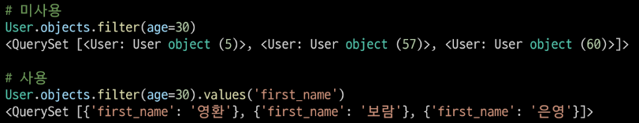

## QuerySet API

- 사전 준비
  
  1. 가상환경 생성 및 활성화
  
  2. 패키지 목록 설치
  
  3. migrate 진행
  
  4. sqlite3에서 csv 데이터 import하기
     
     ```bash
     $ sqlite3 db.sqlite3
     ```
     
     ```
     sqlite > .mode csv
     sqlite > .import users.csv users_user
     sqlite > .exit
     ```
  
  5. 테이블 확인
  
  6. shell_plus 실행
     
     ```bash
     $ python manage.py shell_plus
     ```

### CRUD 기본

- 모든 user 레코드 조회
  
  `User.objects.all()`

- user 레코드 생성
  
  `User.objects.create(`
  
     `...`
  
     `)`

- 101번 user 레코드 조회
  
  `User.objects.get(pk=101)`

- 101번 user 레코드의 age을 30으로 수정
  
  `user = User.objects.get(pk=101)`
  
  `user.age = 30`
  
  `user.save()`
  
  - 확인
    
    `user.age`

- 101번 user 레코드 삭제
  
  `user = User.objects.get(pk=101)`
  
  `user.delete()`
  
  - 확인
    
    `User.objects.get(pk=101)`

- 전체 인원 수 조회
  
  - `len(User.objects.all())`
  
  - `User.objects.count()`

### Sorting data

- 나이가 어린 순으로 이름과 나이 조회하기
  
  `User.objects.order_by('age').values('first_name', 'age')`
  
  - order_by()
    
    - .order_by(*fields)
    
    - QuerySet의 정렬을 재정의
    
    - 기본적으로 오름차순으로 정렬하며 필드명에 '-'(하이픈)을 작성하면 내림차순으로 정렬
    
    - 인자로 '?'를 입력하면 랜덤으로 정렬
  
  - values()
    
    - .values(*fields, **expressions)
    
    - 모델 인스턴스가 아닌 딕셔너리 요소들을 가진 QuerySet을 반환
    
    - *fields는 선택인자이며 조회하고자 하는 필드명을 가변인자로 입력 받음
      
      - 필드를 지정하면 각 딕셔너리에는 지정한 필드에 대한 key와 value만을 출력
      
      - 입력하지 않을 경우 각 딕셔너리에는 레코드의 모든 필드에 대한 key와 value를 출력
      
      

- 이름과 나이를 나이가 많은 순서대로 조회하기
  
  `User.objects.order_by('-age').values('first_name', 'age')`

- 이름, 나이, 계좌 잔고를 나이가 어린 순으로, 만약 같은 나이라면 계좌 잔고가 많은 순으로 정렬해서 조회하기
  
  `User.objects.order_by('age', '-balance').values('first_name', 'age', 'balance')`

### Filtering data

- 중복없이 모든 나라 조회하기
  
  `User.objects.distinct().values('country')`

- 나라 순으로 오름차순 정렬하여 중복없이 모든 나라 조회하기
  
  `User.objects.distinct().values('country').order_by('country')`

- 이름과 나라의 중복 없이 모든 이름과 나라 조회하기
  
  `User.objects.distinct().values('first_name', 'country')`

- 이름과 나라 중복 없이 나라 순으로 오름차순 정렬하여 모든 이름과 나라 조회하기
  
  `User.objects.distinct().values('first_name', 'country').order_by('country')`

- 나이가 30인 사람들의 이름 조회
  
  `User.objects.filter(age=30).values('first_name')`

- 나이가 30살 이상인 사람들의 이름과 나이 조회하기
  
  `User.objects.filter(age__gte=30).values('first_name', 'age')`

- 나이가 30살 이상이고 계좌 잔고가 50만원 초과인 사람들의 이름, 나이, 계좌 잔고 조회하기
  
  `User.objects.filter(age__gte=30, balance__gt=500000).values('first_name', 'age', 'balance')`

- 이름에 '호'가 포함되는 사람들의 이름과 성 조회하기
  
  `User.objects.filter(first_name__contains='호').values('first_name', 'last_name')`

- 핸드폰 번호가 011로 시작하는 사람들의 이름과 핸드폰 번호 조회
  
  `User.objects.filter(phone__startswith='011-').values('first_name', 'phone')`

- 이름이 '준'으로 끝나는 사람들의 이름 조회하기
  
  `User.objects.filter(first_name__endswith='준').values('first_name')`

- 한국 혹은 미국에 사는 사람들의 이름과 나라 조회하기
  
  `User.objects.filter(country__in=['한국', '미국']).values('first_name', 'country')`

- 한국 혹은 미국에 살지 않는 사람들의 이름과 나라 조회하기
  
  `User.objects.exclude(country__in=['한국', '미국']).values('first_name', 'country')`
  
  - exclude()
    
    - exclude(**kwargs)
    
    - 주어진 매개변수와 일치하지 않는 객체를 포함하는 QuerySet 반환

- 나이가 가장 어린 10명의 이름과 나이 조회하기
  
  `User.objects.order_by('age').values('first_name', 'age')[:10]`

- 나이가 30이거나 성이 김씨인 사람들 조회
  
  `shell_plus에서는 import문 생략 가능`
  
  `from django.db.models import Q`
  
  `User.objects.filter(Q(age=30) | Q(last_name='김'))`
  
  - 'Q' object
    
    - 기본적으로 filter()와 같은 메서드의 키워드 인자는 AND statement를 따름
    
    - 만약 더 복잡한 쿼리를 실행해야 하는 경우가 있다면 Q 객체가 필요함
    
    - '&' 및 '|'를 이용하여 Q 객체를 결합할 수 있음
      
      `Q(age=30) | Q(last_name='김')`
    
    - 조회를 하면서 여러 Q 객체를 제공할 수도 있음
      
      `Article.objects.get(`
      
      `Q(title__startwith='Who'),`
      
      `Q(created_at=date(2005, 5, 2)) | Q(created_at=date(2005, 5, 6))`
      
      `)`

### Aggregation (Grouping data)

- aggregate()
  
  - 전체 queryset에 대한 값을 계산
  
  - 특정 필드 전체의 합, 평균, 개수 등을 계산할 때 사용
  
  - 딕셔너리를 반환
  
  - Avg, Count, Max, Min, Sum 등

- aggregate() 활용
  
  - 나이가 30살 이상인 사람들의 평균 나이 조회하기
    
    `from django.db.models import Avg`
    
    `User.objects.filter(age__gte=30).aggregate(Avg('age'))`
    
    - 결과: {'age__avg': avg값}
      
      - 딕셔너리 key이름을 수정할 수도 있음
        
        `User.objects.filter(age__gte=30).aggregate(age_value=Avg('age'))` 
        
        - 결과: {'avg_value': avg값}
  
  - 가장 높은 계좌 잔액 조회하기
    
    `from django.db.models import Max`
    
    `User.objects.aggregate(Max('balance'))`
    
    - 결과: {'balance__max': max값}
  
  - 모든 계좌 잔액 총액 조회하기
    
    `from django.db.models import Sum`
    
    `User.objects.aggregate(Sum('balance'))`
    
    - 결과: {'balance__sum': sum값}

- annotate()
  
  - 쿼리의 각 항목에 대한 요약 값을 계산
  
  - SQL의 GROUP BY에 해당

- annotate() 활용
  
  - 각 나라별로 몇 명씩 살고 있는지 조회하기
    
    `from django.db.models import Count`
    
    `User.objects.values('country').annotate(Count('country'))`
    
    - 결과: <QuerySet [{'country': '한국', 'country__count': 14}, ...]>
      
      - 딕셔너리 key이름을 수정할 수도 있음
        
        `User.objects.values('country').annotate(num_of_country=Count('country'))`
        
        - 결과: <QuerySet [{'country': '한국', 'num_of_country': 14}, ...]>
  
  - 각 나라별로 몇 명씩 살고 있는지 + 나라별 계좌 잔액 평균 조회하기
    
    `User.objects.values('country').annotate(Count('country'), avg_balance=Avg('balance'))`
    
    - 위의 같이 한번에 여러 값을 계산해 조회할 수 있음
  
  - 각 성씨가 몇 명씩 있는지 조회하기
    
    `User.objects.values('last_name').annotate(Count('last_name'))`
  
  - N:1 예시
    
    `Article.objects.annotate(`
    
    `number_of_comment=Count('comment'),`
    
    `pub_date=Count('comment', filter=Q(comment__created_at_lte='2000-01-01'))`
    
    `)`
    
    - 전체 게시글을 조회하면서(Article.objects.all()) annotate로 각 게시글의 댓글 개수와 2000-01-01보다 나중에 작성된 댓글의 개수를 함께 조회
