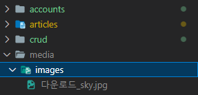
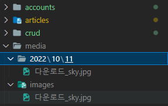
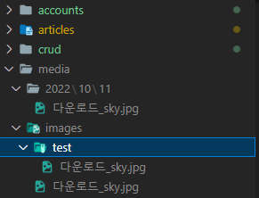
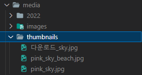
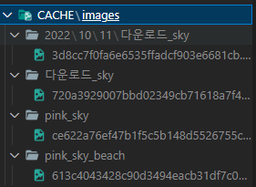

# Static / Media

## Managing static files

### Static files

- 정적 파일
  
  - 응답할 때 별도의 처리 없이 파일 내용을 그대로 보여주면 되는 파일
    
    - 사용자의 요청에 따라 내용이 바뀌는 것이 아니라 요청한 것을 그대로 보여주는 파일
  
  - 파일 자체가 고정되어 있고, 서비스 중에도 추가되거나 변경되지 않고 고정되어있음
    
    - 웹 사이트의 경우 일반적으로 이미지, 자바 스크립트 또는 CSS와 같은 미리 준비된 움직이지 않는 추가 파일을 제공해야 함

- Media File
  
  - 사용자가 웹에서 업로드하는(user-uploaded) 정적 파일
  
  - 유저가 업로드한 모든 정적 파일

- 웹 서버와 정적 파일
  
  - 웹 서버의 기본 동작
    
    - 특정 위치(URL)에 있는 자원을 요청(HTTP request) 받아
    
    - 응답(HTTP response)을 처리하고 제공(serving)
  
  - 즉, 웹 서버는 요청 받은 URL로 서버에 존재하는 정적 자원(static resources)

### Static files 구성하기

- Django에서 정적 파일을 구성하고 사용하기 위한 단계
  
  1. INSTALLED_APPS에 django.contrib.staticfiles가 포함되어 있는지 확인하기
  
  2. settings.py에서 `STATIC_URL` 정의하기
  
  3. 앱의 static 폴더에 정적 파일을 위치하기
  
  4. 템플릿에서 static 템플릿 태그를 사용하여 지정된 경로에 있는 정적 파일의 URL 만들기

- Static files 관련 Core Settings
  
  - STATIC_ROOT
    
    - Django 프로젝트에서 사용하는 모든 정적 파일을 한 곳에 모아 넣는 경로
    
    - *collectstatic*이 배포를 위해 정적 파일을 수집하는 디렉토리의 절대 경로
    
    - Default: None
    
    - 개발 과정에서 settings.py의 DEBUG 값이 True로 설정되어 있으면 해당 값은 작용되지 않음
    
    - 실 서비스 환경(배포 환경)에서 Django의 모든 정적 파일을 다른 웹 서버가 직접 제공하기 위해 사용
    
    - 배포 환경에서는 Django를 직접 실행하는 것이 아니라, 다른 서버에 의해 실행되기 때문에 실행하는 다른 서버는 Django에 내장되어 있는 정적 파일을 인식하지 못함
      
      - 내장되어 있는 정적 파일을 밖으로 꺼내야 함
    
    - collectstatic
      
      - STATIC_ROOT에 Django 프로젝트의 모든 정적 파일을 수집
      
      ```python
      # settings.py
      
      STATIC_ROOT = BASE_DIR / 'staticfiles'
      ```
      
      ```bash
      python manage.py collectstatic
      ```
  
  - STATICFILES_DIRS
    
    - app/static(정적 파일의 기본 경로) 디렉토리 경로를 사용하는 것 외에 추가적인 정적 파일 경로 목록을 정의하는 리스트
    
    - Default: [] (Empty list)
    
    - 추가 파일 디렉토리에 대한 전체 경로를 포함하는 문자열 목록으로 작성되어야 함
      
      ```python
      # settings.py
      
      STATICFILES_DIRS = [
          BASE_DIR / 'static',
      ]
      ```
  
  - STATIC_URL
    
    - STATIC_ROOT에 있는 정적 파일을 참조할 때 사용할 URL
    
    - 개발 단계에서는 실제 정적 파일들이 저장되어 있는 app/static 경로 및 STATICFILES_DIRS에 정의된 추가 경로를 탐색
    
    - Default: None
    
    - 실제 파일이나 디렉토리가 아니며, URL로만 존재
    
    - 비어있지 않은 값으로 설정한다면 반드시 slash(/)로 끝나야 함
      
      ```python
      # settings.py
      
      STATIC_URL = '/static/'
      ```

### Static files 사용하기

- static file 가져오기
  
  - 기본 경로에 있는 static file 가져오기
    
    1. apps/static/apps(이름공간 분리) 경로에 이미지 파일 배치하기
    
    2. static tag를 사용해 이미지 파일 출력하기
       
       ```html
       
       
       ```
    
    3. 이미지 출력 확인
  
  - 추가 경로에 있는 static file 가져오기
    
    1. 추가 경로 작성
       
       ```python
       # settings.py
       
       STATICFILES_DIRS = [
           BASE_DIR / 'static',
       ]
       ```
    
    2. static/ 경로에 이미지 파일 배치하기
    
    3. static tag를 이용해 이미지 파일 출력하기
       
       ```html
       
       ```
    
    4. 이미지 출력 확인

## Image Upload

### Image Field

- ImageField()
  
  - 이미지 업로드에 사용하는 모델 필드
  
  - FileField를 상속받는 서브 클래스이기 때문에 FileField의 모든 속성 및 메서드 사용 가능
  
  - 더해서 사용자에 의해 업로드 된 객체가 유효한 이미지인지 검사
  
  - ImageField 인스턴스는 최대 길이가 100자인 문자열로 DB에 생성되며, max_length 인자를 사용하여 최대 길이를 변경할 수 있음

- FileField()
  
  - FileField(upload_to=' ', storage=None, max_length=100, **options)
  
  - 파일 업로드에 사용하는 모델 필드

- FileField / ImageField를 사용하기 위한 단계
  
  1. settings.py에 MEDIA_ROOT, MEDIA_URL 설정
  
  2. (선택) upload_to 속성을 정의하여 업로드 된 파일에 사용할 MEDIA_ROOT의 하위 경로를 지정

- MEDIA_ROOT
  
  - 사용자가 업로드 한 파일(미디어 파일)을 보관할 디렉토리의 절대 경로
  
  - Default: '' (Empty string)
  
  - Django는 성능을 위해 업로드 파일은 데이터베이스에 저장하지 않음
    
    - 데이터베이스에 저장되는 것은 `파일 경로`
  
  - MEDIA_ROOT는 STATIC_ROOT와 반드시 다른 경로로 지정해야 함
    
    ```python
    # settings.py
    
    MEDIA_ROOT = BASE_DIR / 'media'
    ```

- MEDIA_URL
  
  - MEDIA_ROOT에서 제공되는 미디어 파일을 처리하는 URL
  
  - Default: '' (Empty string)
  
  - 업로드 된 파일의 주소(URL)를 만들어 주는 역할
    
    - 웹 서버 사용자가 사용하는 public URL
  
  - 비어 있지 않은 값으로 설정한다면 반드시 slash(/)로 끝나야 함
  
  - MEDIA_URL은 STATIC_URL과 반드시 다른 경로로 지정해야 함
    
    ```python
    # settings.py
    
    MEDIA_URL = '/media/'
    ```

- 개발 단계에서 사용자가 업로드한 미디어 파일 제공하기
  
  - 사용자로부터 업로드 된 파일이 프로젝트에 업로드 되고 나서, 실제로 사용자에게 제공하기 위해서는 업로드 된 파일의 URL이 필요함
    
    - 업로드 된 파일의 URL: 첫 번째 인자
    
    - 위 URL을 통해 참조하는 파일의 실제 위치: 두 번째 인자
      
      ```python
      # conf/urls.py
      
      from django.conf import settings
      from django.conf.urls.static import static
      
      urlpatterns = [
          ...
      ] + static(settings.MEDIA_URL, document_root=settings.MEDIA_ROOT)
      ```

### CREATE

- ImageField 작성
  
  ```python
  # articles/models.py
  
  class Article(models.Model):
      ...
      image = models.ImageField(blank=True)
  ```
  
  - null=True가 아닌 blank=True인 이유
    
    - ImageField 인스턴스가 문자열로 DB에 생성되기 때문
    
    - 문자열 기반 필드의 데이터 없음에 대한 표현에 두 개의 가능한 값을 갖는 것은 좋지 않음

- Model field option
  
  - blank
    
    - Default: False
    
    - True인 경우 필드를 비워둘 수 있음
      
      - 이 경우 DB에는 ''(빈 문자열)이 저장됨
    
    - 유효성 검사에서 사용됨(is_valid)
      
      - Validation-related
      
      - 필드에 blank=True가 있으면 form 유효성 검사에서 빈 값을 입력할 수 있음
  
  - null
    
    - Default: False
    
    - True인 경우 Django는 빈 값을 DB에 NULL로 저장
      
      - Database-related
    
    - CharField, TextField와 같은 문자열 기반 필드에는 null 옵션 사용을 피해야 함
      
      - 문자열 기반 필드에 null=True로 설정 시 데이터 없음에 대한 표현에 '빈 문자열'과 'NULL' 2가지 모두 가능하게 됨
      
      - 데이터 없음에 대한 표현에 두 개의 가능한 값을 갖는 것은 좋지 않음
      
      - Django는 문자열 기반 필드에서 NULL이 아닌 빈 문자열을 사용하는 것이 규칙

- Migrations
  
  - ImageField를 사용하려면 반드시 Pillow 라이브러리가 필요
    
    - Pillow 설치 없이는 makemigrations 실행 불가
      
      - Pillow
        
        - 광범위한 파일 형식 지원, 효율적이고 강력한 이미지 처리 기능을 제공하는 라이브러리
        
        - 이미지 처리 도구를 위한 견고한 기반을 제공
      
      ```bash
      $ pip install Pillow
      
      $ python manage.py makemigrations
      $ python manage.py migrate
      
      $ pip freeze > requirements.txt
      ```

- Image 필드 출력 확인
  
  - 파일 또는 이미지 업로드 시에는 form 태그에 enctype 속성을 아래와 같이 변경해야 함
    
    ```html
    <!-- articles/create.html -->
    
      <form action="" method="POST" enctype="multipart/form-data">
        
        {{ form.as_p }}
        <input type="submit">
      </form>
    ```

- views.create 수정
  
  - 파일 및 이미지는 request의 POST 속성 값으로 넘어가지 않고 FILES 속성 값에 담겨 넘어가므로 create 함수를 아래와 같이 변경해야 함
    
    ```python
    # articles/views.py
    
    def create(request):
        if request.method == 'POST':
            form = ArticleForm(request.POST, request.FILES) 
            ...
    ```

- 이미지 첨부하기
  
  - 이미지를 첨부하지 않으면 blank=True 속성으로 인해 빈 문자열이 저장됨
  
  - 이미지를 첨부한 경우는 MEDIA_ROOT 경로에 이미지가 업로드 됨
  
  - 만약 같은 이름의 파일을 업로드 한다면 Django는 파일 이름 끝에 임의의 난수 값을 붙여 저장함

### READ

- 업로드 이미지 출력하기
  
  - 업로드 된 파일의 상대 URL은 Django가 제공하는 url 속성을 통해 얻을 수 있음
  
  - 이미지를 업로드 하지 않은 게시물도 있기 때문에 if문을 이용하여 이미지 데이터가 있는 경우만 이미지를 출력하도록
  
  - 혹은 이미지를 업로드 하지 않은 경우 대체 이미지를 설정하여 대체 이미지를 출력하도록 할 수도 있음
    
    ```html
    <!-- articles/detail.html -->
    
      
        
      
    ```
    
    - `article.image.url`: 업로드 파일의 경로
    
    - `article.image`: 업로드 파일의 파일 이름

### UPDATE

- 업로드 이미지 수정하기
  
  - enctype 속성값 추가
    
    ```html
    <!-- articles/update.html -->
    
      <form action="" method="POST" enctype="multipart/form-data">
        
        {{ form.as_p }}
        <input type="submit">
      </form>
    ```
  
  - 이미지 파일이 담겨있는 request.FILES 추가 작성
    
    ```python
    # articles/views.py
    
    def update(request, pk):
        article = Article.objects.get(pk=pk)
        if request.user == article.user:
            if request.method == 'POST':
                form = ArticleForm(request.POST, request.FILES, instance=article)
                ...
    ```

### 'upload_to' argument

- 사용자 지정 업로드 경로와 파일 이름 설정하기
  
  - ImageField는 업로드 디렉토리와 파일 이름을 설정하는 2가지 방법을 제공
    
    1. 문자열 값이나 경로 지정 방법
       
       - upload_to 인자에 새로운 이미지 저장 경로를 추가 후 migration 과정 진행
         
         ```python
         # articles/models.py
         
         class Article(models.Model):
          ...
          image = models.ImageField(blank=True, upload_to='images/')
         ```
       
       - 이미지 업로드 후 MEDIA_ROOT 이후 경로가 추가되는 것 확인
         
         
       
       - 단순 문자열 뿐만 아니라 파이썬 time모듈의 strftime() 형식도 포함될 수 있으며 이는 파일 업로드 날짜/시간으로 대체 됨
         
         ```python
         # articles/models.py
         
         class Article(models.Model):
           ...
           image = models.ImageField(blank=True, upload_to='%Y/%m/%d/')
         ```
       
       - migration 진행 후 이미지 업로드 결과 확인하기
         
         
    
    2. 함수 호출 방법
       
       - upload_to는 함수처럼 호출이 가능하며 해당 함수가 호출되면서 반드시 2개의 인자를 받음 (instance와 filename)
       
       - instance
         
         - FileField가 정의된 모델의 인스턴스
         
         - 데이터베이스가 저장되기 전이므로 아직 pk값이 존재하지 않음에 유의
       
       - filename
         
         - 기존 파일 이름
       
       ```python
       # articles/models.py
       
       def articles_image_path(instance, filename):
          return f'images/{instance.user.username}/{filename}'
       
       class Article(models.Model):
          ...
          image = models.ImageField(blank=True, upload_to=articles_image_path)
       ```
       
       - migrations 과정 진행 후 이미지 업로드 결과 확인
         
         

## Image Resizing

- 사전 준비
  
  - django-imagekt 모듈 설치 및 등록
    
    ```bash
    $ pip install django-imagekit
    
    $ pip freeze > requirements.txt
    ```
    
    ```python
    # settings.py
    
    INSTALLED_APPS = [
      ...
      'imagekit',
    ]
    ```

- 썸네일 만들기
  
  1. 원본 이미지 저장 X
     
     ```python
     # articles/models.py
     
     from imagekit.processors import Thumbnail
     from imagekit.models import ProcessedImageField
     
     class Article(models.Model):
         ...
         image = ProcessedImageField(
             blank=True,
             upload_to='thumbnails/',
             # 가로, 세로 길이(단위는 픽셀)
             processors=[Thumbnail(200, 300)],
             format='JPEG',
             # 해상도
             options={'quality': 80},
         )
     ```
     
     - Migration 진행 후 이미지 업로드
       
       
     
     - ProcessedImageField()의 parameter로 작성된 값은 makemigrations 후에 변경이 되더라도 다시 makemigrations 해줄 필요 없이 즉시 반영 됨
  
  2. 원본 이미지 저장 O
     
     ```python
     # articles/models.py
     
     from imagekit.processors import Thumbnail
     from imagekit.models import ProcessedImageField, ImageSpecField
     
     class Article(models.Model):
         ...
         image = models.ImageField(blank=True)
         # DB에 생성되는 컬럼은 아님
         image_thumbnail = ImageSpecField(
             source='image',
             processors=[Thumbnail(200, 300)],
             format='JPEG',
             options={'quality': 80},
         )
     ```
     
     - Migration 진행 후 이미지 업로드
       
       - 기본적으로 원본 이미지가 업로드되고 출력
       
       - 처음에는 원본만 사용하며 썸네일이 사용되었을 때 resizing한 이미지를 생성(CACHE 폴더에 생성)
       
       - 썸네일을 사용하고 싶으면 detail.html을 수정해야 함
       
       ```html
       <!-- articles/detail.html -->
       
         
           
           
         
       ```
       
       - 이미지가 출력되는 다른 detail 페이지에 이동할 때마다 썸네일이 생성됨
         
         