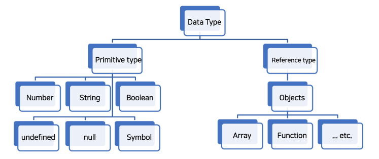

# JavaScript_기초

## JavaScript 시작하기

### JavaScript의 역사

- Web을 조작하기 위한 언어인만큼 Web Browser와도 깊은 연관관계가 있음

- 웹 브라우저와 스크립트 언어
  
  - 이전에는 웹 브라우저가 정적 웹 페이지를 단순히 보여주는 용도에 그침
  
  - 웹 브라우저에 탑재해서 웹 페이지를 동적으로 바꿔줄 Script 언어 개발 필요
    
    - Script 언어
      
      - 소스 코드를 기계어로 바꿔주는 컴파일러 없이 바로 실행 가능한 언어
      
      - 속도가 느리다는 단점
  
  - Netscape에서 Script언어인 Mocha 개발
  
  - 이후 LiveScript로 이름 변경 후 브라우저에 LiveScript를 해석해주는 Engine을 내장
  
  - 이후 당시 인기있던 JAVA의 명성에 기대보고자 JavaScript로 이름 변경

### JavaScript 실행환경 구성

- JavaScript 실행하는 방법
  
  - Web Browser로 실행하기
    
    - HTML 파일에 포함시키기
      
      ```html
      <!DOCTYPE html>
      <html lang="en">
      <head>
          <meta charset="UTF-8">
          <meta http-equiv="X-UA-Compatible" content="IE=edge">
          <meta name="viewport" content="width=device-width, initial-scale=1.0">
          <title>Document</title>
      </head>
      <body>
        <script>
          console.log('hello, javascript')
        </script>
      </body>
      </html>
      ```
    
    - 외부 JavaScript 파일 사용하기
      
      ```js
      console.log('hello, javascript')
      ```
      
      ```html
      <!DOCTYPE html>
      <html lang="en">
      <head>
          <meta charset="UTF-8">
          <meta http-equiv="X-UA-Compatible" content="IE=edge">
          <meta name="viewport" content="width=device-width, initial-scale=1.0">
          <title>Document</title>
      </head>
      <body>
      </body>
      <script src="hello.js"></script>
      </html>
      ```
    
    - Web Browser에서 바로 입력하기
  
  - Node.js로 실행하기

## JavaScript 기초 문법

### 코드 작성법

- 세미콜론
  
  - 자바스크립트는 세미콜론을 선택적으로 사용 가능
  
  - 세미콜론이 없으면 ASI에 의해 자동으로 세미콜론이 삽입됨
    
    - ASI(Automatic Semicolon Insertion, 자동 세미콜론 삽입 규칙)

- 들여쓰기와 코드 블럭
  
  - 2칸 들여쓰기 사용
  
  - 블럭(block)은 if, for, 함수에서 중괄호 내부를 의미
    
    - 중괄호 {} 를 사용해 코드 블럭을 구분

- 코드 스타일 가이드
  
  - 코딩 스타일의 핵심은 합의된 원칙과 일관성
  
  - 코드의 품질에 직결되는 중요한 요소
    
    - 코드의 가독성, 유지보수 또는 팀원과의 커뮤니케이션 등 개발 과정 전체에 영향을 끼침
  
  - JavaScript 코드 스타일 가이드
    
    - Airbnb JavaScript Style Guide
    
    - Google JavaScript Style Guide
    
    - standardJavaScript 등

- 주석
  
  - 한 줄 주석: `//`
  
  - 여러 줄 주석: `/* */`

### 변수와 식별자

- 식별자(identifier)
  
  - 식별자는 변수를 구분할 수 있는 변수명을 의미
  
  - 반드시 문자, 달러($) 또는 밑줄(_)로 시작
  
  - 대소문자를 구분하며, 클래스명 외에는 모두 소문자로 시작
  
  - 예약어 사용 불가능

- 식별자의 특징
  
  - 카멜 케이스(camelCase, lower-camel-case)
    
    - 변수, 객체, 함수에 사용
  
  - 파스칼 케이스(PascalCase, upper-camel-case)
    
    - 클래스, 생성자에 사용
  
  - 대문자 스네이크 케이스(SNAKE_CASE)
    
    - 상수(constants)에 사용
    
    - 상수: 개발자의 의도와 상관없이 변경될 가능성이 없는 값을 의미

- 선언, 할당, 초기화
  
  - 선언(Declaration)
    
    - 변수를 생성하는 행위 또는 시점
  
  - 할당(Assignment)
    
    - 선언된 변수에 값을 저장하는 행위 또는 시점
  
  - 초기화(Initialization)
    
    - 선언된 변수에 처음으로 값을 저장하는 행위 또는 시점

- 변수 선언 키워드
  
  - let
    
    - `재할당 가능, 재선언 불가능`
    
    - `블록 스코프` 지역 변수를 선언, 선언과 동시에 원하는 값을 초기화할 수 있음
      
      - 블록 스코프(block scope)
        
        - if, for, 함수 등의 중괄호 내부를 가리킴
        
        - 블록 스코프를 가지는 변수는 블록 바깥에서 접근 불가능
  
  - const
    
    - `재할당 불가능, 재선언 불가능`
    
    - 선언 시 반드시 초기값을 설정해야하며, 이후 값 변경이 불가능
    
    - let과 동일하게 `블록 스코프`를 가짐
  
  - var
    
    - `재할당 가능, 재선언 가능`
    
    - `함수 스코프(function scope)`를 가짐
    
    - '호이스팅'되는 특성으로 인해 예기치 못한 문제 발생 가능
      
      - 따라서 ES6 이후부터는 var 대신 const와 let을 사용하는 것을 권장
    
    - 변수 선언 시 var, const, let 키워드 중 하나를 사용하지 않으면 자동으로 var로 선언됨

- 호이스팅(hoisting)
  
  - 변수를 선언 이전에 참조할 수 있는 현상
  
  - 변수 선언 이전의 위치에서 접근 시 undefined를 반환

### 데이터 타입

- JavaScript의 데이터 타입은 크게 원시 타입(Primitive type)과 참조 타입(Reference type)으로 분류됨
  
  

- Number
  
  - 정수 또는 실수형 숫자를 표현하는 자료형
  
  - NaN
    
    - Not-A-Number
    
    - Number.isNaN('값')의 경우 '값'의 유형이 Number이고 '값'이 NaN이면 true, 아니면 false를 반환
    
    - NaN을 반환하는 경우
      
      - 숫자로서 읽을 수 없는 경우
      
      - 결과가 허수인 수학 계산식인 경우
      
      - 피연산자가 NaN인 경우
      
      - 정의할 수 없는 계산식인 경우
      
      - 문자열을 포함하면서 덧셈이 아닌 계산식인 경우

- String
  
  - 문자열을 표현하는 자료형
  
  - 작은 따옴표, 큰 따옴표 모두 가능
  
  - 곱셈, 나눗셈, 뺄셈은 안되지만 덧셈을 통해 문자열을 붙일 수 있음
  
  - 줄 바꿈
    
    - 따옴표 이용 시 `\n`를 이용
      
      ```js
      const word1 = "안녕 \n하세요"
      console.log(word1)
      ```
    
    - Template Literal 이용 시 백틱을 이용
      
      ```js
      const word2 = `안녕
      하세요`
      console.log(word2)
      
      const age = 10
      const message = `홍길동은 ${age}세입니다.`
      console.log(message)
      ```
      
      - Template Literal(템플릿 리터럴)
        
        - 내장된 표현식을 허용하는 문자열 작성 방식

- null과 undefined
  
  - 둘 다 값이 존재하지 않음을 표현하는 값
  
  - 대표적인 차이점
    
    - typeof 연산자를 통해 타입을 확인한 결과
      
      ```js
      console.log(typeof null)        // object
      console.log(typeof undefined)   // undefined
      ```
      
      - null이 원시 타입임에도 불구하고 object로 출력되는 것은 버그라고 생각하면 이해하기 쉬움

- null
  
  - 변수의 값이 없음을 의도적으로 표현할 때 사용하는 데이터 타입

- undefined
  
  - 변수 선언 이후 직접 값을 할당하지 않으면 자동으로 할당됨

- Boolean
  
  - true와 false
  
  - 참과 거짓을 표현하는 값
  
  - 조건문 또는 반복문에서 유용하게 사용
    
    - 조건문 또는 반복문에서 boolean이 아닌 데이터 타입은 자동 형변환 규칙에 따라 true 또는 false로 변환됨
      
      - 자동 형변환 (ToBoolean Conversions)
        
        | 데이터 타입    | false      | true      |
        |:---------:|:----------:|:---------:|
        | undefined | 항상 false   | X         |
        | null      | 항상 false   | X         |
        | Number    | 0, -0, NaN | 나머지 모든 경우 |
        | String    | 빈 문자열      | 나머지 모든 경우 |
        | Object    | X          | 항상 true   |

### 연산자

- 할당 연산자
  
  - 오른쪽에 있는 피연산자의 평가 결과를 왼쪽 피연산자에 할당하는 연산자
  
  - Increment 및 Decrement 연산자
    
    - Increment (++): 피연산자의 값을 1 증가시키는 연산자
    
    - Decrement (--): 피연산자의 값을 1 감소시키는 연산자
    
    - += 또는 -=와 같이 더 분명한 표현으로 적을 것을 권장

- 비교 연산자
  
  - 피연산자들(숫자, 문자, Boolean 등)을 비교하고 결과값을 boolean으로 반환하는 연산자
  
  - 문자열은 유니코드 값을 사용하며 표준 사전 순서를 기반으로 비교
    
    - 알파벳의 경우 알파벳 순서 상 후순위가 더 크고 소문자가 대문자보다 더 큼

- 동등 연산자 (==)
  
  - 두 피연산자가 같은 값으로 평가되는지 비교 후 boolean 값을 반환
  
  - 비교할 때 암묵적 타입 변환을 통해 타입을 일치시킨 후 같은 값인지 비교
    
    ```js
    const a = 1
    const b = '1'
    
    console.log(a == b)  // true
    console.log(a == true)  // true
    
    console.log(8 * null)  // 0
    console.log('5' - 1)  // 4
    console.log('5' + 1)  // 51
    console.log('five' * 2)  // NaN
    ```
    
    - 흔히 예상하는 결과와 다른 결과가 나오는 경우가 있으므로 특별한 경우를 제외하고는 사용하지 않는 것이 좋음

- 일치 연산자 (===)
  
  - 두 피연산자의 값과 타입이 모두 같은 경우 true를 반환
  
  - 같은 객체를 가리키거나, 같은 타입이면서 같은 값인지를 비교
    
    ```js
    const a = 1
    const b = '1'
    
    console.log(a === b)  // false
    console.log(a === Number(b))  // true
    ```

- 논리 연산자
  
  - 세 가지 논리 연산자로 구성
    
    - and : `&&`
    
    - or : `||`
    
    - not : `!`
  
  - 단축 평가 지원
    
    - false && true : `false`
    
    - true || false : `true`
    
    ```js
    console.log(true && false)  // false
    console.log(true && true)  // true
    
    console.log(false || true)  // true
    console.log(false || false)  // false
    
    console.log(!true)  // false
    
    console.log(1 && 0)  // 0
    console.log(0 && 1)  // 0
    console.log(2 && 4)  // 4
    
    console.log(1 || 0)  // 1
    console.log(0 || 1)  // 1
    console.log(2 || 4)  // 2
    ```

- 삼항 연산자 (Ternary Operator)
  
  - 3개의 피연산자를 사용하여 조건에 따라 값을 반환하는 연산자
  
  - `조건식 ? 참일 경우 실행할 표현식 : 거짓일 경우 실행할 표현식`
    
    ```js
    console.log(true ? 1 : 2)  // 1
    console.log(false ? 1 : 2)  // 2
    
    const result = Math.PI > 4 ? 'true' : 'false'
    console.log(result)  // false
    ```

### 조건문

- 조건문의 종류와 특징
  
  - `if` statement
    
    - 조건 표현식의 결과값을 boolean 타입으로 변환 후 참/거짓을 판단
    
    - 조건이 많은 경우 가독성이 좋지 않고 유지보수하기 힘들어짐
  
  - `switch` statement
    
    - 조건 표현식의 결과값이 어느 경우에 해당하는지 판별
    
    - 주로 특정 변수의 값에 따라 조건을 분기할 때 활용
      
      - 조건이 많아질 경우 if문보다 가독성이 나을 수 있음

- if statement
  
  - if, else if, else
    
    - 조건은 소괄호(condition) 안에 작성
    
    - 실행한 코드는 중괄호 안에 작성
    
    - 블록 스코프 생성
    
    ```js
    const name = 'admin'
    
    if (name === 'admin') {
      console.log('관리자님 환영합니다.')
    } else if (name === 'manager') {
      console.log('매니저님 환영합니다.')
    } else {
      console.log(`${name}님 환영합니다.`)
    }
    ```

- switch statement
  
  - 표현식의 결과값을 이용한 조건문
  
  - break 및 default 문은 선택적으로 사용 가능
  
  - break문이 없는 경우 break문을 만나거나 default문을 실행할 때까지 다음 조건문 실행
    
    - Fall-through 현상
      
      ```js
      const name = 'admin'
      
      switch(name) {
        case 'admin': {
          console.log('관리자님 환영합니다.')
        }
        case 'manager': {
          console.log('매니저님 환영합니다.')
        }
        default: {
          console.log(`${name}님 환영합니다.`)
        }
      }
      
      // 관리자님 환영합니다.
      // 매니저님 환영합니다.
      // admin님 환영합니다.
      ```
      
      - break를 작성하면 의도한대로 동작
        
        ```js
        const name = 'admin'
        
        switch(name) {
          case 'admin': {
            console.log('관리자님 환영합니다.')
            break
          }
          case 'manager': {
            console.log('매니저님 환영합니다.')
            break
          }
          default: {
            console.log(`${name}님 환영합니다.`)
          }
        }
        
        // 관리자님 환영합니다.
        ```
  
  - 블록 스코프 생성

### 반복문

- while
  
  - 조건문이 참이기만 하면 문장을 계속해서 수행
    
    ```js
    let i = 0
    
    while (i < 6) {
      console.log(i)
      i += 1
    }
    
    // 0
    // 1
    // 2
    // 3
    // 4
    // 5
    ```

- for
  
  - 특정한 조건이 거짓으로 판별될 때까지 반복
  
  - 초기문에 정의한 변수를 재할당하면서 사용하기 때문에 const를 사용하면 에러가 발생함
    
    ```js
    for ([초기문]; [조건문]; [증감문]) {
      // 실행할 내용
    }
    
    for (let i = 0; i < 6; i++) {
        console.log(i)
    }
    
    // 0
    // 1
    // 2
    // 3
    // 4
    // 5
    ```

- for ... in
  
  - **객체의 속성을 순회**할 때 사용
    
    ```js
    for (variable in object) {
      statements
    }
    
    const fruits = { a: 'apple', b: 'banana' }
    
    for (const key in fruits) {
      console.log(key)
      console.log(fruits[key])
    }
    
    // a
    // apple
    // b
    // banana
    ```

- for ... of
  
  - **반복 가능한 객체를 순회**할 때 사용: Array, Set, String 등
    
    ```js
    for (variable of object) {
      statements
    }
    
    const numbers = [0, 1, 2, 3]
    
    for (const number of numbers) {
      console.log(number)
    }
    
    // 0
    // 1
    // 2
    // 3
    ```

- for ... in과 for ... of
  
  - for ... in은 속성 이름을 통해 반복
  
  - for ... of는 속성 값을 통해 반복
  
  - 재할당이 아니라 매 반복 시 변수를 새로 정의하여 사용하므로 에러가 발생하지 않음

## 함수

- 개요
  
  - 참조 타입 중 하나로써 function 타입에 속함
  
  - JavaScript에서 함수를 정의하는 방법은 주로 2가지로 구분됨
    
    - 함수 선언식 (function declaration)
    
    - 함수 표현식 (function expression)

### 함수의 정의

- 함수 선언식
  
  - 일반적인 프로그래밍 언어의 함수 정의 방식
    
    ```js
    function add(num1, num2) {
      return num1 + num2
    }
    
    add(2, 7)
    ```

- 함수 표현식
  
  - 표현식 내에서 함수를 정의하는 방식
  
  - 함수 표현식은 함수의 이름을 생략한 익명 함수로 정의 가능
    
    ```js
    const sub = function (num1, num2) {
      return num1 - num2
    }
    
    sub(7, 2)
    ```
  
  - 표현식에서 함수 이름을 명시하는 것도 가능
  
  - 다만 이 경우 함수 이름은 호출에 사용되지 못하고 디버깅 용도로 사용됨
    
    ```js
    const mySub = function namedSub(num1, num2) {
      return num1 - num2
    }
    
    mySub(1, 2)
    namedSub(1, 2)  // ReferenceError: namedSub is not defined
    ```

- 기본 인자 (Default arguments)
  
  - 인자 작성 시 = 문자 뒤 기본 인자 선언 가능
    
    ```js
    const greeting = function (name = 'admin') {
      return `Hi ${name}`
    }
    
    greeting()  // Hi admin
    ```

- 매개변수와 인자의 개수 불일치 허용
  
  - 매개변수보다 인자의 개수가 많거나 적을 경우
    
    ```js
    const threeArgs = function (arg1, arg2, arg3) {
      return [arg1, arg2, arg3]
    }
    
    threeArgs()
    // [ undefined, undefined, undefined ]
    threeArgs(1)
    // [ 1, undefined, undefined ]
    threeArgs(1, 2)
    // [ 1, 2, undefined ]
    threeArgs(1, 2, 3)
    // [ 1, 2, 3 ]
    threeArgs(1, 2, 3, 4)
    // [ 1, 2, 3 ]
    ```

### 선언식과 표현식

- 함수의 타입
  
  - 선언식 함수와 표현식 함수 모두 타입은 function으로 동일
    
    ```js
    // 함수 표현식
    const add = function (args) {
      // return
    }
    
    // 함수 선언식
    function add(args) {
      // return
    }
    ```
  
  - 함수 선언식
    
    - 호이스팅 발생
  
  - 함수 표현식
    
    - 함수 정의 전에 호출 시 에러 발생
    
    - 함수 표현식으로 정의된 함수는 변수로 평가되어 변수의 scope 규칙을 따름

### 화살표 함수 (Arrow Function)

- 화살표 함수
  
  1. function 키워드 생략 및 화살표 추가
  
  2. 함수의 매개변수가 하나 뿐이라면 매개변수의 `()` 생략 가능
  
  3. 함수의 내용이 한 줄이라면 `{}`와 `return`도 생략 가능

- 화살표 함수는 익명 함수이므로 함수 표현식에서만 사용 가능
  
  ```js
  // 화살표 함수는 함수 표현식에서만 가능
  // 함수 표현식
  const arrow1 = function (name) {
    return `hello, ${name}`
  }
  
  console.log(arrow1('Tom'))  // hello, Tom
  
  // 화살표 함수
  const arrow2 = (name) => `hello, ${name}`
  
  console.log(arrow2('Tom'))  // hello, Tom
  ```

## Array와 Object

### 배열 (Array)

- 배열
  
  - 키와 속성을 담고 있는 참조 타입의 객체
  
  - 순서를 보장
  
  - 대괄호를 이용하여 생성하고, 0부터 시작하는 인덱스로 특정 값에 접근 가능
  
  - 배열의 길이는 `array.length` 형태로 접근 가능

### 배열 메서드 기본

- `array.reverse()`
  
  - 원본 배열 요소의 순서를 반대로 정렬
    
    ```js
    const numbers = [1, 2, 3, 4, 5]
    numbers.reverse()
    console.log(numbers)  // [ 5, 4, 3, 2, 1 ]
    ```

- `array.push() & array.pop()`
  
  - 배열의 가장 뒤에 요소를 추가 또는 제거
    
    ```js
    const numbers = [1, 2, 3, 4, 5]
    
    // push
    numbers.push(6)
    console.log(numbers)  // [ 1, 2, 3, 4, 5, 6 ]
    
    // pop
    numbers.pop()
    console.log(numbers)  // [ 1, 2, 3, 4, 5 ]
    ```

- `array.unshift() & array.shift()`
  
  - 배열의 가장 앞에 요소를 추가 또는 제거
    
    ```js
    const numbers = [1, 2, 3, 4, 5]
    
    // unshift
    numbers.unshift(0)
    console.log(numbers)  // [ 0, 1, 2, 3, 4, 5 ]
    
    // shift
    numbers.shift()
    console.log(numbers)  // [ 1, 2, 3, 4, 5 ]
    ```

- `array.includes(value)`
  
  - 배열에 특정 값(value)이 존재하는지 판별 후 true 또는 false 반환
    
    ```js
    const numbers = [1, 2, 3, 4, 5]
    
    console.log(numbers.includes(5))  // true
    
    console.log(numbers.includes(50))  // false
    ```

- `array.indexOf(value)`
  
  - 배열에 특정 값이 존재하는지 확인 후 가장 첫번째로 찾은 요소의 인덱스 반환
  
  - 만약 해당 값이 없을 경우 -1 반환
    
    ```js
    const numbers = [1, 2, 3, 4, 5]
    let idx
    
    idx = numbers.indexOf(5)
    console.log(idx)  // 4
    
    idx = numbers.indexOf(50)
    console.log(idx)  // -1
    ```

- `array.join([separator])`
  
  - 배열의 모든 요소를 연결하여 반환
  
  - separator는 선택적으로 지정 가능하며 생략 시 쉼표를 기본값으로 사용
    
    ```js
    const numbers = [1, 2, 3, 4, 5]
    let idx
    
    idx = numbers.join()
    console.log(idx)  // 1,2,3,4,5
    
    idx = numbers.join('')
    console.log(idx)  // 12345
    
    idx = numbers.join(' ')
    console.log(idx)  // 1 2 3 4 5
    
    idx = numbers.join('-')
    console.log(idx)  // 1-2-3-4-5
    ```

### 배열 헬퍼 메서드 (Array Helper Methods)

- Array Helper Methods
  
  - 배열을 순회하며 특정 로직을 수행하는 메서드
  
  - 메서드 호출 시 인자로 callback 함수를 받는 것이 특징
    
    - callback 함수: 어떤 함수의 내부에서 실행될 목적으로 인자로 넘겨받는 함수
      
      - 3가지 매개변수로 구성
        
        - element: 배열의 요소
        
        - index: 배열 요소의 인덱스
        
        - array: 배열 자체

- forEach
  
  - `array.forEach(callback(element[, index[, array]]))`
  
  - return 값 없음
    
    ```js
    const cafeStuff = ['table', 'chair', 'book', 'cup', 'window']
    
    cafeStuff.forEach((cafe) => console.log(cafe))
    
    // table
    // chair
    // book
    // cup
    // window
    ```

- map
  
  - `array.map(callback(element[, index[, array]]))`
  
  - 배열의 각 요소에 대해 콜백 함수를 한 번씩 실행
  
  - 콜백 함수의 반환 값을 요소로 하는 새로운 배열 반환
    
    ```js
    const numbers = [1, 2, 3]
    
    const tripleNumbers = numbers.map((number) => {
        return number * 3
    })
    
    console.log(tripleNumbers)  // [ 3, 6, 9 ]
    ```

- filter
  
  - `array.filter(callback(element[, index[, array]]))`
  
  - 배열의 각 요소에 대해 콜백 함수를 한 번씩 실행
  
  - 콜백 함수의 반환 값이 true인 요소만 모아 새로운 배열 반환
    
    ```js
    const foods = [
        { name: 'cucumber', type: 'vegetable' },
        { name: 'banana', type: 'fruit' },
        { name: 'carrot', type: 'vegetable' },
        { name: 'apple', type: 'fruit' },
    ]
    
    const fruits = foods.filter((food) => {
        return food.type === 'fruit'
    })
    
    console.log(fruits)
    // [ { name: 'banana', type: 'fruit' }, { name: 'apple', type: 'fruit' } ]
    ```

- reduce
  
  - `array.reduce(callback(acc, element, [index[, array]])[, initialValue])`
  
  - 인자로 주어지는 함수(콜백 함수)를 배열의 각 요소에 대해 한 번씩 실행해서, 하나의 결과 값을 반환
  
  - 배열을 하나의 값으로 계산하는 동작이 필요할 때 사용(총합, 평균 등)
  
  - acc
    
    - 이전 callback 함수의 반환 값이 누적되는 변수
  
  - initialValue(선택)
    
    - 최초 callback 함수 호출 시 acc에 할당되는 값, default 값은 배열의 첫 번째 값
      
      - 지정하지 않을 시 첫번째 요소의 값
      
      - 빈 배열의 경우 지정하지 않으면 에러 발생
    
    ```js
    const score = [90, 80, 70, 60]
    
    const sum = score.reduce((total, x) => total + x, 0)
    console.log(sum)  // 300
    
    const avg = score.reduce((total, x) => total + x, 0) / score.length
    console.log(avg)  // 75
    ```

- find
  
  - `array.find(callback(element[, index[, array]]))`
  
  - 배열의 각 요소에 대해 콜 백 함수를 한 번씩 실행
  
  - 콜백 함수의 반환 값이 true이면 조건을 만족하는 첫번째 요소를 반환
  
  - 찾는 값이 배열에 없으면 undefined 반환

- some
  
  - `array.some(callback(element[, index[, array]]))`
  
  - 배열의 요소 중 하나라도 주어진 판별 함수를 통과하면 true 반환
  
  - 모든 요소가 통과하지 못하면 거짓 반환
  
  - 빈 배열은 항상 false 반환

- every
  
  - `array.every(callback(element[, index[, array]]))`
  
  - 배열의 모든 요소가 주어진 판별 함수를 통과하면 true 반환
  
  - 하나의 요소라도 통과하지 못하면 false 반환
  
  - 빈 배열은 항상 true 반환

### 메서드 Methods

- bind()
  
  - 첫번째 인자
    
    - 실행이 예정된 함수에서 this 예약어를 사용하게 함
  
  - 두번째 인자
    
    - 호출 예정인 함수가 받는 첫번째 인자
    
    ```js
    func.bind(thisArg[, arg1[, arg2[, ...]]])
    ```

### 객체 (Object)

- 객체
  
  - 속성의 집합
  
  - 중괄호 내부에 key와 value의 쌍으로 표현

- key
  
  - 문자열 타입만 가능
  
  - key 이름에 띄어쓰기 등의 구분자가 있으면 따옴표로 묶어서 표현

- 객체 요소 접근
  
  - `.` 또는 `[]`로 접근
  
  - key 이름에 띄어쓰기 같은 구분자가 있으면 `[]`만 접근 가능

## etc

- Date() 생성자
  
  - 날짜, 시간 표현
    
    ```js
    new Date()
    new Date(value)
    new Date(dateString)
    
    new Date(year, monthIndex)    // 월은 0부터 시작
    new Date(year, monthIndex, day)
    new Date(year, monthIndex, day, hours)
    new Date(year, monthIndex, day, hours, minutes)
    new Date(year, monthIndex, day, hours, minutes, seconds)
    new Date(year, monthIndex, day, hours, minutes, seconds, milliseconds)
    ```
  
  - toISOString()
    
    - Date를 ISOString 형식의 문자열로 변환
      
      ```js
      const expenseDate = new Date(2023, 1, 22);
      console.log(expenseDate.toISOString());
      ```
  
  - toLocaleString()
    
    - 사용하는 객체에 따라 내용이 달라짐
      
      - Date, Number, Array, Object 등
      
      - Date의 경우 지정한 지역에서 표현하는 방식의 날짜를 문자열로 리턴
        
        ```js
        DateObject.toLocaleString([locales, [, options]])
        ```

- 숫자 최대값, 최소값 구하기
  
  - 최대값
    
    - Math.max()
      
      ```js
      console.log(Math.max(1, 3, 2));  // 3
      console.log(Math.max(-1, -3, -2));  // -1
      ```
  
  - 최소값
    
    - Math.min()
      
      ```js
      console.log(Math.min(1, 3, 2));  // 1
      console.log(Math.min(-1, -3, -2));  // -3
      ```
  
  - 배열의 최대값, 최소값
    
    ```js
    const array1 = [1, 3, 2];
    console.log(Math.max(array1));  // NaN
    console.log(Math.min(array1));  // NaN
    ```
    
    - destructuring
      
      ```js
      const array1 = [1, 3, 2];
      console.log(Math.max(...array1));  // 3
      console.log(Math.min(...array1));  // 1
      ```

- 문자형을 숫자형으로 바꾸기
  
  - 단항 더하기 연산자 (+)
    
    ```js
    +enteredAge
    ```
    
    - 문자열이 숫자형으로 변환될 수 없는 경우에는 NaN 반환
  
  - 문자열에 곱하기 1
    
    ```js
    enteredAge * 1
    ```
    
    - 문자열이 숫자형으로 변환될 수 없는 경우에는 NaN 반환

- selected에서 선택한 값 가져오기
  
  ```js
  const onChangeHandler = (target) => {
    // 선택한 option의 value 값
    console.log(target.value);
    // 선택한 option의 text 값
    console.log(target.options[target.selectedIndex].text);
  };
  
  return (
    <select onChange={onChangeHandler}>
      <option value="3개월">3개월</option>
      <option value="6개월">6개월</option>
      <option value="12개월">12개월</option>
    </select>
  );
  ```
