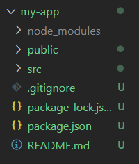
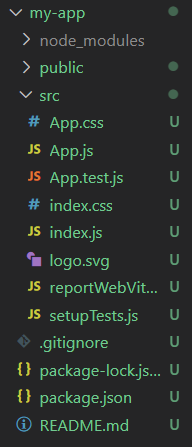
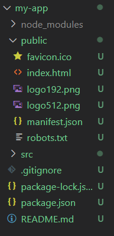

# React

### React

- A JavaScript library for building user interfaces

- makes building complex, interactive and reactive user interfaces `simpler`

### Component

- React is all about component

- components
  
  - reusable building blocks in user interface

### React

- Declarative approach 선언형 프로그래밍
  
  - `Declarative approach` vs `Imperative approach`
    
    - 선언형 프로그래밍 vs 명령형(절차형) 프로그래밍
    
    - 선언형 프로그래밍
      
      - 무엇을 할 것인가
        
        ```js
        <div className="App">
          <h2>Let's get started!</h2>
          <p>This is also visible!</p>
        </div>
        ```
    
    - 명령형(절차형) 프로그래밍
      
      - 어떤 일을 어떻게 할 것인가
        
        ```js
        const para = document.createElement('p');
        para.textContent = 'This is also visible';
        document.getElementById('root').append(para);
        ```

- react
  
  - 컴포넌트
    
    - 상태, props, 컨텍스트 변경 시에만 컴포넌트 함수를 재실행하고 재평가
  
  - 실제 DOM
    
    - 평가 시 차이가 발생한 경우만 변경

- Stateful / Stateless
  
  - Stateful
    
    - State가 있는 컴포넌트
  
  - Stateless
    
    - State가 없는 컴포넌트
  
  - Stateless가 많은 것이 더 좋은 것

### Create React app

[github create-react-app](https://github.com/facebook/create-react-app)

[create-react-app.dev](https://create-react-app.dev/)

```bash
npx create-react-app my-app
cd my-app
npm start
```



- package.json
  
  - 프로젝트에서 사용하는 패키지 정보

- `$ npm install`
  
  - package.json 파일을 살펴보고, 프로젝트 폴더에 필요한 모든 패키지와 개발에 필요한 것들을 다운로드해서 설치



- index.js
  
  ```js
  import ReactDOM from 'react-dom/client';
  
  import './index.css';
  import App from './App';
  
  const root = ReactDOM.createRoot(document.getElementById('root'));
  root.render(<App />);
  ```
  
  - import ReactDOM from 'react-dom/client';
    
    - ReactDOM이라는 객체를 react-dom이라는 서드 파티 라이브러리에서 가져옴
    - 

- App.js
  
  ```js
  function App() {
    return (
      <div>
        <h2>Let's get started!</h2>
      </div>
    );
  }
  
  export default App;
  ```
  
  - export default App;
    
    - App.js 파일에서 정의된 함수, 클래스 또는 객체를 다른 파일에서 사용하기 위해서 내보내는 과정



- index.html
  
  - 브라우저에서 로딩되는 유일한 HTML 파일
  
  - 그 외 웹 페이지 상의 모든 사용자 인터페이스 관련 변경 사항은 React가 처리

- auto format shortcut
  
  - File > Preferences > Keyboard Shortcuts > 'format document' 검색

### JSX

- JSX
  
  - JavaScript XML
  
  - JavaScript에 XML을 추가한 문법
  
  - 리액트 팀이 개발하고 도입한 특수 구문

- className
  
  - class 대신 className을 사용
    
    ```js
    // App.js
    
        <div className="App">
          ...
        </div>
    ```

- htmlFor
  
  - label에서 for 대신 htmlFor 사용
    
    ```js
    <label htmlFor="username">Username</label>
    ```

### npm

- `npm i prop-types`
  
  - 전달받은 props가 원하는 props인지를 확인
    
    ```bash
    npm i prop-types
    ```
  
  - 설치 확인
    
    - package.json의 dependencies에서 `prop-types` 확인
      
      ```js
      Food.propTypes = {
        name: PropTypes.string.isRequired
      } 
      ```

- `axios`
  
  ```bash
  npm i axios
  ```
  
  - axios 설치 후 import
    
    ```js
    import axios from "axios";
    ```

- `router`
  
  ```bash
  npm i react-router-dom
  ```

- `npm init`
  
  - package.json 생성
    
    ```bash
    npm init
    npm init -y
    ```

- `redux`
  
  ```bash
  npm install redux
  ```

### component life cycle

- Mounting
  
  - constructor()
    
    - super()
      
      ```js
        constructor(props) {
          super(props)
          console.log("hello")
        }
      ```
  
  - render()
    
    ```js
      render(){
        console.log("I am rendering")
      }
    ```
  
  - componentDidMount()
    
    ```js
      componentDidMount(){
        console.log("component rendered")
      }
    
      componentDidMount(){
        setTimeout(() => {
          this.setState({ isLoading: false })
        }, 6000);
      }
    ```

- Updating
  
  - render()
    
    ```js
      render(){
        console.log("I am rendering")
      }
    ```
  
  - componentDidUpdate()
    
    ```js
      componentDidUpdate(){
        console.log("I just updated")
      }
    ```

- Unmounting
  
  - componentWillUnmount()
    
    ```js
      componentWillUnmount(){
        console.log("Goodbye")
      }
    ```

### Props

- 재사용 가능한 컴포넌트 생성

- 컴포넌트에서 컴포넌트로 데이터 전달 가능
  
  ```js
  // App.js
  
  import ExpenseItem from "./components/ExpenseItem";
  
  function App() {
    const expenses = [
      {
        id: 'e1',
        title: "Toilet Paper",
        amount: 94.12,
        date: new Date(2020, 7, 14),
      },
      {
        id: 'e2',
        title: "New TV",
        amount: 799.49,
        date: new Date(2021, 2, 12),
      },
      {
        id: 'e3',
        title: "Car Insurance",
        amount: 294.67,
        date: new Date(2021, 2, 28),
      },
      {
        id: 'e4',
        title: "New Desk (Wooden)",
        amount: 450,
        date: new Date(2021, 5, 12),
      },
    ];
  
    return (
      <div className="App">
        <h2>Let's get started!</h2>
        <ExpenseItem
          title={expenses[0].title}
          amount={expenses[0].amount}
          date={expenses[0].date}
        ></ExpenseItem>
        <ExpenseItem
          title={expenses[1].title}
          amount={expenses[1].amount}
          date={expenses[1].date}
        ></ExpenseItem>
        <ExpenseItem
          title={expenses[2].title}
          amount={expenses[2].amount}
          date={expenses[2].date}
        ></ExpenseItem>
        <ExpenseItem
          title={expenses[3].title}
          amount={expenses[3].amount}
          date={expenses[3].date}
        ></ExpenseItem>
      </div>
    );
  }
  
  export default App;
  ```
  
  ```js
  // ExpenseItem.js
  
  import "./ExpenseItem.css";
  
  function ExpenseItem(props) {
  
    return (
      <div className="expense-item">
        <div>{props.date.toISOString()}</div>
        <div className="expense-item__description">
          <h2>{props.title}</h2>
          <div className="expense-item__price">${props.amount}</div>
        </div>
      </div>
    );
  }
  
  export default ExpenseItem;
  ```
  
  ```css
  /* ExpenseItem.css */
  
  .expense-item {
      display: flex;
      justify-content: space-between;
      align-items: center;
      box-shadow: 0 2px 8px rgba(0, 0, 0, 0.25);
      padding: 0.5rem;
      margin: 1rem 0;
      border-radius: 12px;
      background-color: #4b4b4b;
  }
  
  .expense-item__description {
      display: flex;
      flex-direction: column;
      gap: 1rem;
      align-items: flex-end;
      flex-flow: column-reverse;
      justify-content: flex-start;
      flex: 1;
  }
  
  .expense-item h2 {
      color: #3a3a3a;
      font-size: 1rem;
      flex: 1;
      margin: 0 1rem;
      color: white;
  }
  
  .expense-item__price {
      font-size: 1rem;
      font-weight: bold;
      color: white;
      background-color: #40005d;
      border: 1px solid white;
      padding: 0.5rem;
      border-radius: 12px;
  }
  
  @media (min-width: 500px) {
      .expense-item__description {
          flex-direction: row;
          align-items: center;
          justify-content: flex-start;
          flex: 1;
      }
  }
  
  .expense-item__description h2 {
      font-size: 1.25rem;
  }
  
  .expense-item__price {
      font-size: 1.25rem;
      padding: 0.5rem 1.5rem;
  }
  ```

- children prop
  
  - 사용자 지정 컴포넌트에 있는 열고 닫는 태그 사이에 있는 컨텐츠를 모두 표시하는 props
  
  - 중복된 코드 뿐 아니라 Html 코드와 JSX 코드 등을 추출할 수 있음
    
    ```js
    // Card.js
    
    import './Card.css';
    
    function Card(props) {
        const classes = 'card ' + props.className;
    
        return (
            <div className={classes}>{props.children}</div>
        );
    }
    
    export default Card;
    ```
    
    ```css
    /* Card.css */
    
    .card {
         border-radius: 12px;
         box-shadow: 0 1px 8px rgba(0, 0, 0, 0.25);
    }
    ```
    
    ```js
    // Expenses.js
    
    import Card from './Card';
    import './Expenses.css';
    
    function Expenses(props) {
      return (
        <Card className="expenses">
          ...
        </Card>
      );
    }
    
    export default Expenses;
    ```

### 자식 컴포넌트에서 부모 컴포넌트로 데이터 이동

- Lifting State up
  
  - props를 사용해서 부모 컴포넌트로부터 함수를 받고 자식 컴포넌트에서 그 함수를 불러옴
    
    - 자식 컴포넌트인 NewExpense의 데이터를 부모 컴포넌트인 App으로 이동
      
      ```js
      // NewExpense.js
      
      import React from "react";
      import ExpenseForm from './ExpenseForm';
      import './NewExpense.css';
      
      const NewExpense = (props) => {
        const saveExpenseDataHandler = (enteredExpenseData) => {
          const expenseData = {
            ...enteredExpenseData,
            id: Math.random().toString()
          };
          props.onAddExpense(expenseData);
        };
      
        return <div className="new-expense">
          <ExpenseForm onSaveExpenseData={saveExpenseDataHandler} />
        </div>;
      };
      
      export default NewExpense;
      ```
      
      ```js
      // App.js
      
      import React from 'react';
      import Expenses from './components/Expenses/Expenses';
      import NewExpense from './components/NewExpense/NewExpense';
      
      const App = () => {
        const expenses = [
          ...
        ];
      
        const addExpenseHandler = (expense) => {
          console.log('In App.js');
          console.log(expense)
        };
      
        return (
          <div className="App">
            <NewExpense onAddExpense={addExpenseHandler} />
            <Expenses items={expenses}/>
          </div>
        );
      }
      
      export default App;
      ```
  
  - 항목 여러 개를 불러오는 경우
    
    ```js
    // AddUser.js
    
    import React, { useState } from "react";
    import Card from "../UI/Card";
    import Button from "../UI/Button";
    import classes from "./AddUser.module.css";
    
    const AddUser = (props) => {
      const addUserHandler = (event) => {
        event.preventDefault();
        ...
        props.onAddUser(enteredName, enteredUserAge);
        ...
      };
    
      return (
          <Card className={classes.input}>
            <form onSubmit={addUserHandler}>
              <label htmlFor="username">Username</label>
              <input
                id="username"
                type="text"
              />
              <label htmlFor="age">Age (Years)</label>
              <input
                id="age"
                type="number"
              />
              <Button type="submit">Add user</Button>
            </form>
          </Card>
      );
    };
    
    export default AddUser;
    ```
    
    ```js
    // App.js
    
    import React, { useState } from "react";
    import AddUser from "./components/Users/AddUser";
    import UsersList from "./components/Users/UsersList";
    
    function App() {
      const [usersList, setUsersList] = useState([]);
    
      const addUserHandler = (uName, uAge) => {
        setUsersList((prevUsersList) => {
          return [
            ...prevUsersList,
            { name: uName, age: uAge, id: Math.random().toString() },
          ];
        });
      };
    
      return (
        <React.Fragment>
          <AddUser onAddUser={addUserHandler} />
          <UsersList users={usersList} />
        </React.Fragment>
      );
    }
    
    export default App;
    ```

### Context API를 이용한 중앙 state에서의 데이터 관리

- 하나의 중앙 state에서 관리 

- 집중적이고 분리된 접근 방식

- 구성을 하는 경우는 프롭 사용을 권장하고 컴포넌트 또는 전체 앱에서 state 관리를 하는 경우는 컨텍스트 사용을 권장
  
  - index.js
    
    ```js
    import React from "react";
    import ReactDOM from "react-dom/client";
    
    import "./index.css";
    import App from "./App";
    import { AuthContextProvider } from "./store/auth-context";
    
    const root = ReactDOM.createRoot(document.getElementById("root"));
    root.render(
      <AuthContextProvider>
        <App />
      </AuthContextProvider>
    );
    ```
  
  - App.js
    
    ```js
    import React, { useContext } from "react";
    
    import Login from "./components/Login/Login";
    import Home from "./components/Home/Home";
    import MainHeader from "./components/MainHeader/MainHeader";
    import AuthContext from "./store/auth-context";
    
    function App() {
      const ctx = useContext(AuthContext);
      return (
        <React.Fragment>
          <MainHeader />
          <main>
            {!ctx.isLoggedIn && <Login />}
            {ctx.isLoggedIn && <Home />}
          </main>
        </React.Fragment>
      );
    }
    
    export default App;
    ```
  
  - auth-context.js
    
    ```js
    import React, { useState, useEffect } from "react";
    
    const AuthContext = React.createContext({
      isLoggedIn: false,
      // 자동완성 기능을 위해 입력
      onLogout: () => {},
      onLogin: (email, password) => {},
    });
    
    // 전체 로그인 state 관리, 모든 컨텍스트 설정
    export const AuthContextProvider = (props) => {
      const [isLoggedIn, setIsLoggedIn] = useState(false);
    
      useEffect(() => {
        const storedUserLoggedInInformation = localStorage.getItem("isLoggedIn");
    
        // useState를 사용하면 무한루프 생성
        if (storedUserLoggedInInformation === "1") {
          setIsLoggedIn(true);
        }
      }, []);
    
      const logoutHandler = () => {
        localStorage.removeItem("isLoggedIn");
        setIsLoggedIn(false);
      };
    
      const loginHandler = () => {
        localStorage.setItem("isLoggedIn", "1");
        setIsLoggedIn(true);
      };
    
      return (
        <AuthContext.Provider
          value={{
            isLoggedIn: isLoggedIn,
            onLogout: logoutHandler,
            onLogin: loginHandler,
          }}
        >
          {props.children}
        </AuthContext.Provider>
      );
    };
    
    export default AuthContext;
    ```

### Event Handler

- Event Handler
  
  - onClick
    
    - 클릭이 발생했을 때
      
      ```js
      // ExpenseItem.js
      
      import React from 'react';
      import ExpenseDate from './ExpenseDate';
      import Card from '../UI/Card';
      import "./ExpenseItem.css";
      
      const ExpenseItem = (props) => {
        const clickHandler = () => {
          console.log('Clicked!!!!!');
        };
      
        return (
          <Card className="expense-item">
            <ExpenseDate date={props.date} />
            <div className="expense-item__description">
              <h2>{props.title}</h2>
              <div className="expense-item__price">${props.amount}</div>
            </div>
            <button onClick={clickHandler}>Change Title</button>
          </Card>
        );
      }
      
      export default ExpenseItem;
      ```
  
  - onChange
    
    - input이나 드롭다운 메뉴와 같은 키 입력값이 변경될 때
  
  - onSubmit
    
    - 폼이 제출될 때마다 함수를 실행
      
      ```js
      // ExpenseForm.js
      
      import React, { useState } from "react";
      import "./ExpenseForm.css";
      
      const ExpenseForm = () => {
      
        const [enteredTitle, setEnteredTitle] = useState("");
        const [enteredAmount, setEnteredAmount] = useState("");
        const [enteredDate, setEnteredDate] = useState("");
      
        // EventListener
        const titleChangeHandler = (event) => {
          setEnteredTitle(event.target.value);
        };
      
        const amountChangeHandler = (event) => {
          setEnteredAmount(event.target.value);
        };
      
        const dateChangeHandler = (event) => {
          setEnteredDate(event.target.value);
        };
      
        const submitHandler = (event) => {
          event.preventDefault();
      
          const expenseData = {
            title: enteredTitle,
            amount: enteredAmount,
            date: new Date(enteredDate),
          };
      
          console.log(expenseData);
          setEnteredTitle('');
          setEnteredAmount('');
          setEnteredDate('');
        };
      
        return (
          <form onSubmit={submitHandler}>
            <div className="new-expense__controls"></div>
            <div className="new-expense__control">
              <label>Title</label>
              <input
                type="text"
                value={enteredTitle}
                onChange={titleChangeHandler}
              />
            </div>
            <div className="new-expense__control">
              <label>Amount</label>
              <input
                ...
                value={enteredAmount}
                onChange={amountChangeHandler}
              />
            </div>
            <div className="new-expense__control">
              <label>Date</label>
              <input
                ...
                value={enteredDate}
                onChange={dateChangeHandler}
              />
            </div>
            <div className="new-expense__actions">
              <button type="submit">Add Expense</button>
            </div>
          </form>
        );
      };
      
      export default ExpenseForm;
      ```

### React Hook

- 단순히 use로 시작하는 모든 함수

- 리액트 훅 규칙
  
  - 리액트 컴포넌트 함수 또는 사용자 정의 훅에서만 호출 가능
  
  - 리액트 컴포넌트 함수 또는 사용자 정의 훅 함수의 최상위 수준에서만 호출 가능
    
    - 중첩 함수에서 호출 불가능
    
    - block 문에서 호출 불가능
  
  - useEffect 훅의 경우 필요한 경우를 제외하고는 항상 참조하는 모든 항목을 의존성으로 useEffect 내부에 추가해야 함

- useState
  
  - 컴포넌트 함수가 다시 호출되는 곳에서 `변경된 값을 반영`하기 위해 state로 값을 정의할 수 있게 해주는 함수
  
  - `컴포넌트 함수 내부`에서 useState 함수 호출
    
    - 리액트 컴포넌트 함수 안에서만 호출
      
      - 함수 밖에서 호출할 수 없음
      
      - 중첩된 함수 안에서도 호출할 수 없음
    
    - `const [관리되고 있는 값, 새로운 값을 설정하기 위해 호출하는 함수] = useState(초기값)`
      
      ```js
      // ExpenseItem.js
      
      import React, { useState } from 'react';
      import ExpenseDate from './ExpenseDate';
      import Card from '../UI/Card';
      import "./ExpenseItem.css";
      
      const ExpenseItem = (props) => {
        // title에 값을 할당하는 것이 아니기 때문에
        // const 사용가능
        const [title, setTitle] = useState(props.title);
      
        const clickHandler = () => {
          // title = 'Updated!';
          setTitle('Updated!');
          // console.log가 setTitle보다 먼저 실행되기 때문에
          // console.log에는 이전의 title이 출력
          console.log(title);
        };
      
        return (
          <Card className="expense-item">
            <ExpenseDate date={props.date} />
            ...
            <button onClick={clickHandler}>Change Title</button>
          </Card>
        );
      }
      
      export default ExpenseItem;
      ```
  
  - updating State
    
    ```js
    // ExpenseForm.js
    
    import React, { useState } from "react";
    
    const ExpenseForm = () => {
      // 첫 번째 방법
      // const [enteredTitle, setEnteredTitle] = useState('');
      // const [enteredAmount, setEnteredAmount] = useState('');
      // const [enteredDate, setEnteredDate] = useState('');
    
      // 두 번째, 세 번째 방법
      const [userInput, setUserInput] = useState({
        enteredTitle: "",
        enteredAmount: "",
        enteredDate: "",
      });
    
      // EventListener
      const titleChangeHandler = (event) => {
        // 첫 번째 방법
        // setEnteredTitle(event.target.value);
    
        // 두 번째 방법
        setUserInput({
          // 기존의 값을 불러온 후 수정할 부분을 업데이트
          ...userInput,
          enteredTitle: event.target.value,
        });
    
        // 세 번째 방법(권장)
        setUserInput((prevState) => {
            return { ...prevState, enteredTitle: event.target.value };
        });
      };
    
      const amountChangeHandler = (event) => {
        // 첫 번째 방법
        // setEnteredAmount(event.target.value);
    
        // 두 번째 방법
        setUserInput({
          ...userInput,
          enteredAmount: event.target.value,
        });
    
        // 세 번째 방법(권장)
        setUserInput((prevState) => {
            return { ...prevState, enteredAmout: event.target.value };
        });
      };
    
      const dateChangeHandler = (event) => {
        // 첫 번째 방법
        // setEnteredDate(event.target.value);
    
        // 두 번째 방법
        setUserInput({
          ...userInput,
          enteredDate: event.target.value,
        });
    
        // 세 번째 방법(권장)
        setUserInput((prevState) => {
            return { ...prevState, enteredDate: event.target.value };
        });
      };
    
      return (
        <form action="">
          ...
          <div className="new-expense__control">
            ...
            <input type="text" onChange={titleChangeHandler} />
          </div>
          <div className="new-expense__control">
            ...
            <input ... onChange={amountChangeHandler}/>
          </div>
          <div className="new-expense__control">
            ...
            <input ... onChange={dateChangeHandler}/>
          </div>
          <div className="new-expense__actions">
            <button type="submit">Add Expense</button>
          </div>
        </form>
      );
    };
    
    export default ExpenseForm;
    ```

- useRef
  
  - 다른 DOM 요소에 접근해서 작업할 수 있도록 함
  
  - 리렌더링하지 않고 컴포넌트의 속성만 조회, 수정함
  
  - DOM을 조작하는 예외적인 작업을 해야 함
    
    ```js
    // AddUser.js
    
    import React, { useState, useRef } from "react";
    import Card from "../UI/Card";
    import Button from "../UI/Button";
    import ErrorModal from "../UI/ErrorModal";
    import Wrapper from "../Helpers/Wrapper";
    import classes from "./AddUser.module.css";
    
    const AddUser = (props) => {
      const nameInputRef = useRef();
      const ageInputRef = useRef();
    
      const [error, setError] = useState();
    
      const addUserHandler = (event) => {
        event.preventDefault();
        const enteredName = nameInputRef.current.value;
        const enteredUserAge = ageInputRef.current.value;
        if (enteredName.trim().length === 0 || enteredUserAge.trim().length === 0) {
          ...
          });
          return;
        }
        if (+enteredUserAge < 1) {
          ...
          });
          return;
        }
        props.onAddUser(enteredName, enteredUserAge);
        nameInputRef.current.value = '';
        ageInputRef.current.value = '';
      };
    
      const errorHandler = () => {
        setError(null);
      };
    
      return (
        <Wrapper>
          ...
          <Card className={classes.input}>
            <form onSubmit={addUserHandler}>
              <label htmlFor="username">Username</label>
              <input
                id="username"
                type="text"
                ref={nameInputRef}
              />
              <label htmlFor="age">Age (Years)</label>
              <input
                id="age"
                type="number"
                ref={ageInputRef}
              />
              <Button type="submit">Add user</Button>
            </form>
          </Card>
        </Wrapper>
      );
    };
    
    export default AddUser;
    ```
  
  - React.forwardRef
    
    - 자식 컴포넌트에게 ref를 넘겨주는 기술
      
      ```js
      // Input.js
      
      import React from "react";
      import classes from "./Input.module.css";
      
      const Input = React.forwardRef((props, ref) => {
        return (
          <div className={classes.input}>
            <label htmlFor={props.input.id}>{props.label}</label>
            <input ref={ref} {...props.input} />
          </div>
        );
      });
      
      export default Input;
      ```

- useEffect
  
  ```js
  useEffect(() -> {...}, [ dependencies]);
  ```
  
  - 지정한 의존성이 변경된 경우에만 실행
    
    - 컴포넌트가 다시 렌더링될 때는 실행되지 않음
    
    - 실행될 때 모든 컴포넌트 렌더링 주기 후에 실행됨
    
    - 직접적으로 컴포넌트 함수에 들어가서는 안됨
      
      - 버그나 무한 루프가 발생할 가능성이 높음
  
  - 첫 번째 인수는 함수
    
    - 지정된 의존성이 변경된 경우 모든 컴포넌트 평가 후에 실행되는 함수
  
  - 두 번째 인수는 지정된 의존성
    
    - 의존성으로 구성된 배열
    
    - 두 번째 인수를 지정하지 않는 경우
      
      - 컴포넌트가 처음으로 마운트되었을 때 실행되고 state가 업데이트될 때마다 실행됨
        
        ```js
          useEffect(() => {
            console.log("EFFECT RUNNING");
          });
        ```
    
    - 두 번째 인수가 빈 배열인 경우
      
      - 컴포넌트가 처음으로 마운트되고 렌더링될 때 한 번만 실행
        
        ```js
          useEffect(() => {
            console.log("EFFECT RUNNING");
          }, []);
        ```
  
  ```js
  // App.js
  
  import React, { useState, useEffect } from "react";
  
  import Login from "./components/Login/Login";
  import Home from "./components/Home/Home";
  import MainHeader from "./components/MainHeader/MainHeader";
  
  function App() {
    const [isLoggedIn, setIsLoggedIn] = useState(false);
  
    useEffect(() => {
      const storedUserLoggedInInformation = localStorage.getItem("isLoggedIn");
  
      // useState를 사용하면 무한루프 생성
      if (storedUserLoggedInInformation === "1") {
        setIsLoggedIn(true);
      }
    }, []);
  
    const loginHandler = (email, password) => {
      // We should of course check email and password
      // But it's just a dummy/ demo anyways
      localStorage.setItem("isLoggedIn", "1");
      setIsLoggedIn(true);
    };
  
    const logoutHandler = () => {
      localStorage.removeItem("isLoggedIn");
      setIsLoggedIn(false);
    };
  
    return (
      <React.Fragment>
        <MainHeader isAuthenticated={isLoggedIn} onLogout={logoutHandler} />
        <main>
          {!isLoggedIn && <Login onLogin={loginHandler} />}
          {isLoggedIn && <Home onLogout={logoutHandler} />}
        </main>
      </React.Fragment>
    );
  }
  
  export default App;
  ```
  
  - cleanup function
    
    - effect를 특정한 컴포넌트가 DOM에서 마운트 해제될 때마다(재사용될 때마다) 실행
      
      - return문 이용
    
    - 모든 새로운 side effect 함수가 실행되기 전, 컴포넌트가 제거되기 전 실행
      
      ```js
      // Login.js
      
      ...
      
      const Login = (props) => {
        ...
      
        useEffect(() => {
          const identifier = setTimeout(() => {
            console.log("Checking form validity!");
            setFormIsValid(
              enteredEmail.includes("@") && enteredPassword.trim().length > 6
            );
          }, 500);
          return () => {
            console.log("CLEANUP");
            clearTimeout(identifier);
          };
        }, [enteredEmail, enteredPassword]);
      
        ...
      
      export default Login;
      ```
    
    - async, await와 동시에 사용할 수 없음
      
      - cleanup 함수는 useEffect와 동시에 실행되기 때문에 promise와 같은 것을 반환하지 않음
      
      - 따라서 asyc, await와 함께 사용하고 싶다면 useEffect 안에서 새로운 함수를 만들어 사용
  
  - 라이프 사이클과의 연관 관계
    
    - `componentDidMount`
      
      - 최초로 렌더링되는 시점에만 단 한번 실행
        
        ```js
            useEffect(() => {
                console.log('componentDidMount')
            }, [])
        ```
    
    - `componentDidUpdate`
      
      - 실행되는 시점
        
        - props가 바뀌는 시점
        
        - state가 바뀌는 시점
        
        - 부모 컴포넌트가 재렌더링되는 시점
        
        - forceUpdate 함수를 통해 강제로 렌더링되는 시점
        
        ```js
            useEffect(() => {
                console.log('componentDidUpdate')
            })
        ```
    
    - `componentWillUnmount`
      
      - 컴포넌트가 DOM에서 제거될 때 실행
        
        ```js
            useEffect(() => {
                console.log('componentDidMount')
                return function componentWillUnmount() {
                    console.log('componentWillUnmount')
                }
            }, [])
        ```

- useReducer
  
  - state 관리를 도와줌
  
  - 다른 state를 기반으로 하는 state를 업데이트하는 경우 유용
    
    ```js
    const [state, dispatchFn] = useReducer(reducerFn, initialState, initFn);
    ```
    
    - 항상 두 개의 값이 있는 배열 반환
    
    - `state`
      
      - 컴포넌트에서 사용할 상태
    
    - `dispatchFn`
      
      - reducerFn 실행
      
      - action 객체를 인자로 받으며 action 객체는 어떤 행동인지를 나타내는 type 속성과 해당 행동과 관련된 payload를 담고 있음
    
    - `reducerFn`
      
      - 컴포넌트 외부에서 state를 업데이트하는 함수
    
    - `initialState`
      
      - 초기 state
    
    - `initFn`
      
      - 초기 함수
    
    ```js
    // Login.js
    
    import React, { useState, useEffect, useReducer } from "react";
    ...
    
    // reducerFn: 컴포넌트 외부에서 state를 업데이트하는 함수
    const emailReducer = (state, action) => {
      if (action.type === "USER_INPUT") {
        return { value: action.val, isValid: action.val.includes("@") };
      }
      if (action.type === "INPUT_BLUR") {
        return { value: state.value, isValid: state.value.includes("@") };
      }
      return { value: "", isValid: false };
    };
    
    const Login = (props) => {
      const [enteredPassword, setEnteredPassword] = useState("");
      const [passwordIsValid, setPasswordIsValid] = useState();
      const [formIsValid, setFormIsValid] = useState(false);
    
      const [emailState, dispatchEmail] = useReducer(emailReducer, {
        value: "",
        isValid: null,
      });
    
      const emailChangeHandler = (event) => {
        dispatchEmail({ type: "USER_INPUT", val: event.target.value });
        setFormIsValid(
          event.target.value.includes("@") && enteredPassword.trim().length > 6
        );
      };
    
      ...
    
      const validateEmailHandler = () => {
        dispatchEmail({ type: "INPUT_BLUR" });
      };
    
      ...
    
      const submitHandler = (event) => {
        event.preventDefault();
        props.onLogin(emailState.value, enteredPassword);
      };
    
      return (
        <Card className={classes.login}>
          <form onSubmit={submitHandler}>
            <div
              className={`${classes.control} ${
                emailState.isValid === false ? classes.invalid : ""
              }`}
            >
              <label htmlFor="email">E-Mail</label>
              <input
                type="email"
                id="email"
                value={emailState.value}
                onChange={emailChangeHandler}
                onBlur={validateEmailHandler}
              />
            </div>
            ...
          </form>
        </Card>
      );
    };
    
    export default Login;
    ```
  
  - useState와의 비교
    
    | useState                        | useReducer                                     |
    |:------------------------------- |:---------------------------------------------- |
    | 주요 state 관리 도구                  | state 관리를 도와줌                                  |
    | state가 독립적인 경우 좋음               | 다른 state를 기반으로 하는 state를 업데이트하는 경우 좋음          |
    | state 업데이트가 쉽고 몇 종류 되지 않는 경우 유용 | 복잡한 state가 있거나 state 하나를 변경하는 여러 action이 있는 경우 |

- useContext(검색해서 확인)

- useMemo
  
  - useMemo
    
    - App.js
      
      ```js
      import { useMemo } from 'react';
      
      function App() {
        const listItems = useMemo(() => [5, 3, 1, 10, 9], []);
      
        return (
          <div>
            <DemoList title={listTitle} items={listItems} />
          </div>
        );
      }
      export default App;
      ```
    
    - DemoList.js
      
      ```js
      import { useMemo } from 'react';
      
      const DemoList = (props) => {
        const { items } = props;
      
        const sortedList = useMemo(() => {
          return items.sort((a, b) => a - b);
        }, [items]);
      };
      ```
  
  - React.memo
    
    - 함수형 컴포넌트 최적화
    
    - 불필요한 재렌더링을 피할 수 있음
    
    - 인자로 들어간 컴포넌트에 어떤 props가 입력되는지 확인하고 입력되는 모든 props의 신규 값을 확인한 뒤 이를 기존의 props의 값과 비교하도록 리액트에 전달
    
    - props의 값이 바뀐 경우에만 컴포넌트를 재실행 및 재평가
    
    - 부모 컴포넌트가 변경되었지만 그 컴포넌트의 props 값이 바뀌지 않았다면 컴포넌트 실행은 건너 뜀
      
      ```js
      // DemoOutput.js
      
      import React from "react";
      import MyParagraph from './MyParagraph';
      
      const DemoOutput = (props) => {
          console.log('DemoOutput RUNNING')
          return <MyParagraph>{props.show ? 'This is new!' : ''}</MyParagraph>
      };
      
      export default React.memo(DemoOutput);
      ```
  
  - 모든 컴포넌트에 적용하지 않는 이유
    
    - 최적화에는 비용이 따름
    
    - App에 변경이 발생할 때마다 기존 props 값과 새로운 값을 비교
      
      - 기존의 props 값을 저장할 공간이 필요
      
      - 비교하는 작업 필요
      
      - 따라서 개별적인 성능 비용이 필요함
  
  - 적용하면 좋은 경우
    
    - 자식 컴포넌트가 많아서 컴포넌트 트리가 매우 큰 경우
    
    - 컴포넌트 트리의 상위에 위치해있다면 전체 컴포넌트에 대한 쓸데없는 재렌더링을 막을 수 있어 좋음

- useCallback
  
  - 선택한 함수를 리액트의 내부 저장 공간에 저장해서 함수 객체가 실행될 때마다 `재사용`할 수 있도록 하는 훅
  
  - useMemo 훅과 더불어 성능 최적화에 사용
  
  - 매번 실행할 때마다 함수를 재생성할 필요가 없다는 것을 알릴 수 있음
  
  - `동일한 함수 객체는 메모리의 동일한 위치에 저장`되므로 이를 통해 비교 작업이 가능
    
    ```js
    const CallbackFn = useCallback(함수, 배열);
    ```
    
    ```js
    const toggleParagraphHandler = useCallback(() => {
          setShowParagraph((prevShowParagraph) => !prevShowParagraph);
      }, []);
    ```

- useNavigate
  
  - 양식이 제출되거나 특정 event가 발생할 때, url을 조작할 수 있는 interface를 제공하는 훅
  
  - useNavigate()를 호출하면 경로 이동 처리를 할 수 있는 함수를 반환
    
    ```js
    import { useNavigate } from "react-router-dom";
    
    const navigate = useNavigate();
    navigate("../", { replace: true });
    ```
    
    - replace 옵션을 통해 history에 이력을 남길지 여부 설정 가능
      
      - replace: true인 경우 이력을 남기지 않음
    
    - state 옵션을 통해 state를 넘길 수 있음
      
      - useLocation()을 통해 전달받은 state를 취득할 수 있음

### Custom Hook

- Custom Hook
  
  - `use`로 시작하는 훅을 만들어야 함
  
  - 상태와 관련된 로직을 사용한다던가 다른 리액트 훅을 사용할 수 있으며 컴포넌트 간에 특정 로직을 공유할 수 있음

- useInterval
  
  - React에서 setInterval / clearInterval을 사용한 경우
    
    - Closure오류 발생
      
      - 어떤 내부 함수를 감싸는 외부 함수가 실행되고 나서 종료되어도 내부 함수에서 외부 함수의 값에 접근할 수 있는 오류
  
  - useInterval을 이용하여 해결
    
    - useInterval.js 파일을 만들고 아래와 같이 작성 후 필요로 하는 곳에서 import하여 사용
      
      ```js
      // useInterval.js
      
      import { useEffect, useRef } from 'react';
      
      // useInterval
      const useInterval = (callback, delay) => {
          // useRef를 이용해 렌더를 해도 초기화되지 않도록 설정
          const savedCallback = useRef();
      
          useEffect(() => {
            // callback에 변경될 때마다 최신 상태를 저장
            savedCallback.current = callback;
          }, [callback]);
      
          // 인터벌 설정
          useEffect(() => {
            const tick = () => {
              savedCallback.current();
            };
      
            if (delay !== null) {
              const timerId = setInterval(tick, delay);
              return () => clearInterval(timerId);
            }
          }, [delay]);
        };
      
      export default useInterval;
      ```
      
      ```js
      // 필요로 하는 파일
      
      import useInterval from "./userInterval";
      
        useInterval(() => {
          // Your custom logic here
        }, delay);
      
      ---
      
        useInterval(() => {
          if (getSessionStatus) {
            getSession();
          }
        }, 10000);
      ```

### Axios vs Fetch

- Axios
  
  - 서드파티 라이브러리로 CDN 혹은 npm과 같은 패키지 매니저를 통해 설치하여 프로젝트에 추가 가능
  
  - 설치
    
    - CDN
      
      ```js
      <script src="https://cdn.jsdelivr.net/npm/axios/dist/axios.min.js"></script>
      ```
    
    - npm
      
      ```bash
      npm install axios
      ```
      
      ```js
      import axios from "axios";
      ```
    
    ```js
    axios({
      method: 'post',
      url: '/user/12345',
      data: {
        firstName: 'Fred',
        lastName: 'Flintstone'
      }
    })
      .then()
      .catch()
    
    //
    const sendLeave = async (sessionId) => {
      const url = APPLICATION_SERVER_URL + "api/sessions/" + sessionId + "/disconnections"
      const data = {}
      const response = await axios.post(
        url,
        data,
        {
          headers: {
            Authorization: userToken,
          },
        }
      );
      return response.data;
    };
    ```

- Fetch
  
  - 모던 브라우저에 내장되어 있어 따로 설치할 필요가 없음
    
    ```js
    fetch(url, {
      method: 'GET',  // 'POST', 'PUT', 'DELETE' 등
    })
      .then()
      .catch()
    ```
  
  - async ...await
    
    - 함수 앞에 `async` 예약어를 추가하고 프로미스를 반환하는 작업 앞에 `await` 예약어를 사용
      
      ```js
      async function functionName() {
        await fetch("url").then((response) => {
          return response.json();
        });
      }
      ```
    
    - `then / catch`가 아닌 `try / catch`를 이용

### Portal

- 컴포넌트를 렌더링 할 때, 부모 컴포넌트의 DOM 외부에 존재하는 DOM 노드에 렌더링 할 수 있게 해줌

- Modal 컴포넌트를 만들어야 할 때 유용하게 사용
  
  - index.html
    
    ```html
      <body>
        <noscript>You need to enable JavaScript to run this app.</noscript>
        <div id="backdrop-root"></div>
        <div id="overlay-root"></div>
        <div id="root"></div>
        ...
      </body>
    ```
  
  - ErrorModal.js
    
    ```js
    import React from "react";
    import ReactDOM from "react-dom";
    import Card from "./Card";
    import Button from "./Button";
    import classes from "./ErrorModal.module.css";
    
    const Backdrop = (props) => {
      return <div className={classes.backdrop} onClick={props.onConfirm}></div>;
    };
    
    const ModalOverlay = (props) => {
      return (
        <Card className={classes.modal}>
          <header className={classes.header}>
            <h2>{props.title}</h2>
          </header>
          <div className={classes.content}>
            <p>{props.message}</p>
          </div>
          <footer className={classes.actions}>
            <Button onClick={props.onConfirm}>Okay</Button>
          </footer>
        </Card>
      );
    };
    
    const ErrorModal = (props) => {
      return (
        <React.Fragment>
          {ReactDOM.createPortal(
            <Backdrop onConfirm={props.onConfirm} />,
            document.getElementById("backdrop-root")
          )}
          {ReactDOM.createPortal(
            <ModalOverlay
              title={props.title}
              message={props.message}
              onConfirm={props.onConfirm}
            />,
            document.getElementById("overlay-root")
          )}
        </React.Fragment>
      );
    };
    
    export default ErrorModal;
    ```

### Context API

- 리액트 내부적으로 state를 관리할 수 있도록 함

- prop을 이용하지 않고 공급자에 설정하여 모든 자식 컴포넌트에서 리스닝할 수 있음

- Provider - Consumer
  
  ```js
  // auth-context.js
  
  import React from "react";
  
  const AuthContext = React.createContext({
    isLoggedIn: false,
  });
  
  export default AuthContext;
  ```
  
  - 데이터를 보낼 범위에 Provider 설정
    
    ```js
    // App.js
    
    import React, { useState, useEffect } from "react";
    
    import Login from "./components/Login/Login";
    import Home from "./components/Home/Home";
    import MainHeader from "./components/MainHeader/MainHeader";
    import AuthContext from "./store/auth-context";
    
    ...
    
      return (
        <AuthContext.Provider value={{ isLoggedIn: isLoggedIn }}>
          <MainHeader onLogout={logoutHandler} />
          <main>
            {!isLoggedIn && <Login onLogin={loginHandler} />}
            {isLoggedIn && <Home onLogout={logoutHandler} />}
          </main>
        </AuthContext.Provider>
      );
    
    export default App;
    ```
  
  - 데이터를 받을 범위에 Consumer 설정
    
    ```js
    // Navigation.js
    
    import React from "react";
    
    import AuthContext from "../../store/auth-context";
    import classes from "./Navigation.module.css";
    
    const Navigation = (props) => {
      return (
        <AuthContext.Consumer>
          {(ctx) => {
            return (
              <nav className={classes.nav}>
                <ul>
                  {ctx.isLoggedIn && (
                    <li>
                      <a href="/">Users</a>
                    </li>
                  )}
                  {ctx.isLoggedIn && (
                    <li>
                      <a href="/">Admin</a>
                    </li>
                  )}
                  {ctx.isLoggedIn && (
                    <li>
                      <button onClick={props.onLogout}>Logout</button>
                    </li>
                  )}
                </ul>
              </nav>
            );
          }}
        </AuthContext.Consumer>
      );
    };
    
    export default Navigation;
    ```

- useContext (Consumer 설정 외 다른 방법)
  
  ```js
  // Navigation.js
  
  import React, { useContext } from "react";
  
  import AuthContext from "../../store/auth-context";
  import classes from "./Navigation.module.css";
  
  const Navigation = (props) => {
    const ctx = useContext(AuthContext);
    return (
      ...
    );
  };
  
  export default Navigation;
  ```

### Redux

- Redux
  
  - 라이브러리
  
  - A state management system for cross-component or app-wide state
  
  - 크로스 컴포넌트 또는 앱 와이드 상태를 위한 상태 관리 시스템
  
  - 상태를 변경하고 화면에 표시하는 데이터를 관리하도록 도움

- useContext에서의 잠재적 단점
  
  - 설정과 상태관리가 복잡해질 수 있음
  
  - 데이터가 자주 변경되는 경우 성능이 좋지 않음

- 한 개의 중앙 데이터 저장소
  
  - 컴포넌트는 절대로 저장된 데이터를 직접 조작하지 않음
  
  - 중앙 데이터 저장소에서 컴포넌트를 구독
    
    - 데이터는 중앙 데이터 저장소에서 컴포넌트로만

- Reducer Function(리듀서 함수)
  
  - 입력을 받아서 그 입력을 변환하고 새로운 결과를 리턴하는 함수
  
  - 순수함수이어야 하며 부수 효과가 없고 동기식이어야 함
    
    - HTTP 요청을 전송하거나 로컬 저장소에 무언가를 기록하거나 로컬 저장소에서 무언가를 가져오는 등의 행동을 해서는 안됨
    
    - 그렇다면 비동기 코드를 어디에 넣어야 할까?
      
      - useEffect()를 이용하거나 자체 action creator를 생성


- redux 설치
  
  - `npm init -y`
  
  - `npm install redux`
  
  - Node.js에서의 redux import
    
    ```js
    const redux = require('redux');
    ```
  
  ```js
  const redux = require("redux");
  
  // Reducer
  // 2개의 파라미터(기존의 상태, 발송된 액션)를 입력받음
  const counterReducer = (state = { counter: 0 }, action) => {
    if (action.type === "increment") {
      return {
        counter: state.counter + 1,
      };
    }
  
    if (action.type === "decrement") {
      return {
        counter: state.counter - 1,
      };
    }
  
    return state;
  };
  
  const store = redux.createStore(counterReducer);
  
  // Subscriber
  const counterSubscriber = () => {
    // 변경된 후의 최신 상태 받아오기
    const latestState = store.getState();
    console.log(latestState);
  };
  
  // subscribe로 함수를 받고
  // 리덕스는 데이터와 store가 변경될 때마다 재렌더링
  store.subscribe(counterSubscriber);
  
  // Action
  store.dispatch({ type: "increment" });
  store.dispatch({ type: "decrement" });
  ```

- Redux in React
  
  - npm install
    
    ```bash
    npm install redux react-redux
    ```
  
  - create 스토어, create 리듀서
    
    - createStore에는 리듀서 함수에서 매개변수로 포인터가 있어야 함
      
      ```js
      // (src/store/index.js)
      
      import { createStore } from "redux";
      
      const initialState = { counter: 0, showCounter: true };
      
      const counterReducer = (state = initialState, action) => {
        if (action.type === "increment") {
          return {
            counter: state.counter + 1,
            showCounter: state.showCounter,
          };
        }
      
        if (action.type === "increase") {
          return {
            counter: state.counter + action.amount,
            showCounter: state.showCounter,
          };
        }
      
        if (action.type === "decrement") {
          return {
            counter: state.counter - 1,
            showCounter: state.showCounter,
          };
        }
      
        if (action.type === "toggle") {
          return {
            counter: state.counter,
            showCounter: !state.showCounter,
          };
        }
      
        return state;
      };
      
      const store = createStore(counterReducer);
      
      export default store;
      ```
  
  - react 앱과 redux store 연결
    
    - 앱의 컴포넌트가 dispatch하고 들을 수 있음
    
    - 보통 최고 수준에서 제공
      
      ```js
      // (src/index.js)
      
      import React from "react";
      import ReactDOM from "react-dom/client";
      import { Provider } from "react-redux";
      
      import "./index.css";
      import App from "./App";
      import store from './store/index';
      
      const root = ReactDOM.createRoot(document.getElementById("root"));
      root.render(
        <Provider store={store}>
          <App />
        </Provider>
      );
      ```
  
  - `useSelector`
    
    - 저장소가 관리하는 상태 부분을 자동적으로 선택할 수 있음
    
    - useSelector를 사용할 때 react-redux가 리덕스 저장소에 자동으로 subscription 설정하므로 따로 subscribe 할 필요 없음
      
      - 리덕스 저장소에서 데이터가 변경될 때마다 자동으로 업데이트되고 최신값을 받게 됨
      
      ```js
      import { useSelector } from "react-redux";
      
      import classes from "./Counter.module.css";
      
      const Counter = () => {
        const counter = useSelector((state) => state.counter);
        const toggleCounterHandler = () => {};
      
        return (
          <main className={classes.counter}>
            <h1>Redux Counter</h1>
            <div className={classes.value}>{counter}</div>
            <button onClick={toggleCounterHandler}>Toggle Counter</button>
          </main>
        );
      };
      
      export default Counter;
      ```
    
    - connect 함수
      
      - 클래스 컴포넌트를 감싸는 래퍼로 사용해서 그 클래스 컴포넌트를 저장소에 연결할 수 있음
  
  - 내부 컴포넌트에서 Action을 Dispatch하기
    
    - `useDispatch`
      
      ```js
      import { useSelector, useDispatch } from "react-redux";
      
      import classes from "./Counter.module.css";
      
      const Counter = () => {
        const dispatch = useDispatch();
        const counter = useSelector((state) => state.counter.counter);
        const show = useSelector((state) => state.counter.showCounter);
      
        const incrementHandler = () => {
          dispatch({ type: "increment" });
        };
      
        const increaseHandler = () => {
          dispatch({ type: "increase", amount: 5 });
        };
      
        const decrementHandler = () => {
          dispatch({ type: "decrement" });
        };
      
        const toggleCounterHandler = () => {
          dispatch({ type: "toggle" });
        };
      
        return (
          <main className={classes.counter}>
            <h1>Redux Counter</h1>
            {show && <div className={classes.value}>{counter}</div>}
            <div>
              <button onClick={incrementHandler}>Increment</button>
              <button onClick={increaseHandler}>Increase by 5</button>
              <button onClick={decrementHandler}>Decrement</button>
            </div>
            <button onClick={toggleCounterHandler}>Toggle Counter</button>
          </main>
        );
      };
      
      export default Counter;
      ```
  
  - 반환되는 state
    
    - 기존의 state를 대체하는 완전히 새로운 객체를 반환
    
    - 기존의 state와 병합되지 않고 기존의 state를 덮어씀
      
      - 주의사항
        
        - `기존의 state를 변경해서는 안 됨`
        
        - 예측 불가능한 동작이 발생할 수 있고 프로그램을 디버깅하는 것도 어려워질 수 있음

### 리덕스 툴킷(Redux Toolkit)

- 리덕스를 더 편리하고 쉽게 작동할 수 있도록 해주는 추가적인 패키지

- 필요성
  
  - 리덕스에서 관리해야 할 상태가 많아지는 경우
  
  - state의 변경 불가능성

- 설치
  
  ```bash
  npm install @reduxjs/toolkit
  ```
  
  - package.json에서 `redux` 삭제
    
    - 이미 redux toolkit에 포함되어있음

- `createSlice`

- `configureStore`
  
  - createStore 대신 configureStore을 사용하는 이유
    
    - createStore에는 하나의 리듀서만 전달해야 하는데 앱의 규모가 커져 slice가 여러 개가 된다면 .reducer을 이용해 서로 다른 slice에 접근하는 리듀서가 여러 개가 되므로 문제가 생길 수 있기 때문
    
    - configureStore를 이용하면 여러 개의 리듀서를 하나의 리듀서로 합칠 수 있음
  
  ```js
  // store/index.js
  
  import { createSlice, configureStore } from "@reduxjs/toolkit";
  
  const initialState = { counter: 0, showCounter: true };
  
  const counterSlice = createSlice({
   name: "counter",
   initialState: initialState,
   reducers: {
     increment(state) {
       state.counter++;
     },
     decrement(state) {
       state.counter--;
     },
     increase(state, action) {
       state.counter = state.counter + action.payload;
     },
     toggleCounter(state) {
       state.showCounter = !state.showCounter;
     },
   },
  });
  
  const store = configureStore({
   // reducer: { counter: counterSlice.reducer }
   reducer: counterSlice.reducer,
  });
  
  export const counterActions = counterSlice.actions;
  
  export default store;
  ```
  
  - state를 변경하는 코드를 작성할 수 있는 이유
    
    - Redux toolkit의 immer패키지가 state를 변경하는 코드를 감지하고 자동으로 원래 있는 state를 복제 후 새로운 상태 객체를 생성하고 오버라이드
  
  - actions
    
    ```js
    // store/index.js
    
    export const counterActions = counterSlice.actions;
    ```
  
  - dispatch
    
    ```js
    // components/Counter.js
    
    import { counterActions } from "../store/index";
    ...
    
    const Counter = () => {
     const dispatch = useDispatch();
     const counter = useSelector((state) => state.counter);
     const show = useSelector((state) => state.showCounter);
    
     const incrementHandler = () => {
       // dispatch({ type: "increment" });
       dispatch(counterActions.increment());
     };
    
     const increaseHandler = () => {
       // dispatch({ type: "increase", amount: 5 });
       dispatch(counterActions.increase(5));
     };
    
     const decrementHandler = () => {
       // dispatch({ type: "decrement" });
       dispatch(counterActions.decrement());
     };
    
     const toggleCounterHandler = () => {
       // dispatch({ type: "toggle" });
       dispatch(counterActions.toggleCounter());
     };
    
     ...
    };
    ```

### 리덕스 툴킷을 이용한 전체적인 흐름

- bash 설치
  
  ```bash
  npm install react-redux
  npm install @reduxjs/toolkit
  ```

- src 파일에 store 파일 생성
  
  - 리덕스 등을 설정할 index.js 파일 추가
  
  - 만들고 싶은 slice.js 파일 추가

- slice.js 파일에서 작업하기
  
  ```js
  // ui-slice.js
  
  import { createSlice } from "@reduxjs/toolkit";
  
  const uiSlice = createSlice({
    name: "ui",
    initialState: { cartIsVisible: false },
    reducers: {
      toggle(state) {
        state.cartIsVisible = !state.cartIsVisible;
      },
    },
  });
  
  export const uiActions = uiSlice.actions;
  
  export default uiSlice;
  ```
  
  - createSlice를 import한 후 name, initialState, reducers를 지정하고 export
  
  ```js
  // cart-slice.js
  
  import { createSlice } from "@reduxjs/toolkit";
  
  const cartSlice = createSlice({
    name: "cart",
    initialState: {
      items: [],
      totalQuantity: 0,
      totalAmount: 0,
    },
    reducers: {
      addItemToCart(state, action) {
        const newItem = action.payload;
        const existingItem = state.items.find((item) => item.id === newItem.id);
        state.totalQuantity++;
        if (!existingItem) {
          state.items.push({
            id: newItem.id,
            price: newItem.price,
            quantity: 1,
            totalPrice: newItem.price,
            name: newItem.title,
          });
        } else {
          existingItem.quantity++;
          existingItem.totalPrice = existingItem.totalPrice + newItem.price;
        }
      },
      removeItemFromCart(state, action) {
        const id = action.payload;
        const existingItem = state.items.find((item) => item.id === id);
        state.totalQuantity--;
        if (existingItem.quantity === 1) {
          state.items = state.items.filter((item) => item.id !== id);
        } else {
          existingItem.quantity--;
          existingItem.totalPrice = existingItem.totalPrice - existingItem.price;
        }
      },
    },
  });
  
  export const cartActions = cartSlice.actions;
  
  export default cartSlice;
  ```
  
  - payload를 보내기 위해서는 reducers를 작성할 때 action도 함께 작성
  
  - createSlice를 import한 후 name, initialState, reducers를 지정하고 export

- index.js 파일에 store 생성
  
  ```js
  import { configureStore } from "@reduxjs/toolkit";
  
  import uiSlice from "./ui-slice";
  import cartSlice from "./cart-slice";
  
  const store = configureStore({
    reducer: { ui: uiSlice.reducer, cart: cartSlice.reducer },
  });
  
  export default store;
  ```
  
  - configureStore를 import한 후 store를 생성하고 export

- 루트 애플리케이션 구성 요소를 렌더링하는 src 파일의 index.js에 import
  
  - store를 export한 상태를 적용하기 위함
    
    ```js
    // src/index.js
    
    import ReactDOM from "react-dom/client";
    import { Provider } from "react-redux";
    
    import "./index.css";
    import App from "./App";
    import store from "./store/index";
    
    const root = ReactDOM.createRoot(document.getElementById("root"));
    root.render(
      <Provider store={store}>
        <App />
      </Provider>
    );
    ```
    
    - Provider와 store를 import한 후 store 적용

- 적용하기1
  
  ```js
  // CartButton.js
  
  import { useDispatch, useSelector } from "react-redux";
  
  import { uiActions } from "../../store/ui-slice";
  import classes from "./CartButton.module.css";
  
  const CartButton = (props) => {
    const dispatch = useDispatch();
    const cartQuantity = useSelector((state) => state.cart.totalQuantity);
  
    const toggleCartHandler = () => {
      dispatch(uiActions.toggle());
    };
  
    return (
      <button className={classes.button} onClick={toggleCartHandler}>
        <span>My Cart</span>
        <span className={classes.badge}>{cartQuantity}</span>
      </button>
    );
  };
  
  export default CartButton;
  ```
  
  - export한 action을 import
    
    - 여기서는 uiActions
  
  - useDispatch를 import하여 dispatch
  
  - 렌더링할 컴포넌트에서 적용
    
    ```js
    // App.js
    
    import { useSelector } from "react-redux";
    
    import Cart from "./components/Cart/Cart";
    import Layout from "./components/Layout/Layout";
    import Products from "./components/Shop/Products";
    
    function App() {
      const showCart = useSelector(state => state.ui.cartIsVisible);
    
      return (
        <Layout>
          {showCart && <Cart />}
          <Products />
        </Layout>
      );
    }
    
    export default App;
    ```
    
    - useSelector를 import하고 해당 컴포넌트에서 실행
    
    - useSelector는 state를 통해 현재 상태를 자동으로 수신하고 컴포넌트에서 사용하려는 데이터를 반환

- 적용하기2
  
  - 장바구니 설정을 위해 필요한 더미 데이터 생성
  
  ```js
  // Products.js
  
  import ProductItem from "./ProductItem";
  import classes from "./Products.module.css";
  
  const DUMMY_PRODUCTS = [
    {
      id: "p1",
      price: 6,
      title: "My First Book",
      description: "The first book I ever wrote",
    },
    {
      id: "p2",
      price: 5,
      title: "My Second Book",
      description: "The second book I ever wrote",
    },
  ];
  
  const Products = (props) => {
    return (
      <section className={classes.products}>
        <h2>Buy your favorite products</h2>
        <ul>
          {DUMMY_PRODUCTS.map((product) => (
            <ProductItem
              key={product.id}
              id={product.id}
              title={product.title}
              price={product.price}
              description={product.description}
            />
          ))}
        </ul>
      </section>
    );
  };
  
  export default Products;
  ```
  
  - dispatch
    
    ```js
    // ProductItem.js
    
    import { useDispatch } from "react-redux";
    
    import { cartActions } from "../../store/cart-slice";
    import Card from "../UI/Card";
    import classes from "./ProductItem.module.css";
    
    const ProductItem = (props) => {
      const dispatch = useDispatch();
    
      const { title, price, description, id } = props;
    
      const addToCartHandler = () => {
        dispatch(
          cartActions.addItemToCart({
            id,
            title,
            price,
          })
        );
      };
    
      return (
        <li className={classes.item}>
          <Card>
            <header>
              <h3>{title}</h3>
              <div className={classes.price}>${price.toFixed(2)}</div>
            </header>
            <p>{description}</p>
            <div className={classes.actions}>
              <button onClick={addToCartHandler}>Add to Cart</button>
            </div>
          </Card>
        </li>
      );
    };
    
    export default ProductItem;
    ```

### 리덕스로 작업할 때 비동기 코드를 넣는 방법

- 자체 action creator 함수를 생성하여 리덕스 툴킷을 이용하지 않고 작성
  
  - 리듀서 내부(cart-slice.js)가 아니라 컴포넌트(ProductItem.js)에서 데이터 변환을 수행하기 때문에 최적의 코드라고는 할 수 없음
    
    - cart-slice.js
      
      ```js
      import { createSlice } from "@reduxjs/toolkit";
      
      const cartSlice = createSlice({
        name: "cart",
        initialState: {
          items: [],
          totalQuantity: 0,
          totalAmount: 0,
        },
        reducers: {
          replaceCart(state, action) {
            state.totalQuantity = action.payload.totalQuantity;
            state.items = action.payload.item;
          },
          addItemToCart(state, action) {
            const newItem = action.payload;
            const existingItem = state.items.find((item) => item.id === newItem.id);
            state.totalQuantity++;
            if (!existingItem) {
              state.items.push({
                id: newItem.id,
                price: newItem.price,
                quantity: 1,
                totalPrice: newItem.price,
                name: newItem.title,
              });
            } else {
              existingItem.quantity++;
              existingItem.totalPrice = existingItem.totalPrice + newItem.price;
            }
          },
          removeItemFromCart(state, action) {
            const id = action.payload;
            const existingItem = state.items.find((item) => item.id === id);
            state.totalQuantity--;
            if (existingItem.quantity === 1) {
              state.items = state.items.filter((item) => item.id !== id);
            } else {
              existingItem.quantity--;
              existingItem.totalPrice = existingItem.totalPrice - existingItem.price;
            }
          },
        },
      });
      
      export const cartActions = cartSlice.actions;
      
      export default cartSlice;
      ```
    
    - ProductItem.js
      
      ```js
      import { useDispatch, useSelector } from "react-redux";
      
      import { cartActions } from "../../store/cart-slice";
      import Card from "../UI/Card";
      import classes from "./ProductItem.module.css";
      
      const ProductItem = (props) => {
        const cart = useSelector((state) => state.cart);
        const dispatch = useDispatch();
      
        const { title, price, description, id } = props;
      
        const addToCartHandler = () => {
          // 리덕스 툴킷이 아니므로 cart.totalQuantity 자체를 수정해서는 안됨
          const newTotalQuantity = cart.totalQuantity + 1;
      
          // cart.items 자체를 수정할 수 없으므로 updatedItems로 복사
          const updatedItems = cart.items.slice();
          // 복사한 항목 중 id가 일치하는 것만을 existingItem에 저장
          const existingItem = updatedItems.find((item) => item.id === id);
          if (existingItem) {
            // existingItem 또한 리덕스 스토어의 일부인 메모리 객체이므로
            // updatedItem이라는 새 객체에 복사하여 사용
            const updatedItem = { ...existingItem };
            updatedItem.quantity++;
            updatedItem.price = updatedItem.price + price;
            const existingItemIndex = updatedItems.findIndex(
              (item) => item.id === id
            );
            updatedItems[existingItemIndex] = updatedItem;
          } else {
            updatedItems.push({
              id: id,
              price: price,
              quantity: 1,
              totalPrice: price,
              name: title,
            });
          }
      
          const newCart = {
            totalQuantity: newTotalQuantity,
            items: updatedItems,
          };
      
          dispatch(cartActions.replaceCart(newCart));
        };
      
        return (
          <li className={classes.item}>
            <Card>
              <header>
                <h3>{title}</h3>
                <div className={classes.price}>${price.toFixed(2)}</div>
              </header>
              <p>{description}</p>
              <div className={classes.actions}>
                <button onClick={addToCartHandler}>Add to Cart</button>
              </div>
            </Card>
          </li>
        );
      };
      
      export default ProductItem;
      ```

- useEffect를 이용하여 컴포넌트에 직접 비동기 코드의 부수 효과 넣기
  
  - 앱이 시작될 때 useEffect가 실행되는 문제 발생
    
    - 함수 외부에 변수를 추가하여 해결
      
      ```js
      ...
      
      let isInitial = true;
      
      function App() {
        ...
      
          // 제일 처음 렌더링 됐을 때는 sendCartData가 실행되지 않도록 설정
          if (isInitial) {
            isInitial = false;
            return;
          }
      
          sendCartData().catch((error) => {
            dispatch(
              uiActions.showNotification({
                status: "error",
                title: "Error!",
                message: "Sending cart data failed!",
              })
            );
          });
        }, [cart, dispatch]);
      
        return (
          <Fragment>
            ...
          </Fragment>
        );
      }
      
      export default App;
      ```
    
    - App.js (꼭 App.js일 필요는 없음)
      
      ```js
      import { useEffect } from "react";
      import { useSelector } from "react-redux";
      
      import Cart from "./components/Cart/Cart";
      import Layout from "./components/Layout/Layout";
      import Products from "./components/Shop/Products";
      
      function App() {
        const showCart = useSelector((state) => state.ui.cartIsVisible);
        const cart = useSelector((state) => state.cart);
      
        // cart가 변경되면 useEffect를 통해 컴포넌트가 재실행되면서
        // 최신 버전의 cart가 받아와짐
        useEffect(() => {
          fetch("https://create-http-77654-default-rtdb.firebaseio.com/cart.json", {
            method: "PUT",
            body: JSON.stringify(cart),
          });
        }, [cart]);
      
        return (
          <Layout>
            {showCart && <Cart />}
            <Products />
          </Layout>
        );
      }
      
      export default App;
      ```
    
    - ProductItem.js
      
      ```js
      import { useDispatch } from "react-redux";
      
      import { cartActions } from "../../store/cart-slice";
      import Card from "../UI/Card";
      import classes from "./ProductItem.module.css";
      
      const ProductItem = (props) => {
        const dispatch = useDispatch();
      
        const { title, price, description, id } = props;
      
        const addToCartHandler = () => {
          dispatch(
            cartActions.addItemToCart({
              id,
              title,
              price,
            })
          );
        };
      
        return (
          <li className={classes.item}>
            <Card>
              <header>
                <h3>{title}</h3>
                <div className={classes.price}>${price.toFixed(2)}</div>
              </header>
              <p>{description}</p>
              <div className={classes.actions}>
                <button onClick={addToCartHandler}>Add to Cart</button>
              </div>
            </Card>
          </li>
        );
      };
      
      export default ProductItem;
      ```

### etc

- styling CSS - 동적으로 css 설정하기
  
  ```js
  // CourseInput.js
  
  import React, { useState } from "react";
  import Button from "../../UI/Button/Button";
  import "./CourseInput.css";
  
  const CourseInput = (props) => {
    ...
    const [isValid, setIsValid] = useState(true);
  
    const formSubmitHandler = (event) => {
      ...
    };
  
    return (
      <form onSubmit={formSubmitHandler}>
        <div className={`form-control ${!isValid ? 'invalid' : ''}`}>
          ...
        </div>
        ...
      </form>
    );
  };
  
  export default CourseInput;
  ```
  
  - ``<div className={`form-control ${!isValid ? 'invalid' : ''}`}>``
    
    - isValid가 true이면 className="form-control"
    
    - isValid가 false이면 className="form-control invalid"

- media query
  
  ```css
  @media (조건) {
    스타일
  }
  ```

- CSS 모듈
  
  - css 클래스나 css 파일을 가지고 그 클래스 이름을 고유하게 바꿈
  
  - css 파일에서 설정한 css 스타일의 범위가 import하는 컴포넌트에 한정됨
  
  - CSS 모듈 사용하기
    
    - css 파일명은 보통 `클래스명.module.css`
      
      ```js
      // CourseInput.js
      
      import React, { useState } from "react";
      import Button from "../../UI/Button/Button";
      import styles from "./CourseInput.module.css";
      
      const CourseInput = (props) => {
        const [enteredValue, setEnteredValue] = useState("");
        const [isValid, setIsValid] = useState(true);
      
        const goalInputChangeHandler = (event) => {
          if (event.target.value.trim().length > 0) {
            setIsValid(true);
          }
          setEnteredValue(event.target.value);
        };
      
        const formSubmitHandler = (event) => {
          event.preventDefault();
          if (enteredValue.trim().length === 0) {
            setIsValid(false);
            return;
          }
          props.onAddGoal(enteredValue);
        };
      
        return (
          <form onSubmit={formSubmitHandler}>
            <div className={`${styles['form-control']} ${!isValid && styles.invalid}`}>
              <label>Course Goal</label>
              <input type="text" onChange={goalInputChangeHandler} />
            </div>
            <Button type="submit">Add Goal</Button>
          </form>
        );
      };
      
      export default CourseInput;
      ```
      
      - `import styles from "./CourseInput.module.css";`
      
      - 여러 개의 클래스를 사용할 때는 백틱(`) 사용
      
      - ``<div className={`${styles['form-control']} ${!isValid && styles.invalid}`}>``

- ... syntax

- localStorage 사용하기
  
  - localStorage
    
    - 사용자의 로컬에 존재하는 저장소
    
    - 데이터를 브라우저에 반영구적으로 저장
    
    - 브라우저를 종료 후 재시작해도 데이터가 남아있음
  
  - 데이터 추가
    
    - `localStorage.setItem('데이터이름', '데이터');`
  
  - 데이터 조회
    
    - `localStorage.getItem('데이터이름');`
  
  - 데이터 삭제
    
    - `localStorage.removeItem('데이터이름');`

- 별점 기능 구현
  
  ```bash
  npm i react-icons
  ```
  
  ```js
  import React, { useState } from "react";
  import { FaStar } from "react-icons/fa";
  import classes from "./StarRating.module.css";
  
  const StarRating = () => {
    const [rating, setRating] = useState(null);
    const [hover, setHover] = useState(null);
  
    return (
      <div>
        <div>
          {[...Array(5)].map((star, i) => {
            const ratingValue = i + 1;
            return (
              <label>
                <input
                  className={classes["star-type"]}
                  type="radio"
                  name="rating"
                  value={ratingValue}
                  onClick={() => setRating(ratingValue)}
                />
                <FaStar
                  className={classes.star}
                  color={ratingValue <= (hover || rating) ? "#ffc107" : "#e4e5e9"}
                  size={25}
                  onMouseEnter={() => setHover(ratingValue)}
                  onMouseLeave={() => setHover(null)}
                />
              </label>
            );
          })}
        </div>
      </div>
    );
  };
  
  export default StarRating;
  ```
  
  ```css
  .section {
      display: flex;
      justify-content: center;
      align-items: center;
      min-height: 100vh;
  }
  
  .star-type {
      display: none;
  }
  
  .star {
      cursor: pointer;
      transition: color 200ms;
  }
  ```

- 
