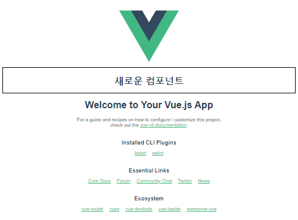
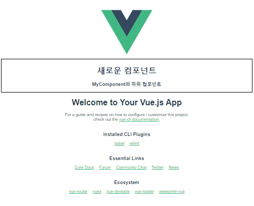
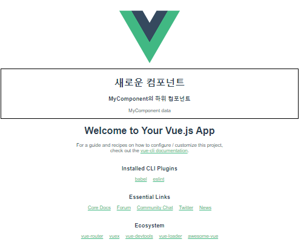
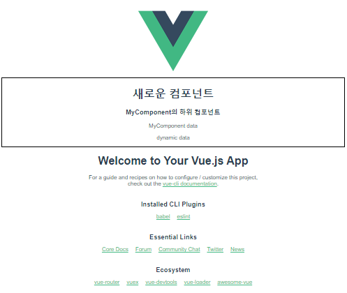
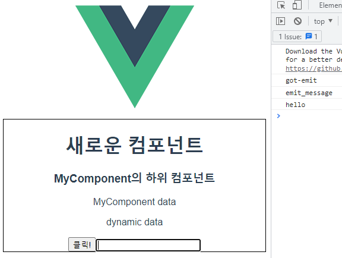

# Vue CLI

## Vue CLI

### Node.js

- 자바스크립트는 브라우저를 조작하는 유일한 언어이지만 브라우저 밖에서는 구동할 수 없음

- 자바스크립트를 브라우저 밖에서도 사용할 수 있도록 런타임 환경을 만든 것이 Node.js

- NPM (Node Package Manager)
  
  - 자바스크립트 패키지 관리자
    
    - 다양한 의존성 패키지를 관리
  
  - Node.js의 기본 패키지 관리자

### Vue CLI

- Vue CLI
  
  - Vue 개발을 위한 표준 도구
  
  - 프로젝트의 구성을 도와주는 역할
  
  - 확장 플러그인, GUI, Babel 등 다양한 툴 제공

- Vue CLI 프로젝트 생성 및 실행
  
  - 설치
    
    ```bash
    $ npm install -g @vue/cli
    ```
  
  - 프로젝트 생성
    
    - vscode terminal에서 진행 (선택해야 하는 부분이 있기 때문)
      
      ```bash
      $ vue create vue-cli
      ```
  
  - Vue 버전 선택
  
  - 프로젝트 생성 성공 후 프로젝트 디렉토리로 이동
    
    ```bash
    $ cd vue-cli
    ```
  
  - 프로젝트 실행
    
    ```bash
    npm run serve
    ```

- Vue CLI 프로젝트 구조
  
  - node_modules
    
    - node.js 환경의 여러 의존성 모듈
    
    - python의 venv와 비슷한 역할을 함
      
      - 따라서 .gitignore에 넣어주어야 하며, Vue 프로젝트를 생성하면 자동으로 추가됨
  
  - Babel
    
    - JavaScript compiler
    
    - 자바스크립트의 ES6+ 코드를 '구버전'으로 번역/변환해주는 도구
    
    - 자바스크립트의 파편화, 표준화의 영향으로 작성된 코드의 스펙트럼이 매우 다양
      
      - 최신 문법을 사용해도 브라우저의 버전 별로 동작하지 않는 상황이 발생
      
      - 버전에 따른 같은 의미의 다른 코드를 작성하는 등의 대응이 필요해졌고, 이러한 문제를 해결하기 위한 도구
      
      - 원시 코드(최신 버전)를 목적 코드(구 버전)로 옮기는 번역기가 등장하면서 더 이상 코드가 특정 브라우저에서 동작하지 않는 상황에 대해 크게 고민하지 않을 수 있음
  
  - node_modules - Webpack
    
    - `static module bundler`
    
    - 모듈 간의 의존성 문제를 해결하기 위한 도구
    
    - 프로젝트에 필요한 모든 모듈을 매핑하고 내부적으로 종속성 그래프를 빌드함
    
    - `Module`
      
      - Module
        
        - 개발하는 애플리케이션의 크기가 커지고 복잡해지면 파일 하나에 모든 기능을 담기가 어려워짐
        
        - 따라서 자연스럽게 파일을 여러 개로 분리하여 관리하게 되었고, 이 때 분리된 파일 각각이 모듈(module)
        
        - 즉 js 파일 하나가 하나의 모듈임
        
        - 모듈은 대개 기능 단위로 분리하며, 클래스 하나 혹은 특정한 목적으로 가진 복수의 함수로 구성된 라이브러리 하나로 구성
      
      - Module의 의존성 문제
        
        - 모듈의 수가 많아지고 라이브러리 혹은 모듈 간의 의존성(연결성)이 깊어지면서 특정한 곳에서 발생한 문제가 어떤 모듈 간의 문제인지 파악하기 어려움
          
          - Module 간의 의존성 문제를 해결하기 위해 Webpack 등장
    
    - `Bundler`
      
      - 모듈 의존성 문제를 해결해주는 작업을 하는 도구
      
      - 모듈을 하나로 묶어주고 묶인 파일은 하나(혹은 여러 개)로 만들어짐
      
      - Bundling된 결과물은 개별 모듈의 실행 순서에 영향을 받지 않고 동작하게 됨
    
    - 의존성을 Webpack이 담당하므로 개발자는 npm install을 사용해 다양한 모듈을 한 번에 설치하고 각 모듈을 사용해 개발에 집중할 수 있음
  
  - package.json
    
    - 프로젝트의 종속성 목록과 지원되는 브라우저에 대한 구성 옵션을 포함
  
  - package-lock.json
    
    - node_modules에 설치되는 모듈과 관련된 모든 의존성을 설정 및 관리
    
    - 협업 및 배포 환경에서 정확히 동일한 종속성을 설치하도록 보장하는 표현
    
    - 사용할 패키지의 버전을 고정
    
    - 개발 과정 간의 의존성 패키지 충돌 방지
    
    - python의 requirements.txt 역할
  
  - public/index.html
    
    - Vue 앱의 뼈대가 되는 html 파일
    
    - Vue 앱과 연결될 요소가 있음
  
  - src/
    
    - src/assets
      
      - 정적 파일을 저장하는 디렉토리
    
    - src/components
      
      - 하위 컴포넌트가 위치
    
    - **src/App.vue**
      
      - 최상위 컴포넌트
      
      - public/index.html과 연결됨
    
    - src/main.js
      
      - webpack이 빌드를 시작할 때 가장 먼저 불러오는 entry point
      
      - public/index.html과 src/App.vue를 연결시키는 작업이 이루어지는 곳
      
      - Vue 전역에서 활용할 모듈을 등록할 수 있는 파일

## SFC

### Component

- Component
  
  - UI를 독립적이고 재사용 가능한 조각들로 나눈 것
    
    - 기능별로 분화한 코드 조각
  
  - CS에서는 다시 사용할 수 있는 범용성을 위해 개발된 소프트웨어 구성 요소를 의미
  
  - 하나의 app을 구성할 때 중첩된 컴포넌트의 tree로 구성하는 것이 보편적임
    
    - src/App.vue를 root node로 하는 tree의 구조를 가짐
  
  - 컴포넌트는 유지보수를 쉽게 만들어줄 뿐만 아니라 재사용성의 측면에서도 매우 강력한 기능을 제공
  
  - 하나의 컴포넌트를 만들어두면 반복되는 UI를 쉽게 처리할 수 있음

- component based architecture의 특징
  
  - 관리가 용이
    
    - 유지/보수 비용 감소
  
  - 재사용성
  
  - 확장 가능
  
  - 캡슐화
  
  - 독립적

### SFC

- SFC (Single File Component)
  
  - 하나의 `.vue` 파일이 하나의 Vue instance이고, 하나의 컴포넌트이다
  
  - Vue instance에서는 HTML, CSS, JavaScript 코드를 한번에 관리
    
    - Vue instance를 **기능 단위로 작성**하는 것이 핵심
    
    - 컴포넌트 기반 개발의 핵심 기능

### Vue component

- Vue component 구조
  
  - 템플릿(HTML)
    
    - HTML의 body 부분
    
    - 눈으로 보여지는 요소 작성
    
    - 다른 컴포넌트를 HTML 요소처럼 추가 가능
  
  - 스크립트(JavaScript)
    
    - JavaScript 코드가 작성되는 곳
    
    - 컴포넌트 정보, 데이터, 메서드 등 vue 인스턴스를 구성하는 대부분이 작성됨
  
  - 스타일(CSS)
    
    - CSS가 작성되며 컴포넌트의 스타일을 담당

### Vue component 실습

- Vue CLI를 실행한 직후의 구조
  
  - Vue CLI를 실행하면 이미 HelloWorld.vue라는 컴포넌트가 생성되어 있고 App.vue에 등록되어 사용되고 있음

- 하위 컴포넌트 MyComponent 생성 후 실습해보기
  
  - src/components/ 안에 생성
  
  - script에 이름 등록
  
  - template에 요소 추가
    
    - templates 안에는 반드시 하나의 요소만 추가 가능
      
      - 비어있어도 안됨
      
      - 해당 요소 안에 추가 요소를 작성해야 함
    
    ```html
    // MyComponent.vue
    
    <template>
      <div class="border">
        <h1>새로운 컴포넌트</h1>
      </div>
    </template>
    
    <script>
    export default {
      name: 'MyComponent',
    }
    </script>
    
    <style>
      .border {
        border: solid 1px black;
      }
    </style>
    ```

- component 등록 3단계
  
  - 불러오기
    
    - `import {instance name} from {위치}`
    
    - instance name은 instance 생성 시 작성한 name
    
    - @는 src의 shortcut
    
    - `.vue` 생략 가능
  
  - 등록하기
  
  - 보여주기
    
    ```html
    <template>
      <div id="app">
        
        <!-- 3. 보여주기 -->
        <MyComponent/>
        <HelloWorld msg="Welcome to Your Vue.js App"/>
      </div>
    </template>
    
    <script>
    import HelloWorld from './components/HelloWorld.vue'
    // 1. 불러오기
    // import MyComponent from './components/MyComponent.vue'
    import MyComponent from '@/components/MyComponent'
    
    export default {
      name: 'App',
      components: {
        HelloWorld,
        // 2. 등록하기
        MyComponent,
      }
    }
    </script>
    
    <style>
    #app {
      font-family: Avenir, Helvetica, Arial, sans-serif;
      -webkit-font-smoothing: antialiased;
      -moz-osx-font-smoothing: grayscale;
      text-align: center;
      color: #2c3e50;
      margin-top: 60px;
    }
    </style>
    ```
    
    

- MyComponent의 자식 컴포넌트 생성
  
  - src/components/ 안에 MyComponentItem 생성
    
    ```html
    // MyComponentItem.vue
    
    <template>
      <div>
        <h3>MyComponent의 하위 컴포넌트</h3>
      </div>
    </template>
    
    <script>
    export default {
      name: 'MyComponentItem',
    }
    </script>
    
    <style>
    
    </style>
    ```
  
  - MyComponent에 등록
    
    ```html
    // MyComponent.vue
    
    <template>
      <div class="border">
        <h1>새로운 컴포넌트</h1>
        <!-- 3. 보여주기 -->
        <MyComponentItem/>
      </div>
    </template>
    
    <script>
    // 1. 불러오기
    import MyComponentItem from '@/components/MyComponentItem'
    
    export default {
      name: 'MyComponent',
      // 2. 등록하기
      components: {
        MyComponentItem,
      }
    }
    </script>
    
    <style>
      .border {
        border: solid 1px black;
      }
    </style>
    ```
    
    

## Pass Props & Emit Events

### Data in components

- Data in components
  
  - 필요한 컴포넌트끼리 데이터를 주고 받는 경우
    
    - 데이터의 흐름을 파악하기 힘듦
    
    - 개발 속도 저하
    
    - 유지보수 난이도 증가
  
  - 컴포넌트가 부모-자식 관계를 가지고 있으므로 부모-자식 관계만 데이터를 주고 받도록 하는 경우
    
    - 데이터의 흐름을 파악하기 용이
    
    - 유지 보수하기 쉬워짐

- pass props & emit events
  
  - pass **props**
    
    - 부모에서 자식으로의 데이터 흐름
  
  - **emit** event
    
    - 자식에서 부모로의 데이터 흐름

### Pass Props

- Pass Props
  
  - 부모에서 자식으로의 data 전달 방식
  
  - 정적인 데이터를 전달하는 경우 static props라고 명시하기도 함
  
  - **요소의 속성**을 사용하여 데이터 전달이 가능하며 `prop-data-name="value"`의 형태로 데이터를 전달
    
    - 이 때 속성의 키 값은 **kebab-case**를 사용
    
    - html 파일에서 보내기 때문
    
    - props로 받을 때는 JS 표현식을 이용하기 때문에 **camelCase** 사용
  
  - props는 부모 컴포넌트의 정보를 전달하기 위한 사용자 지정 특성
  
  - 자식 컴포넌트는 props 옵션을 사용하여 수신하는 props를 명시적으로 선언해야 함
    
    - 전달받은 props를 type과 함께 명시
  
  - 컴포넌트를 문서화할 뿐만 아니라, 잘못된 타입을 전달하는 경우 브라우저의 자바스크립트 콘솔에서 사용자에게 경고
  
  ```html
  // MyComponent.vue (부모)
  
  <template>
    <div class="border">
      <h1>새로운 컴포넌트</h1>
      <!-- 요소의 속성을 사용하여 전달, kebab-case 사용 -->
      <MyComponentItem static-props="MyComponent data"/>
    </div>
  </template>
  
  <script>
  import MyComponentItem from '@/components/MyComponentItem'
  
  export default {
    name: 'MyComponent',
    components: {
      MyComponentItem,
    }
  }
  </script>
  
  <style>
    .border {
      border: solid 1px black;
    }
  </style>
  ```
  
  ```html
  // MyComponentItem.vue (자식)
  
  <template>
    <div>
      <h3>MyComponent의 하위 컴포넌트</h3>
      <!-- camelCase 사용 -->
      <p>{{ staticProps }}</p>
    </div>
  </template>
  
  <script>
  export default {
    name: 'MyComponentItem',
    // props 명시적으로 선언
    props: {
      staticProps: String,
    }
  }
  </script>
  
  <style>
  
  </style>
  ```
  
  

- Dynamic props
  
  - 변수를 props로 전달할 수 있음
  
  - v-bind directive를 사용해 데이터를 동적으로 바인딩
  
  - 부모 컴포넌트의 데이터가 업데이트 되면 자식 컴포넌트로 전달되는 데이터 또한 업데이트 됨
  
  ```html
  // MyComponent.vue (부모)
  
  <template>
    <div class="border">
      <h1>새로운 컴포넌트</h1>
      <!-- Dynamic props, kebab-case 사용 -->
      <MyComponentItem
        static-props="MyComponent data"
        :my-props="dynamicProps"
      />
    </div>
  </template>
  
  <script>
  import MyComponentItem from '@/components/MyComponentItem'
  
  export default {
    name: 'MyComponent',
    components: {
      MyComponentItem,
    },
    // data 함수, camelCase 사용
    data: function () {
      return {
        dynamicProps: 'dynamic data',
      }
    }
  }
  </script>
  ```
  
  ```html
  // MyComponentItem.vue (자식)
  
  <template>
    <div>
      <h3>MyComponent의 하위 컴포넌트</h3>
      <!-- camelCase 사용 -->
      <p>{{ staticProps }}</p>
      <p>{{ myProps }}</p>
    </div>
  </template>
  
  <script>
  export default {
    name: 'MyComponentItem',
    // props 명시적으로 선언
    props: {
      staticProps: String,
      myProps: String,
    }
  }
  </script>
  ```
  
  - 컴포넌트의 data 함수
    
    - 각 vue 인스턴스는 같은 data 객체를 공유하므로 새로운 data 객체를 반환(return)하여 사용해야 함
  
  

- 단방향 데이터 흐름
  
  - 모든 props는 부모에서 자식으로 즉 아래로 단방향 바인딩을 형성
  
  - 부모 속성이 업데이트되면 자식으로 흐르지만 반대 방향은 아님
    
    - 부모 컴포넌트가 업데이트 될 때마다 자식 컴포넌트의 모든 prop이 최신 값으로 새로고침 됨
  
  - 목적
    
    - 하위 컴포넌트가 실수로 상위 컴포넌트 상태를 변경하여 앱의 데이터 흐름을 이해하기 힘들게 만드는 것을 방지
  
  - 하위 컴포넌트에서 prop을 변경하려고 시도해서는 안되며 그렇게 하면 Vue는 콘솔에서 경고를 출력함

### Emit Event

- 부모 컴포넌트에서 자식 컴포넌트로 데이터를 전달할 때는 **이벤트를 발생**시킴
  
  - 데이터를 이벤트 리스너의 콜백함수의 인자로 전달
  
  - 상위 컴포넌트는 해당 이벤트를 통해 데이터를 받음

- `$emit`
  
  - `$emit` 메서드를 통해 부모 컴포넌트에 이벤트를 발생
    
    - `$emit('event-name')` 형식으로 사용하며 부모 컴포넌트에 event-name이라는 이벤트가 발생했다는 것을 알림

- Emit Event
  
  - 자식 컴포넌트에 버튼을 만들고 클릭 이벤트를 추가
  
  - `$emit`을 통해 부모 컴포넌트에게 child-to-parent 이벤트를 트리거
  
  - emit된 이벤트를 상위 컴포넌트에서 청취 후 핸들러 함수 실행
    
    ```html
    // MyComponentItem.vue (자식)
    
    <template>
      <div>
        <h3>MyComponent의 하위 컴포넌트</h3>
        <p>{{ staticProps }}</p>
        <p>{{ dynamicProps }}</p>
        <!-- emit -->
        <button @click="childToParent">클릭!</button>
        <input
          type="text"
          v-model="childInputData"
          @keyup.enter="childInput"
        >
      </div>
    </template>
    
    <script>
    export default {
      name: 'MyComponentItem',
      props: {
        staticProps: String,
        dynamicProps: String,
      },
    
      data: function () {
        return {
          childInputData: null,
        }
      },
    
      methods: {
        childToParent: function () {
          // 부모 template에 작성되어야 하므로 kebab-case로 입력
          // 첫 번째 인자는 불러오는 이름, 두 번째 인자는 데이터
          this.$emit('emit-to-parent', 'emit_message')
        },
        childInput: function () {
          this.$emit('child-input', this.childInputData)
          this.childInputData = null
        },
      }
    }
    </script>
    ```
    
    ```html
    // MyComponent.vue (부모)
    
    <template>
      <div class="border">
        <h1>새로운 컴포넌트</h1>
        <MyComponentItem
          static-props="MyComponent data"
          :dynamic-props="dynamicProps"
          @emit-to-parent="parentGetEvent"
          @child-input="getDynamicData"
        />
      </div>
    </template>
    
    <script>
    import MyComponentItem from '@/components/MyComponentItem'
    
    export default {
      name: 'MyComponent',
      components: {
        MyComponentItem,
      },
      // data 함수, camelCase 사용
      data: function () {
        return {
          dynamicProps: 'dynamic data',
        }
      },
      // emit
      methods: {
        parentGetEvent: function (childData) {
          console.log('got-emit')
          console.log(childData)
        },
        getDynamicData: function (childInputData) {
          console.log(`${childInputData}`)
        }
      }
    }
    </script>
    
    <style>
      .border {
        border: solid 1px black;
      }
    </style>
    ```
    
    
  
  - Emit Event 흐름
    
    - 자식 컴포넌트에 있는 버튼 클릭 이벤트를 청취하여 연결된 핸들러 함수 호출
    
    - 호출된 함수에서 `$emit`을 통해 상위 컴포넌트에 이벤트 발생
    
    - 상위 컴포넌트는 자식 컴포넌트가 발생시킨 이벤트를 청취하여 연결된 핸들러 함수 호출
  
  - emit with data
    
    - 이벤트를 발생(emit)시킬 때 인자로 데이터를 전달 가능
    
    - 전달한 데이터는 이벤트와 연결된 부모 컴포넌트의 핸들러 함수의 인자로 사용 가능

- pass props / emit event 컨벤션
  
  - HTML 요소에서 사용할 때는 kebab-case
  
  - JavaScript에서 사용할 때는 camelCase
  
  - props
    
    - 상위 -> 하위 흐름에서 HTML 요소로 내려줌: kebab-case
    
    - 하위에서 받을 때 JavaScript에서 받음: camelCase
  
  - emit
    
    - emit 이벤트를 발생시키면 HTML 요소가 이벤트를 청취함: kebab-case
    
    - 메서드, 변수명 등은 JavaScript에서 사용함: camelCase
