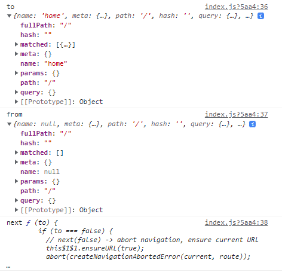

# Vue Router

## UX & UI

### UX & UI

- UX (User Experience)
  
  - 유저와 가장 가까이에 있는 분야, 데이터를 기반으로 유저를 조사하고 분석해서 개발자, 디자이너가 이해할 수 있게 소통
  
  - 좋은 UX
    
    - 사람들의 마음과 생각을 이해하고 정리해서 제품에 녹여내는 과정 필요
    
    - 유저 리서치, 데이터 설계 및 정제, 유저 시나리오, 프로토타입 설계 등이 필요

- UI (User Interface)
  
  - 유저에게 보여지는 화면을 디자인
  
  - 좋은 UI
    
    - 사용자가 보다 쉽게 편리하게 사용할 수 있도록 하는 부분까지 고려
    
    - 통일된 디자인을 위한 디자인 시스템, 소통을 위한 중간 산출물, 프로토타입 등이 필요

|      | UX 디자인                     | UI 디자인                      | GUI 디자인              |
|:----:|:--------------------------:|:---------------------------:|:--------------------:|
| 주요업무 | 사용자 요구사항, 비즈니스, 내부 이슈 조율   | 디바이스 지정, 구조, 구성 기획          | 비주얼 디자인, 브랜드 반영      |
| 형태   | 추상적, 목표 가치 수립              | 구체화, 디바이스 지정, 구조, 구성 기획안    | 구체적, 비주얼 디자인, 브랜드 반영 |
| 산출물  | UX 전략(방향성), 주요 기능, 주요 콘텐츠안 | 인포메이션 아키텍처, 네비게이션, 레이아웃 디자인 | 디자인 이미지, 스타일 가이드     |

### Prototyping

- Software prototyping
  
  - 애플리케이션의 프로토타입을 만드는 것
  
  - 개발 중인 소프트웨어 프로그램의 완성되기 전 버전을 만드는 것
  
  - 중간마다 현재 상태를 체크하는 과정

- Figma
  
  - 70% 이상의 Prototyping tool 시장 점유율
  
  - 협업에 중점을 두면서 UI/UX 설계에 초점을 맞춤
    
    - 실시간으로 팀원들이 협업할 수 있는 기능을 제공
  
  - 웹 기반 시스템을 가짐(웹 환경에서 동작)
    
    - 매우 가벼운 환경에서 실행가능, 모든 작업 내역에 웹에 저장됨
  
  - 직관적으로 다양한 디자인 툴 제공
  
  - 대부분의 기능을 무료로 사용할 수 있음

## Vue Router

### Routing

- Routing
  
  - 네트워크에서 경로를 선택하는 프로세스
  
  - 웹 서비스에서의 라우팅
    
    - 유저가 방문한 URL에 대해 적절한 결과를 응답하는 것

- Routing in SSR
  
  - URL로 요청이 들어오면 응답으로 완성된 HTML 제공
  
  - 서버가 모든 라우팅을 통제
  
  - 즉, Routing(URL)에 대한 결정권을 서버가 가짐

- Routing in SPA / CSR
  
  - 서버는 하나의 HTML만을 제공
  
  - 이후의 모든 동작은 하나의 HTML 문서 위에서 JavaScript 코드를 활용
  
  - 페이지 간의 이동이 없으므로 하나의 URL만 가짐
  
  - Routing이 없다면
    
    - 유저가 URL을 통한 페이지의 변화를 감지할 수 없음
    
    - 페이지가 무엇을 렌더링 중인지에 대한 상태를 알 수 없음
      
      - 새로고침 시 처음 페이지로 돌아감
      
      - 링크를 공유할 시 처음 페이지만 공유 가능
    
    - 브라우저의 뒤로 가기 기능을 사용할 수 없음

### Vue Router

- Vue의 공식 라우터

- 라우트(routes)에 컴포넌트를 매핑한 후, 어떤 URL에서 렌더링할지 알려줌
  
  - SPA를 MPA처럼 URL을 이동하면서 사용 가능
    
    - MPA (Multiple Page Application)
      
      - 여러 개의 페이지로 구성된 애플리케이션
      
      - SSR 방식으로 렌더링
  
  - SPA의 단점 중 하나인 URL이 변경되지 않는 부분을 해결

- Vue Router 실행하기
  
  ```bash
  // Vue 프로젝트 생성 및 디렉토리 이동 후
  $ vue add router  // Vue CLI를 통해 router plugin 적용
  ```
  
  - History mode
    
    - 브라우저의 History API를 활용한 방식
      
      - 새로고침 없이 URL 이동 기록을 남길 수 있음 (/)
    
    - History mode를 사용하지 않으면 Default 값이 hash mode로 설정됨 (#)

- router-link
  
  - URL을 이동시킴(a태그와 비슷한 기능)
    
    - routes에 등록된 컴포넌트와 매핑됨
    
    - 히스토리 모드에서 router-link는 클릭 이벤트를 차단하여 a태그와 달리 브라우저가 페이지를 다시 로드하지 않도록 함
  
  - 목표 경로는 to속성으로 지정됨
  
  - 기능에 맞게 HTML에서 a태그로 렌더링되지만 필요에 따라 다른 태그로 바꿀 수 있음

- router-view
  
  - 주어진 URL에 대해 일치하는 컴포넌트를 렌더링하는 컴포넌트
  
  - 실제 컴포넌트가 DOM에 부착되어 보이는 자리를 의미
  
  - router-link를 클릭하면 routes에 매핑된 컴포넌트를 렌더링

- src/router/index.js
  
  - 라우터에 관련된 정보 및 설정이 작성되는 곳
  
  - routes에 URL과 컴포넌트를 매핑

- src/Views
  
  - router-view에 들어갈 컴포넌트 작성
  
  - 폴더별 컴포넌트 배치 (권장사항)
    
    - views/
      
      - routes에 매핑되는 컴포넌트를 모아두는 폴더
      
      - 다른 컴포넌트와 구분하기 위해 View로 끝나도록 만드는 것을 권장
    
    - components/
      
      - routes에 매핑된 컴포넌트의 하위 컴포넌트를 모아두는 폴더

### Vue Router 실습

- 주소를 이동하는 2가지 방법
  
  - 선언적 방식 네비게이션
    
    - router-link의 to속성으로 주소 전달
      
      - routes에 등록된 주소와 매핑된 컴포넌트로 이동
        
        - App.vue
          
          ```html
          <template>
            <div id="app">
              <nav>
                <router-link to="/">Home</router-link> |
                <router-link to="/about">About</router-link> |
              </nav>
              <router-view/>
            </div>
          </template>
          ```
    
    - Named Routes를 이용하는 경우
      
      - 동적인 값을 사용하기 때문에 v-bind를 사용해야 정상적으로 작동
        
        - router/index.js
          
          ```js
          const routes = [
            {
              path: '/',
              name: 'home',
              component: HomeView
            },
            ...
          ]
          ```
        
        - App.vue
          
          ```html
          <template>
            <div id="app">
              <nav>
                <router-link :to="{ name: 'home' }">Home</router-link> |
                <router-link :to="{ name: 'about' }">About</router-link> |
              </nav>
              <router-view/>
            </div>
          </template>
          ```
  
  - 프로그래밍 방식 네비게이션
    
    - Vue 인스턴스 내부에서 라우터 인스턴스에 `$router`로 접근할 수 있음
    
    - 다른 URL로 이동하려면 `this.$router.push`를 사용
      
      - history stack에 이동한 URL을 넣는 방식
      
      - history stack에 기록이 남기 때문에 사용자가 브라우저의 뒤로 가기 버튼을 클릭하면 이전 URL로 이동할 수 있음
    
    - 동작 원리는 선언적 방식과 동일
    
    - AboutView.vue
      
      ```html
      <template>
        <div class="about">
          <h1>This is an about page</h1>
          <!-- 선언적 방식 -->
          <router-link :to="{ name: 'home' }">홈으로!</router-link>
          <!-- 프로그래밍 방식 -->
          <button @click="toHome">홈으로</button>
        </div>
      </template>
      ```
      
      ```js
      <script>
      export default {
        name: 'AboutView',
        methods: {
          toHome() {
            // 프로그래밍 방식
            this.$router.push({ name: 'home' })
          },
        },
      }
      </script>
      ```

- Dynamic Route Matching
  
  - 동적 인자 전달
    
    - URL의 특정 값을 변수처럼 사용할 수 있음
  
  - router/index.js
    
    ```js
    import HelloView from '@/views/HelloView'
    
    const routes = [
      ...,
      // route를 추가할 때 동적 인자를 명시 (:userName)
      {
        path: '/hello/:userName',
        name: 'hello',
        component: HelloView,
      },
    ]
    ```
  
  - views/HelloView.vue
    
    ```html
    <template>
      <div>
        <h1>hello, {{ $route.params.userName }}</h1>
        <h1>hello, {{ userName }}</h1>
      </div>
    </template>
    ```
    
    ```js
    <script>
    export default {
      name: 'HelloView',
      data() {
        return {
          userName: this.$route.params.userName
        }
      }
    }
    </script>
    ```
  
  - 선언적 방식 네비게이션
    
    - params를 이용하여 동적 인자 전달 가능
      
      ```html
      // App.vue
      
      <template>
        <div id="app">
          <nav>
            ...
            <router-link :to="{ name: 'hello', params: {userName: 'gello'} }">Hello</router-link>
          </nav>
          <router-view/>
        </div>
      </template>
      ```
  
  - 프로그래밍 방식 네비게이션
    
    ```html
    // AboutView.vue
    
    <template>
      <div class="about">
        ...
        <input
          type="text"
          v-model="inputData"
          @keyup.enter="goToHello"
        >
      </div>
    </template>
    ```
    
    ```js
    // AboutView.vue
    
    <script>
    export default {
      name: 'AboutView',
      data() {
        return {
          inputData: null,
        }
      },
    
      methods: {
        ...
        goToHello() {
          this.$router.push({ name: 'hello', params: { userName: this.inputData }})
        }
      },
    }
    </script>
    ```

- lazy-loading
  
  - 모든 파일을 한 번에 로드하려고 하면 모든 것을 다 읽는 시간이 오래 걸림
  
  - 미리 로드를 하지 않고 특정 라우트에 `방문할 때` 매핑된 컴포넌트의 코드를 로드하는 방식을 활용할 수 있음
    
    - 모든 파일을 한 번에 로드하지 않아도 되기 때문에 최초에 로드하는 시간이 빨라짐
    
    - 당장 사용하지 않을 컴포넌트는 먼저 로드하지 않는 것이 포인트 

## Navigation Guard

- 네비게이션 가드
  
  - Vue router를 통해 특정 URL에 접근할 때 다른 url로 redirect를 하거나 해당 URL로의 접근을 막는 방법
    
    - 예) 사용자의 인증 정보가 없으면 특정 페이지에 접근하지 못하게 함
  
  - 종류
    
    - 전역 가드: 애플리케이션 전역에서 동작
    
    - 라우터 가드: 특정 URL에서만 동작
    
    - 컴포넌트 가드: 라우터 컴포넌트 안에 정의

### 전역 가드

- Global Before Guard
  
  - 다른 url 주소로 이동할 때 항상 실행
  
  - router/index.js에 `router.beforeEach()`를 사용하여 설정
  
  - 콜백 함수의 값으로 3개의 인자를 받음
    
    
    
    - `to`: 이동할 URL 정보가 담긴 Route 객체
    
    - `from`: 현재 URL 정보가 담긴 Route 객체
    
    - `next`: 지정한 URL로 이동하기 위해 호출하는 함수
      
      - 콜백 함수 내부에서 반드시 한 번만 호출되어야 함
      
      - 기본적으로 to에 해당하는 URL로 이동
  
  - URL이 변경되어 화면이 전환되기 전 router.beforeEach()가 호출됨
    
    - next()가 없다면 화면이 전환되지 않고 대기 상태가 됨
  
  - 변경된 URL로 라우팅하기 위해서는 next()를 호출해줘야 함
    
    - next()가 호출되기 전까지 화면이 전환되지 않음
    
    ```js
    // router/index.js
    
    const router = new VueRouter({
      mode: 'history',
      base: process.env.BASE_URL,
      routes
    })
    
    router.beforeEach((to, from, next) => {
      console.log('to', to)
      console.log('from', from)
      console.log('next', next)
      next()
    })
    
    export default router
    ```

- Login 여부에 따른 라우팅 처리
  
  - Login 페이지 생성 후 App.vue에 라우터 링크 추가
    
    - views/LoginView.vue
      
      ```html
      <template>
        <div>
          <h1>로그인 페이지</h1>
        </div>
      </template>
      
      <script>
      export default {
        name: 'LoginView',
      }
      </script>
      
      <style>
      
      </style>
      ```
    
    - router/index.js
      
      ```js
      import LoginView from '@/views/LoginView'
      
      const routes = [
        ...
        {
          path: '/login',
          name: 'login',
          component: LoginView,
        },
      ]
      ```
    
    - App.vue
      
      ```html
      <template>
        <div id="app">
          <nav>
            ...
            <router-link :to="{ name: 'login' }">Login</router-link>
          </nav>
          <router-view/>
        </div>
      </template>
      ```
  
  - Login이 되어있지 않다면 Login 페이지로 이동하는 기능 추가
    
    ```js
    // router/index.js
    
    const router = new VueRouter({
      mode: 'history',
      base: process.env.BASE_URL,
      routes
    })
    
    router.beforeEach((to, from, next) => {
      // 로그인 여부
      const isLoggedIn = false
    
      // 로그인이 필요한 페이지 (지금은 hello)
      const authPages = ['hello']
    
      const isAuthRequired = authPages.includes(to.name)
    
      // 로그인이 필요하지 않은 페이지만 따로 받을 수도 있음
      // const allowAllPages = ['login']
      // const isAuthRequired2 = !allowAllPages.includes(to.name)
    
      if (isAuthRequired && !isLoggedIn) {
        console.log('Login으로 이동!')
        next({ name: 'login'})
      } else {
        console.log('to로 이동!')
        next()
      }
    })
    
    export default router
    ```
  
  - console창에 log가 2개 찍힌 이유
    
    - 첫번째 출력은 about으로 접속 시도 후 전역 가드에서 login으로 이동 요청할 때 출력
    
    - 두 번째 출력은 login으로 이동 요청할 때 출력
    
    - 재귀 알고리즘 생각하면 이해 쉬움
      
      - 그래도 이해가 안되면 console.log('Login으로 이동!')과 next({ name: 'login'})의 순서를 바꾼 후 실행해보기
  
  - 반대로 Login하지 않아도 되는 페이지를 모아둘 수도 있음

### 라우터 가드

- 라우터 가드
  
  - 전체 route가 아닌 `특정 route에 대해서만 가드를 설정하고 싶을 때` 사용
  
  - `beforeEnter()`
    
    - route에 진입했을 때 실행됨
    
    - 라우터를 등록한 위치에 추가
    
    - 매개변수, 쿼리, 해시 값이 변경될 때는 실행되지 않고 다른 경로에서 탐색할 때만 실행됨
    
    - 콜백 함수는 to, from, next를 인자로 받음

- Login 여부에 따른 라우팅 처리
  
  - 이미 로그인 되어 있는 경우 Login 페이지 접속 시도 시 HomeView로 이동하기
    
    ```js
    // router/index.js
    
    // 로그인 여부에 대한 임시 변수 생성
    const isLoggedIn = true
    
    const routes = [
      {
        path: '/login',
        name: 'login',
        component: LoginView,
        beforeEnter(to, from, next) {
          if (isLoggedIn === true) {
            console.log('이미 로그인 되어있음')
            next({ name: 'home' })
          } else {
            next()
          }
        }
      },
    ]
    ```

### 컴포넌트 가드

- 컴포넌트 가드
  
  - 특정 컴포넌트 내에서 가드를 지정하고 싶을 때 사용
  
  - `beforeRouteUpdate()`
    
    - 해당 컴포넌트를 렌더링하는 경로가 변경될 때 실행

- Params 변화 감지
  
  - About 페이지에서 값을 입력 후 Hello 페이지로 이동
    
    - URL은 변하지만 페이지는 변화하지 않음
      
      
      
      - 컴포넌트가 재사용되었기 때문
      
      - 기존 컴포넌트를 지우고 새로 만드는 것보다 효율적
        
        - lifecycle hook이 호출되지는 않음
        
        - beforeRouteUpdate()를 이용하여 처리
  
  - beforeRouteUpdate() 이용
    
    ```js
    // views/HelloView.vue
    
    <script>
    export default {
      name: 'HelloView',
      data() {
        return {
          userName: this.$route.params.userName
        }
      },
      beforeRouteUpdate(to, from, next) {
        this.userName = to.params.userName
        next()
      }
    }
    </script>
    ```
    
    - userName을 이동할 params에 있는 userName으로 재할당

### 404 Not Found

- 404 Not Found
  
  - 404 Not Found 페이지 만들기
    
    - views/NotFound404.vue
      
      ```html
      <template>
        <div>
          <h1>404 Not Found</h1>
        </div>
      </template>
      
      <script>
      export default {
        name: 'NotFound404',
      }
      </script>
      ```
    
    - router/index.js
      
      ```js
      import NotFound404 from '@/views/NotFound404'
      
      const routes = [
        ...
        {
          path: '/404',
          name: 'NotFound404',
          component: NotFound404,
        },
      ]
      ```
  
  - 요청한 리소스가 존재하지 않는 경우
    
    - 모든 경로에 대해서 404 page로 redirect 시키기
      
      - 기존에 명시한 경로가 아닌 모든 경로가 404 page로 redirect 됨
      
      - 이 때 `routes에 최하단부에 작성해야 함`
        
        ```js
        // router/index.js
        
        const routes = [
          ...
          {
            path: '*',
            redirect: '/404',
          },
        ]
        ```
  
  - 형식은 유효하지만 특정 리소스를 찾을 수 없는 경우
    
    - 데이터가 없음을 명시하고 404 page로 이동
      
      ```js
      // vue 파일
      
      axios({
          method: 'get',
          url: url
      })
        .then((response) => {
          console.log(response)
        })
        .catch((error) => {
          this.message = `${this.$route.params.Url}은 없는 주소입니다.`
          console.log(error)
        })
      ```
    
    - 요청이 실패할 경우 `this.$router.push`를 이용하여 404 페이지로 이동시킬 수도 있음
      
      ```js
      axios({
          method: 'get',
          url: url
      })
        .then((response) => {
          console.log(response)
        })
        .catch((error) => {
          this.$router.push('/404')
          console.log(error)
        })
      ```
