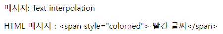
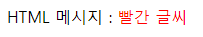
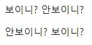
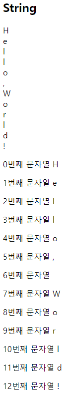
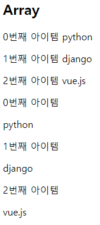
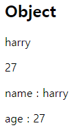
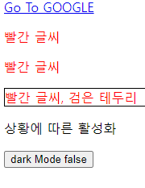
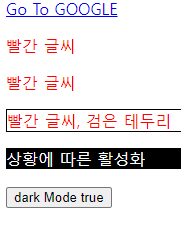
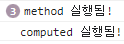

# Vue_basic

## Vue intro

### Front-end Development

- Front-end Framework
  
  - FE(Front-end Framework)
    
    - 사용자에게 보여주는 화면 만들기
  
  - Web App(SPA)을 만들 때 사용하는 도구
    
    - SPA(Single Page Application)

- Web App
  
  - 웹 브라우저에서 실행되는 어플리케이션 소프트웨어
  
  - 웹 페이지가 그대로 보이는 것이 아닌 디바이스에 설치된 App처럼 보이는 것
  
  - 웹 페이지가 디바이스에 맞는 적절한 UX/UI로 표현되는 형태

- SPA(Single Page Application)
  
  - 서버에서 최초 1장의 HTML만 전달받아 모든 요청에 대응하는 방식
    
    - CSR(Client Side Rendering) 방식으로 요청

- SSR과 CSR
  
  - SSR(Server Side Rendering)
    
    - Server가 사용자의 요청에 적합한 HTML을 렌더링하여 제공하는 방식
    
    - 전달받은 새 문서를 보여주기 위해 브라우저는 새로고침을 진행
  
  - CSR(Client Side Rendering)
    
    - 최초 한 장의 HTML을 받아오는 것은 동일하지만 Server로부터 최초로 받아오는 문서는 빈 HTML 문서
    
    - 각 요청에 대한 대응을 JavaScript를 사용하여 필요한 부분만 다시 렌더링
      
      - 새로운 페이지를 서버에 AJAX로 요청
      
      - 서버는 화면을 그리기 위해 필요한 데이터를 JSON 방식으로 전달
      
      - JSON 데이터를 JavaScript로 처리, DOM 트리에 반영(렌더링)
  
  - 제공하려는 서비스에 적합한 렌더링 방식을 적절하게 활용할 수 있어야 함

- CSR
  
  - CSR방식의 장점
    
    - 모든 HTML 페이지를 서버로부터 받아서 표시하지 않아도 됨
      
      - 클라이언트 - 서버간 통신 즉, 트래픽이 감소
      
      - 트래픽이 감소한다는 것은 응답 속도가 빨라진다는 것을 의미
    
    - 매번 새 문서를 받아 새로고침하는 것이 아니라 필요한 부분만 고쳐나가므로 각 요청이 끊김없이 진행됨
      
      - 요청이 자연스럽게 진행되면서 UX 향상
    
    - BE와 FE의 작업 영역을 명확히 분리할 수 있음
      
      - 각자 맡은 역할을 명확히 분리하여 협업이 용이해짐
  
  - CSR방식의 단점
    
    - 첫 구동 시 필요한 데이터가 많으면 많을수록 최초 작동 시작까지 오랜 시간이 소요
    
    - 검색 엔진 최적화(SEO, Search Engine Optimization)가 어려움
      
      - 서버가 제공하는 것은 빈 HTML
      
      - 내용을 채우는 것은 AJAX의 요청으로 얻은 JSON 데이터로 클라이언트(브라우저)가 진행
    
    - 대체적으로 HTML에 작성된 내용을 기반으로 하는 검색 엔진에 빈 HTML을 공유하는 SPA 서비스가 노출되기는 어려움

### Vue 사용하기

- Vue를 사용하는 이유
  
  - 다른 Framework보다 가볍고, 간편하게 사용할 수 있는 Framework
  
  - 직관적인 구조
  
  - FE Framework를 빠르고 쉽게 학습하고 활용 가능

- Vue로 코드 작성하기
  
  - Vanilla JS만으로 모든 데이터를 조작한다면 반복적인 코드를 일일히 입력해야하지만 Vue를 통해 데이터를 관리하면 변경 사항을 한 번에 반영할 수 있음
  
  - Vue CDN 가져오기
  
  - Vue instance 생성
  
  - el, data 설정
    
    - data에 관리할 속성 정의
  
  - 선언적 렌더링 `{{}}`
    
    - Vue data를 화면에 렌더링
  
  - input tag에 `v-model` 작성

## Vue instance

- MVVM Pattern
  
  - 소프트웨어 아키텍처 패턴의 일종
  
  - 마크업 언어로 구현하는 그래픽 사용자 인터페이스(view)의 개발을 Back-end(model)로 분리시켜 view가 어느 특정한 모델 플랫폼에 종속되지 않도록 함
  
  - 서로 의존성은 줄고 독립성은 증가함
  
  
  
  - View: DOM
  
  - Model: 실제 데이터 (JSON)
  
  - View Model (Vue)
    
    - View를 위한 Model
    
    - View와 연결되어 Action을 주고 받음
    
    - Model이 변경되면 View Model도 변경되고 바인딩된 View도 변경됨
    
    - **View에서 사용자가 데이터를 변경하면 View Model의 데이터가 변경되고 바인딩된 다른 View도 변경됨**

- Vue instance 생성하기
  
  ```html
  <!DOCTYPE html>
  <html lang="en">
  <head>
    ...
  </head>
  <body>
    <!-- Vue CDN -->
    <script src="https://cdn.jsdelivr.net/npm/vue@2/dist/vue.js"></script>
    <script>
      const vm = new Vue()
      console.log(vm)
    </script>
  </body>
  </html>
  ```
  
  - Vue CDN 가져오기
  
  - new 연산자를 사용하여 생성자 함수 호출 및 Vue instance 생성
  
  - Vue instance는 1개의 객체이고 아주 많은 속성과 메서드를 이미 가지고 있음
    
    - 이러한 기능을 사용할 것
  
  - 생성자 함수
    
    - 동일한 구조의 객체를 여러 개 만들고 싶을 때 사용
    
    - 생성자 함수를 사용할 때는 반드시 new 연산자를 사용
    
    - 함수 이름은 반드시 대문자로 시작

- el (element)
  
  - Vue instance와 DOM을 연결하는 옵션
    
    - View와 Model을 연결하는 역할
    
    - HTML id 혹은 class와 연결 가능
  
  - Vue instance와 연결되지 않은 DOM 외부는 Vue의 영향을 받지 않음
    
    - Vue 속성 및 메서드 사용 불가
  
  ```html
  <!DOCTYPE html>
  <html lang="en">
  <head>
    ...
  </head>
  <body>  
    <!-- Vue CDN -->
    <script src="https://cdn.jsdelivr.net/npm/vue@2/dist/vue.js"></script>
    <script>
      const app = new Vue({
        el: '#app',
      })
      console.log(app)
    </script>
  </body>
  </html>
  ```
  
  - 새로운 Vue 인스턴스를 생성한 후 생성자 함수 첫번째 인자로 Object 작성
  
  - el 옵션에 #app을 작성하여 body에서 id가 app인 div와 연결 (DOM 연결)
  
  - 인스턴스를 출력하면 app의 Vue 정보가 나오고 `$el:div#app`과 같이 el옵션을 확인할 수 있음

- data
  
  - Vue instance의 데이터 객체 혹은 인스턴스 속성
  
  - 데이터 객체는 반드시 기본 객체 `{} (Object)`여야 함
  
  - 객체 내부의 아이템들은 value로 모든 타입의 객체를 가질 수 있음
  
  - 정의된 속성은 `interpolation {{}}`을 통해 view에 렌더링 가능함
  
  ```html
  <!DOCTYPE html>
  <html lang="en">
  <head>
    ...
  </head>
  <body>
    <!-- 아래에 생성한 app과 연결되어 있으므로
    해당 message 값이 출력됨 -->
    <div id="app">
      {{ message }}
    </div>
  
    <!-- 연결된 객체가 없으므로
    `{{ message }}`를 그대로 출력 -->
    <div>
      {{ message }}
    </div>
  
    <!-- Vue CDN -->
    <script src="https://cdn.jsdelivr.net/npm/vue@2/dist/vue.js"></script>
    <script>
      const app = new Vue({
        el: '#app',
        data: {
          message: 'Hello, Vue!'
        },
      })
      console.log(app)
    </script>
  </body>
  </html>
  ```
  
  - 추가된 객체의 각 값은 `this.message` 형태로 접근 가능

- methods
  
  - Vue instance의 method를 정의하는 곳
  
  - methods 객체 정의
    
    - 객체 내 print method 정의
    
    - print method 실행 시 Vue instance의 data 내 message 출력
      
      ```html
      <script>
        const app = new Vue({
          el: '#app',
          data: {
            message: 'Hello, Vue!'
          },
          methods: {
            print: function () {
              console.log(this.message)
            },
          }
        })
        console.log(app)
      </script>
      ```
    
    - 콘솔창에서 `객체.print()` (여기서는 app.print()) 실행 시 확인 가능
      
      
  
  - method를 호출하여 data 변경 가능
    
    - 객체 내 bye method 정의
    
    - print method 실행 시 Vue instance의 data 내 message 변경
    
    ```html
    <script src="https://cdn.jsdelivr.net/npm/vue@2/dist/vue.js"></script>
    <script>
      const app = new Vue({
        el: '#app',
        data: {
          message: 'Hello, Vue!'
          },
    
        methods: {
          print: function () {
            console.log(this.message)
          },
    
          bye: function () {
            this.message = 'Bye, Vue!'
          },
    
        }
      })
      console.log(app)
    </script>
    ```
  
  - 콘솔창에 app.bye() 실행
    
    - DOM에 바로 변경된 결과 반영
    
    - Vue의 강력한 반응성 확인 가능
  
  - methods with Arrow Function
    
    - **메서드를 정의할 때 Arrow Function을 사용하면 안됨**
    
    - Arrow Function의 this는 함수가 선언될 때 상위 스코프를 가리키므로 메서드 정의할 때 사용하면 this가 window를 가리키게 됨
    
    - 호출은 문제없이 가능하지만 this로 Vue의 data를 변경할 수 없음

## Basic Syntax

- Template Syntax
  
  - 렌더링 된 DOM을 기본 Vue instance의 data에 선언적으로 바인딩할 수 있는 HTML 기반 template syntax를 사용
    
    - 렌더링 된 DOM: 브라우저에 의해 보기 좋게 그려질 HTML 코드
    
    - HTML 기반 template syntax: HTML 코드에 직접 작성할 수 있는 문법 제공
    
    - 선언적으로 바인딩: Vue instance와 DOM을 연결
  
  - Vue guide의 template syntax 참고

- Template Interpolation
  
  - 가장 기본적인 바인딩(연결) 방법
  
  - 중괄호 2개로 표기 `{{}}`
  
  - Template interpolation 방법은 HTML을 일반텍스트로 표현
  
  ```html
  <div id="app">
    <p>메시지: {{ msg }}</p>   
    <p>HTML 메시지 : {{ rawHTML }}</p>
  </div>
  
  <script src="https://cdn.jsdelivr.net/npm/vue@2/dist/vue.js"></script>
  <script>
    const app = new Vue({
      el: '#app',
      data: {
        msg: 'Text interpolation',
        rawHTML: '<span style="color:red"> 빨간 글씨</span>'
      }
    })
  </script>
  ```
  
  

- RAW HTML
  
  - `v-html` directive를 사용하여 data와 바인딩
    
    - directive: HTML 기반 template syntax
  
  - HTML의 기본 속성이 아닌 Vue가 제공하는 특수 속성의 값으로 data를 작성
  
  ```html
  <div id="app">
    <p>HTML 메시지 : <span v-html="rawHTML"></span></p>
  </div>
  
  <script src="https://cdn.jsdelivr.net/npm/vue@2/dist/vue.js"></script>
  <script>
    const app = new Vue({
      el: '#app',
      data: {
        rawHTML: '<span style="color:red"> 빨간 글씨</span>'
      }
    })
  </script>
  ```
  
  

- JS 표현식 형태로도 작성 가능
  
  ```html
  <div id="app">
    <p>{{ msg.split('').reverse().join('') }}</p>
  </div>
  
  <script src="https://cdn.jsdelivr.net/npm/vue@2/dist/vue.js"></script>
  <script>
    const app = new Vue({
      el: '#app',
      data: {
        msg: 'Text interpolation',
      }
    })
  </script>
  ```
  
  

## Directives

- Directives
  
  - v-접두사가 있는 특수 속성에는 값을 할당할 수 있음
    
    - 값에는 JS 표현식을 작성할 수 있음
  
  - directive의 역할은 표현식의 값이 변경될 때 반응적으로 DOM에 적용하는 것

- Directives 기본 구성
  
  - `Name : Argument . Modifires = " Value "`
    
    - 예시) v-on:submit.prevent="onSubmit"
    
    - : 를 통해 전달인자를 받을 수 있음
    
    - . 으로 표시되는 특수 접미사: directive를 특별한 방법으로 바인딩해야 함

- v-text
  
  - Template Interpolation과 함께 가장 기본적인 바인딩 방법
  
  - `{{}}`와 비슷한 역할
  
  ```html
  <div id="app">
    <p v-text="message"></p>
    <!-- 같음 -->
    <p>{{ message }}</p>
  </div>
  
  <script src="https://cdn.jsdelivr.net/npm/vue@2/dist/vue.js"></script>
  <script>
    const app = new Vue({
      el: '#app',
      data: {
        message: 'Hello!',
      }
    })
  </script>
  ```
  
  

- v-html
  
  - RAW HTML을 표현할 수 있는 방법
  
  - **사용자가 입력하거나 제공하는 컨텐츠에는 사용 금지**
    
    - XSS 공격
  
  ```html
  <div id="app">
    <p v-html="html"></p>
  </div>
  
  <script src="https://cdn.jsdelivr.net/npm/vue@2/dist/vue.js"></script>
  <script>
    const app = new Vue({
      el: '#app',
      data: {
        html: '<a href="https://www.google.com">GOOGLE</a>'
      }
    })
  </script>
  ```
  
    

- v-show와 v-if
  
  ```html
  <div id="app">
    <p v-show="isActive">보이니? 안보이니?</p>
    <p v-if="isActive">안보이니? 보이니?</p>
  </div>
  
  <script src="https://cdn.jsdelivr.net/npm/vue@2/dist/vue.js"></script>
  <script>
    const app = new Vue({
      el: '#app',
      data: {
        isActive: true
      }
    })
  </script>
  ```
  
  
  
  - v-show
    
    - 표현식에 작성된 값에 따라 element를 보여줄 것인지 결정
      
      - boolean 값이 변경될 때마다 반응
    
    - 대상 element의 display 속성을 기본 속성과 none으로 toggle
    
    - 요소 자체는 항상 DOM에 렌더링 됨
      
      - display 속성이 변경된 것이지 DOM에는 존재함
  
  - v-if
    
    - v-show와 사용 방법은 동일
    
    - 값이 false인 경우 DOM에서 사라짐
  
  - v-show와 v-if
    
    - v-show (Expensive initial load, cheap toggle)
      
      - **표현식 결과와 관계없이 렌더링**되므로 초기 렌더링에 필요한 비용은 v-if 보다 높을 수 있음
      
      - display 속성 변경으로 표현 여부를 판단하므로 렌더링 후 toggle 비용은 적음
    
    - v-if (Cheap initial load, expensive toggle)
      
      - **표현식 결과가 false인 경우 렌더링조차 되지 않**으므로 초기 렌더링 비용은 v-show보다 낮을 수 있음
      
      - 표현식 값이 자주 변경되는 경우 잦은 재렌더링으로 비용이 증가할 수 있음

- v-for
  
  - `for .. in ..` 형식으로 작성
  
  - 반복한 데이터 타입에 모두 사용 가능
  
  - 특수 속성 `key`
    
    - v-for 사용 시 반드시 key 속성을 각 요소에 작성해야 함
    
    - vue 화면 구성 시 이전과 달라진 점을 확인하는 용도로 활용
      
      - key가 중복되어서는 안됨
    
    - 각 요소가 고유한 값을 가지고 있지 않다면 생략할 수 있음
  
  - index를 함께 출력하려면 (char, index) 형태로 사용
    
    ```html
    <div id="app">
      <h2>String</h2>
      <div v-for="char in myStr">
        {{ char }}
      </div>
      <div v-for="(char, index) in myStr" :key="index">
        <p>{{ index }}번째 문자열 {{ char }}</p>
      </div>
    </div>
    
    <script src="https://cdn.jsdelivr.net/npm/vue@2/dist/vue.js"></script>
    <script>
      const app = new Vue({
        el: '#app',
        data: {
          myStr: 'Hello, World!',
        }
      })
    </script>
    ```
    
    
  
  - 배열도 문자열과 동일하게 사용 가능
  
  - 각 요소가 객체라면 dot notation으로 접근할 수 있음
    
    ```html
    <div id="app">
      <h2>Array</h2>
      <div v-for="(item, index) in myArr" :key="index">
        <p>{{ index }}번째 아이템 {{ item }}</p>
      </div>
      <div v-for="(item, index) in myArr2" :key="`arry-${index}`">
        <p>{{ index }}번째 아이템</p>
        <p>{{ item.name }}</p>
      </div>
    </div>
    
    <script src="https://cdn.jsdelivr.net/npm/vue@2/dist/vue.js"></script>
    <script>
      const app = new Vue({
        el: '#app',
        data: {
          myArr: ['python', 'django', 'vue.js'],
          myArr2: [
            { id: 1, name: 'python', completed: true},
            { id: 2, name: 'django', completed: true},
            { id: 3, name: 'vue.js', completed: false},
          ],
        }
      })
    </script>
    ```
    
    
  
  - 객체 순회 시 value가 할당되어 출력
  
  - 두번째 변수 할당 시 key값 출력 가능
    
    ```html
    <div id="app">
      <h2>Object</h2>
      <div v-for="value in myObj">
        <p>{{ value }}</p>
      </div>
      <div v-for="(value, key) in myObj"  :key="key">
        <p>{{ key }} : {{ value }}</p>
      </div>
    </div>
    
    <script src="https://cdn.jsdelivr.net/npm/vue@2/dist/vue.js"></script>
    <script>
      const app = new Vue({
        el: '#app',
        data: {
          myObj: {
            name: 'harry',
            age: 27
          },
        }
      })
    </script>
    ```
    
    
  
  - v-for과 v-if
    
    - v-if가 v-for보다 우선순위가 높음

- v-on
  
  - `:`을 통해 전달받은 인자를 확인
  
  - 대기하고 있던 이벤트가 발생하면 할당된 표현식 실행
  
  - method를 통한 data 조작도 가능
  
  - method에 인자를 넘기는 방법은 일반 함수를 호출할 때와 동일한 방식
  
  - `@` shortcut 제공
    
    ```html
    <div id="app">
      <button v-on:click="number++">increase Number</button>
      <p>{{ number }}</p>
    
      <button v-on:click="toggleActive">toggle isActive</button>
      <p>{{ isActive }}</p>
    
      <button @click="checkActive(isActive)">check isActive</button>
    </div>
    
    <script src="https://cdn.jsdelivr.net/npm/vue@2/dist/vue.js"></script>
    <script>
      const app = new Vue({
        el: '#app',
        data: {
          number: 0,
          isActive: false,
        },
        methods: {
          toggleActive: function () {
            this.isActive = !this.isActive
          },
    
          checkActive: function (check) {
            console.log(check)
          }
        }
      })
    </script>
    ```

- v-bind
  
  - HTML 기본 속성에 Vue data를 연결
  
  - class의 경우 다양한 형태로 연결 가능
    
    - 조건부 바인딩
      
      - `{'class Name': '조건 표현식'}`
      
      - 삼항 연산자도 가능
    
    - 다중 바인딩
      
      - `['JS표현식', 'JS표현식', ...]`
  
  - Vue data의 변화에 반응하여 DOM에 반영하므로 상황에 따라 유동적 할당 가능
  
  - `:` shortcut 제공
    
    ```html
    <head>
      ...
      <style>
        .red-text {
          color: red;
        }
        .border-black {
                border: solid 1px black;
            }
    
        .dark-mode {
          color: white;
          background-color: black
        }
    
        .white-mode {
          color: black;
          background-color: white;
        }
      </style>
    </head>
    <body>
      <div id="app">
        <a v-bind:href="url">Go To GOOGLE</a>
    
        <p v-bind:class="redTextClass">빨간 글씨</p>
        <p v-bind:class="{ 'red-text': true }">빨간 글씨</p>
        <p v-bind:class="[redTextClass, borderBlack]">빨간 글씨, 검은 테두리</p>
    
        <p :class="theme">상황에 따른 활성화</p>
        <button @click="darkModeToggle">dark Mode {{ isActive }}</button>
      </div>
    
      <script src="https://cdn.jsdelivr.net/npm/vue@2/dist/vue.js"></script>
      <script>
        const app = new Vue({
          el: '#app',
          data: {
            url: 'https://www.google.com/',
            redTextClass: 'red-text',
            borderBlack: 'border-black',
            isActive: true,
            theme: 'dark-mode'
          },
          methods: {
            darkModeToggle() {
              this.isActive = !this.isActive
              if (this.isActive) {
                this.theme = 'dark-mode'
              } else {
                this.theme = 'white-mode'
              }
            }
          }
        })
      </script>
    </body>
    ```
    
      

- v-model
  
  - Vue instance와 DOM의 **양방향 바인딩**
  
  - Vue data 변경 시 v-model로 연결된 사용자 입력 element에도 적용
    
    ```html
    <div id="app">
      <h2>1. Input -> Data</h2>
      <h3>{{ myMessage }}</h3>
      <input @input="onInputChange" type="text">
      <hr>
    
      <h2>2. Input <-> Data</h2>
      <h3>{{ myMessage2 }}</h3>
      <input v-model="myMessage2" type="text">
      <hr>
    </div>
    
    <script src="https://cdn.jsdelivr.net/npm/vue@2/dist/vue.js"></script>
    <script>
      const app = new Vue({
        el: '#app',
        data: {
          myMessage: '',
          myMessage2: '',
        },
        methods: {
          onInputChange: function (event) {
            this.myMessage = event.target.value
          },
        }
      })
    </script>
    ```

## Vue advanced

- computed
  
  - Vue instance가 가진 options 중 하나
  
  - computed 객체에 정의한 함수를 페이지가 최초로 렌더링될 때 호출하여 계산
    
    - 계산 결과가 변하기 전까지 함수를 재호출하는 것이 아닌 계산된 값을 반환

- methods와 computed
  
  - methods
    
    - 호출될 때마다 함수를 실행
    
    - 같은 결과여도 매번 새롭게 계산
  
  - computed
    
    - 함수의 종속 대상의 변화에 따라 계산 여부가 결정됨
    
    - 종속 대상이 변하지 않으면 항상 저장된 값을 반환
  
  ```html
  <div id="app">
    <h1>data_01 : {{ number1 }}</h1>
    <h1>data_02 : {{ number2 }}</h1>
    <hr>
    <h1>add_method : {{ add_method() }}</h1>
    <h1>add_method : {{ add_method() }}</h1>
    <h1>add_method : {{ add_method() }}</h1>
    <hr>
    <h1>add_computed : {{ add_computed }}</h1>
    <h1>add_computed : {{ add_computed }}</h1>
    <h1>add_computed : {{ add_computed }}</h1>
    <hr>
    <button v-on:click="dataChange">Change Data</button>
  </div>
  
  <script src="https://cdn.jsdelivr.net/npm/vue@2/dist/vue.js"></script>
  <script>
    const app = new Vue({
      el: '#app',
      data: {
        number1: 100,
        number2: 100
      },
      computed: {
        add_computed: function () {
          console.log('computed 실행됨!')
          return this.number1 + this.number2
        }
      },
      methods: {
        add_method: function () {
          console.log('method 실행됨!')
          return this.number1 + this.number2
        },
        dataChange: function () {
          this.number1 = 200
          this.number2 = 300
        }
      }
    })
  </script>
  ```
  
  

- watch
  
  - 특정 데이터의 변화를 감지하는 기능
    
    1. watch 객체를 정의
    
    2. 감시할 대상 data를 지정
    
    3. data가 변할 시 실행할 함수를 정의
  
  - 실행 함수를 Vue method로 대체 가능
    
    - 감시 대상 data의 이름으로 객체 생성
    
    - 실행하고자 하는 method를 handler에 문자열 형태로 할당
  
  - Array, Object의 내부 요소 변경 감지를 위해서는 deep 속성 추가 필요
  
  ```html
  <div id="app">
    <h3>Increase number</h3>
    <p>{{ number }}</p>
    <button @click="number++">+</button>
    <hr>
  
    <h3>Change name</h3>
    <p>{{ name }}</p>
    <input type="text" v-model="name">
    <hr>
  
    <h3>push myObj</h3>
    <p>{{ myObj }}</p>
    <button @click="itemChange">change Item</button>
  </div>
  
  <script src="https://cdn.jsdelivr.net/npm/vue@2/dist/vue.js"></script>
  <script>
    const app = new Vue({
      el: '#app',
      data: {
        number: 0,
        name: '',
        myObj: {completed: true}
      },
      methods: {
        nameChange: function () {
          console.log('name is changed')
        },
  
        itemChange: function () {
          this.myObj.completed = !this.myObj.completed
        }
      },
      watch: {
        number: function (val, oldVal) {
          console.log(val, oldVal)
        },
  
        name: {
          handler: 'nameChange'
        },
  
        myObj: {
          handler: function (val) {
            console.log(val)
          },
          deep: true
        },
      }
    })
  </script>
  ```

- filters
  
  - 텍스트 형식화를 적용할 수 있는 필터
  
  - interpolation 혹은 v-bind를 이용할 때 사용 가능
  
  - 필터는 자바스크립트 표현식 마지막에 `|`와 함께 추가되어야 함
  
  - chaining 가능
  
  ```html
  <div id="app">
    <p>{{ numbers | getOddNums | getUnderTenNums }}</p>
  </div>
  
  <script src="https://cdn.jsdelivr.net/npm/vue@2/dist/vue.js"></script>
  <script>
    const app = new Vue({
      el: '#app',
      data: {
        numbers: [1, 2, 3, 4, 5, 6, 7, 8, 9, 10, 11, 12, 13, 14, 15],
      },
      filters: {
        getOddNums: function (nums) {
          const oddNums = nums.filter((num) => {
            return num % 2
          })
          return oddNums
        },
  
        getUnderTenNums: function (nums) {
          const underTen = nums.filter((num) => {
            return num < 10
          })
          return underTen
        }
      }
    })
  </script>
  ```
