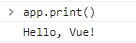

# Vue_basic

## Vue intro

### Front-end Development

- Front-end Framework
  
  - FE(Front-end Framework)
    
    - 사용자에게 보여주는 화면 만들기
  
  - Web App(SPA)을 만들 때 사용하는 도구
    
    - SPA(Single Page Application)

- Web App
  
  - 웹 브라우저에서 실행되는 어플리케이션 소프트웨어
  
  - 웹 페이지가 그대로 보이는 것이 아닌 디바이스에 설치된 App처럼 보이는 것
  
  - 웹 페이지가 디바이스에 맞는 적절한 UX/UI로 표현되는 형태

- SPA(Single Page Application)
  
  - 서버에서 최초 1장의 HTML만 전달받아 모든 요청에 대응하는 방식
    
    - CSR(Client Side Rendering) 방식으로 요청

- SSR과 CSR
  
  - SSR(Server Side Rendering)
    
    - Server가 사용자의 요청에 적합한 HTML을 렌더링하여 제공하는 방식
    
    - 전달받은 새 문서를 보여주기 위해 브라우저는 새로고침을 진행
  
  - CSR(Client Side Rendering)
    
    - 최초 한 장의 HTML을 받아오는 것은 동일하지만 Server로부터 최초로 받아오는 문서는 빈 HTML 문서
    
    - 각 요청에 대한 대응을 JavaScript를 사용하여 필요한 부분만 다시 렌더링
      
      - 새로운 페이지를 서버에 AJAX로 요청
      
      - 서버는 화면을 그리기 위해 필요한 데이터를 JSON 방식으로 전달
      
      - JSON 데이터를 JavaScript로 처리, DOM 트리에 반영(렌더링)
  
  - 제공하려는 서비스에 적합한 렌더링 방식을 적절하게 활용할 수 있어야 함

- CSR
  
  - CSR방식의 장점
    
    - 모든 HTML 페이지를 서버로부터 받아서 표시하지 않아도 됨
      
      - 클라이언트 - 서버간 통신 즉, 트래픽이 감소
      
      - 트래픽이 감소한다는 것은 응답 속도가 빨라진다는 것을 의미
    
    - 매번 새 문서를 받아 새로고침하는 것이 아니라 필요한 부분만 고쳐나가므로 각 요청이 끊김없이 진행됨
      
      - 요청이 자연스럽게 진행되면서 UX 향상
    
    - BE와 FE의 작업 영역을 명확히 분리할 수 있음
      
      - 각자 맡은 역할을 명확히 분리하여 협업이 용이해짐
  
  - CSR방식의 단점
    
    - 첫 구동 시 필요한 데이터가 많으면 많을수록 최초 작동 시작까지 오랜 시간이 소요
    
    - 검색 엔진 최적화(SEO, Search Engine Optimization)가 어려움
      
      - 서버가 제공하는 것은 빈 HTML
      
      - 내용을 채우는 것은 AJAX의 요청으로 얻은 JSON 데이터로 클라이언트(브라우저)가 진행
    
    - 대체적으로 HTML에 작성된 내용을 기반으로 하는 검색 엔진에 빈 HTML을 공유하는 SPA 서비스가 노출되기는 어려움

### Vue 사용하기

- Vue를 사용하는 이유
  
  - 다른 Framework보다 가볍고, 간편하게 사용할 수 있는 Framework
  
  - 직관적인 구조
  
  - FE Framework를 빠르고 쉽게 학습하고 활용 가능

- Vue로 코드 작성하기
  
  - Vanilla JS만으로 모든 데이터를 조작한다면 반복적인 코드를 일일히 입력해야하지만 Vue를 통해 데이터를 관리하면 변경 사항을 한 번에 반영할 수 있음
  
  - Vue CDN 가져오기
  
  - Vue instance 생성
  
  - el, data 설정
    
    - data에 관리할 속성 정의
  
  - 선언적 렌더링 `{{}}`
    
    - Vue data를 화면에 렌더링
  
  - input tag에 `v-model` 작성

## Vue instance

- MVVM Pattern
  
  - 소프트웨어 아키텍처 패턴의 일종
  
  - 마크업 언어로 구현하는 그래픽 사용자 인터페이스(view)의 개발을 Back-end(model)로 분리시켜 view가 어느 특정한 모델 플랫폼에 종속되지 않도록 함
  
  - 서로 의존성은 줄고 독립성은 증가함
  
  
  
  - View: DOM
  
  - Model: 실제 데이터 (JSON)
  
  - View Model (Vue)
    
    - View를 위한 Model
    
    - View와 연결되어 Action을 주고 받음
    
    - Model이 변경되면 View Model도 변경되고 바인딩된 View도 변경됨
    
    - **View에서 사용자가 데이터를 변경하면 View Model의 데이터가 변경되고 바인딩된 다른 View도 변경됨**

- Vue instance 생성하기
  
  ```html
  <!DOCTYPE html>
  <html lang="en">
  <head>
    ...
  </head>
  <body>
    <!-- Vue CDN -->
    <script src="https://cdn.jsdelivr.net/npm/vue@2/dist/vue.js"></script>
    <script>
      const vm = new Vue()
      console.log(vm)
    </script>
  </body>
  </html>
  ```
  
  - Vue CDN 가져오기
  
  - new 연산자를 사용하여 생성자 함수 호출 및 Vue instance 생성
  
  - Vue instance는 1개의 객체이고 아주 많은 속성과 메서드를 이미 가지고 있음
    
    - 이러한 기능을 사용할 것
  
  - 생성자 함수
    
    - 동일한 구조의 객체를 여러 개 만들고 싶을 때 사용
    
    - 생성자 함수를 사용할 때는 반드시 new 연산자를 사용
    
    - 함수 이름은 반드시 대문자로 시작

- el (element)
  
  - Vue instance와 DOM을 연결하는 옵션
    
    - View와 Model을 연결하는 역할
    
    - HTML id 혹은 class와 연결 가능
  
  - Vue instance와 연결되지 않은 DOM 외부는 Vue의 영향을 받지 않음
    
    - Vue 속성 및 메서드 사용 불가
  
  ```html
  <!DOCTYPE html>
  <html lang="en">
  <head>
    ...
  </head>
  <body>  
    <!-- Vue CDN -->
    <script src="https://cdn.jsdelivr.net/npm/vue@2/dist/vue.js"></script>
    <script>
      const app = new Vue({
        el: '#app',
      })
      console.log(app)
    </script>
  </body>
  </html>
  ```
  
  - 새로운 Vue 인스턴스를 생성한 후 생성자 함수 첫번째 인자로 Object 작성
  
  - el 옵션에 #app을 작성하여 body에서 id가 app인 div와 연결 (DOM 연결)
  
  - 인스턴스를 출력하면 app의 Vue 정보가 나오고 `$el:div#app`과 같이 el옵션을 확인할 수 있음

- data
  
  - Vue instance의 데이터 객체 혹은 인스턴스 속성
  
  - 데이터 객체는 반드시 기본 객체 `{} (Object)`여야 함
  
  - 객체 내부의 아이템들은 value로 모든 타입의 객체를 가질 수 있음
  
  - 정의된 속성은 `interpolation {{}}`을 통해 view에 렌더링 가능함
  
  ```html
  <!DOCTYPE html>
  <html lang="en">
  <head>
    ...
  </head>
  <body>
    <!-- 아래에 생성한 app과 연결되어 있으므로
    해당 message 값이 출력됨 -->
    <div id="app">
      {{ message }}
    </div>
  
    <!-- 연결된 객체가 없으므로
    `{{ message }}`를 그대로 출력 -->
    <div>
      {{ message }}
    </div>
  
    <!-- Vue CDN -->
    <script src="https://cdn.jsdelivr.net/npm/vue@2/dist/vue.js"></script>
    <script>
      const app = new Vue({
        el: '#app',
        data: {
          message: 'Hello, Vue!'
        },
      })
      console.log(app)
    </script>
  </body>
  </html>
  ```
  
  - 추가된 객체의 각 값은 `this.message` 형태로 접근 가능

- methods
  
  - Vue instance의 method를 정의하는 곳
  
  - methods 객체 정의
    
    - 객체 내 print method 정의
    
    - print method 실행 시 Vue instance의 data 내 message 출력
      
      ```html
      <script>
        const app = new Vue({
          el: '#app',
          data: {
            message: 'Hello, Vue!'
          },
          methods: {
            print: function () {
              console.log(this.message)
            },
          }
        })
        console.log(app)
      </script>
      ```
    
    - 콘솔창에서 `객체.print()` (여기서는 app.print()) 실행 시 확인 가능
      
      
  
  - method를 호출하여 data 변경 가능
    
    - 객체 내 bye method 정의
    
    - print method 실행 시 Vue instance의 data 내 message 변경
    
    ```html
    <script src="https://cdn.jsdelivr.net/npm/vue@2/dist/vue.js"></script>
    <script>
      const app = new Vue({
        el: '#app',
        data: {
          message: 'Hello, Vue!'
          },
    
        methods: {
          print: function () {
            console.log(this.message)
          },
    
          bye: function () {
            this.message = 'Bye, Vue!'
          },
    
        }
      })
      console.log(app)
    </script>
    ```
  
  - 콘솔창에 app.bye() 실행
    
    - DOM에 바로 변경된 결과 반영
    
    - Vue의 강력한 반응성 확인 가능
  
  - methods with Arrow Function
    
    - **메서드를 정의할 때 Arrow Function을 사용하면 안됨**
    
    - Arrow Function의 this는 함수가 선언될 때 상위 스코프를 가리키므로 메서드 정의할 때 사용하면 this가 window를 가리키게 됨
    
    - 호출은 문제없이 가능하지만 this로 Vue의 data를 변경할 수 없음
