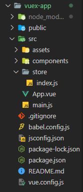
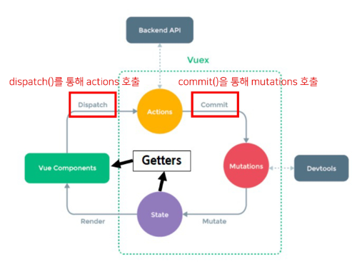

# Vuex

## Vuex

### State Management

- 상태 관리
  
  - 상태 (State)
    
    - 현재에 대한 정보 (data)
    
    - 현재 App이 가지고 있는 Data로 표현
  
  - 상태 관리의 필요성
    
    - 각 component는 독립적이기 때문에 각각의 상태(data)를 가짐
    
    - 여러 개의 component를 조합해서 하나의 App을 만듦
    
    - 따라서 여러 개의 component가 같은 상태(data)를 유지할 필요가 있음

- Pass Props & Emit Event
  
  - 장점
    
    - 같은 데이터를 공유하고 있으므로 각 컴포넌트가 동일한 상태를 유지
    
    - 데이터 흐름을 직관적으로 파악 가능
  
  - 단점
    
    - 컴포넌트의 중첩이 깊어지면 데이터 전달이 쉽지 않음

- Centralized Store
  
  - 중앙 저장소(store)에 데이터를 모아서 상태 관리
  
  - 각 컴포넌트는 중앙 저장소의 데이터를 사용
  
  - 컴포넌트의 계층에 상관없이 중앙 저장소에 접근해서 데이터를 얻거나 변경할 수 있음
  
  - 중앙 저장소의 데이터가 변경되면 각각의 컴포넌트는 해당 데이터의 변화에 반응하여 새로 변경된 데이터를 반영
  
  - 규모가 크거나 컴포넌트 중첩이 깊은 프로젝트의 관리가 매우 편리

- Vuex
  
  - 'state management pattern + library' for vue.js
  
  - 중앙 저장소를 통해 상태 관리를 할 수 있도록 하는 라이브러리
  
  - 데이터가 예측 가능한 방식으로만 변경될 수 있도록하는 구칙을 설정하며, Vue의 반응성을 효율적으로 사용하는 상태 관리 기능을 제공
  
  - Vue의 공식 도구로써 다양한 기능을 제공

### Vuex 시작하기

- Vuex 시작하기
  
  ```bash
  $ vue create vuex-app
  
  $ cd vuex-app
  
  $ vue add vuex
  ```
  
  - src / store / index.js 생성
    
    

- Vuex의 핵심 개념
  
  
  
  - state `(Vue에서의 data)`
    
    - vue 인스턴스의 data에 해당
    
    - 중앙에서 관리하는 모든 상태 정보
    
    - 개별 컴포넌트는 state에서 데이터를 가져와서 사용
      
      - 개별 컴포넌트가 관리하던 데이터를 중앙 저장소(Vuex Store의 state)에서 관리하게 됨
    
    - state의 데이터가 변화하면 해당 데이터를 사용하는 컴포넌트도 자동으로 다시 렌더링
    
    - $store.state로  state 데이터에 접근
  
  - getters `(Vue에서의 computed)`
    
    - state를 활용하여 계산된 값을 얻고자 할 때 사용
    
    - state의 원본 데이터를 건들지 않고 게산된 값을 얻을 수 있음
    
    - getters의 결과는 캐시(cache)되며, 종속된 값이 변경된 경우에만 재계산됨
    
    - getters에서 계산된 값은 state에 영향을 미치지 않음
    
    - 첫번째 인자로 state, 두번째 인자로 getter를 받음
  
  - mutations `(Vue에서의 methods)`
    
    - 실제로 `state를 변경하는 유일한 방법`
    
    - vue 인스턴스의 methods에 해당하지만 `Mutations에서 호출되는 핸들러 함수`는 반드시 `동기적`이어야 함
      
      - 비동기 로직으로 mutations를 사용해서 state를 변경하는 경우, state의 변화 시기를 특정할 수 없기 때문
      
      - 핸들러 함수(handler 함수)
        
        - mutation, action에서 호출되는 함수
    
    - 첫번째 인자로 state를 받으며, 컴포넌트 혹은 Actions에서 `commit()` 메서드로 호출됨
  
  - actions `(Vue에서의 methods)`
    
    - mutations와 비슷하지만 `비동기`작업을 포함할 수 있다는 차이가 있음
    
    - state를 직접 변경하지 않고 commit() 메서드로 mutations를 호출해서 state를 변경함
    
    - context 객체를 인자로 받으며, 이 객체를 통해 store.js의 모든 요소와 메서드에 접근할 수 있음
      
      - state를 직접 변경할 수 있지만 하지 않아야 함
    
    - 컴포넌트에서 `dispatch()` 메서드에 의해 호출됨
  
  - Mutations & Actions
    
    - Vue 컴포넌트의 methods 역할이 분화된 것
    
    - Mutations
      
      - state를 변경
    
    - Actions
      
      - state 변경을 제외한 나머지 로직

### Vuex 실습

```html
<!-- App.vue -->

<template>
  <div id="app">
    <!-- state1. 바로 접근 -->
    <h1>{{ $store.state.message }}</h1>
    <!-- state2. -->
    <h1>{{ message }}</h1>
    <!-- getters -->
    <h2>입력된 문자의 길이는 {{ messageLength }}</h2>
    <!-- actions -->
    <input
      type="text"
      @keyup.enter="changeMessage"
      v-model="inputData"
    >
  </div>
</template>
```

```js
// App.vue

<script>

export default {
  name: 'App',
  data() {
    return {
      inputData: null,
    }
  },

  components: {
  },

  // state2. computed나 method 값을 이용하는 방법(권장)
  // this를 이용함
  computed: {
    message() {
      return this.$store.state.message
    },
    messageLength() {
      return this.$store.getters.messageLength
    }
  },

  methods: {
    changeMessage() {
      const newMessage = this.inputData
      this.$store.dispatch('changeMessage', newMessage)
    }
  },

}
</script>
```

```js
// store/index.js

import Vue from 'vue'
import Vuex from 'vuex'

Vue.use(Vuex)

export default new Vuex.Store({
  state: {
    message: 'message in store',
  },
  getters: {
    // 계산된 값이므로 computed에 선언
    messageLength(state) {
      return state.message.length
    }
  },
  mutations: {
    // mutations임을 강조하기 위해서 대문자 이용
    CHANGE_MESSAGE(state, newMessage) {
      // console.log(state)
      // console.log(newMessage)

      // state 변경
      state.message = newMessage
    }
  },
  actions: {
    changeMessage(context, newMessage) {
      // console.log(context)
      // console.log(newMessage)
      context.commit('CHANGE_MESSAGE', newMessage)
    }
  },
  modules: {
  }
})
```

- state
  
  - 중앙에서 관리하는 모든 상태 정보
  
  - $store.state로 접근 가능
  
  - store의 state에 message 데이터 정의
  
  - component에서 state 사용
  
  - $store.state로 바로 접근하기 보다 computed에 정의 후 접근하는 것을 권장

- getters
  
  - state를 활용한 새로운 변수
  
  - getters 함수의 첫번째 인자는 state, 두번째 인자는 getters
  
  - computed에 정의해서 사용하는 것을 권장

- mutations
  
  - state를 변경하는 유일한 방법
  
  - 컴포넌트 또는 actions에서 commit()에 의해 호출됨
    
    - commit(A, B)
      
      - A: 호출하고자 하는 mutations 함수
      
      - B: 넘겨주는 데이터 (payload)
  
  - mutations 함수의 첫번째 인자는 state, 두번째 인자는 payload

- actions
  
  - state를 변경할 수 있는 mutations 호출
  
  - 컴포넌트에서 dispatch()에 의해 호출됨
    
    - dispatch(A, B)
      
      - A: 호출하고자 하는 actions 함수
      
      - B: 넘겨주는 데이터 (pay load)
  
  - actions에 정의된 changeMessage 함수에 데이터 전달하기
  
  - 컴포넌트에서 actions는 dispatch()에 의해 호출됨
  
  - `context`
    
    - actions의 첫번째 인자
    
    - context는 store의 전반적인 속성을 모두 가지고 있으므로 context.state와 context.getters를 통해 mutations를 호출하는 것이 모두 가능
    
    - dispatch()를 사용해 다른 actions도 호출할 수 있음
  
  - `payload`
    
    - actions의 두번째 인자
    
    - 넘겨준 데이터를 받아서 사용
