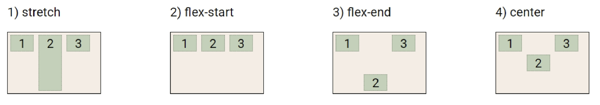

# Bootstrap

## CSS Layout

### Flexbox

- CSS Flexible Box Layout
  
  - ie 부분지원
  
  - 행과 열 형태로 아이템들을 배치하는 1차원 레이아웃 모델
  
  - 축
    
    - main axis (메인 축)
    
    - cross axis (교차 축)
  
  - 구성요소
    
    - flex container (부모 요소)
      
      > 부모요소에 flex 적용
    
    - flex item (자식 요소)

- Flexbox 축
  
  - flex-direction : row

- Flex 구성요소
  
  - Flex Container(부모 요소)
    
    - flexbox 레이아웃을 형성하는 가장 기본적인 모델
    
    - Flex Item들이 놓여있는 영역
    
    - display 속성을 flex 혹은 inline-flex로 지정
  
  - Flex Item(자식 요소)
    
    - 컨테이너에 속해 있는 컨텐츠(박스)

- Flex 속성
  
  - 배치 설정
    
    - **flex-direction** (default 값 : row)
    
    - flex-wrap
  
  - 공간 나누기
    
    - **justify-content (main axis)**
    
    - **align-content (cross axis)**
  
  - 정렬
    
    - **align-items** (모든 아이템을 cross axis 기준으로)
    
    - align-self (개별 아이템)
  
  - flex-direction
    
    
    
    - Main axis 기준 방향 설정
    
    - 역방향의 경우 HTML 태그 선언 순서와 시각적으로 다르니 유의 (웹 접근성에 영향)
  
  - flex-wrap
    
    
    
    - 아이템이 컨테이너를 벗어나는 경우 해당 영역 내에 배치되도록 설정
    
    - 즉, 기본적으로 컨테이너 영역을 벗어나지 않도록 함
      
      > wrap(넘치면 그 다음줄로 배치), nowrap(한 줄에 배치)
  
  - flex-flow
    
    - flex-direction과 flex-wrap의 shorthand
    
    - flex-direction과 flex-wrap에 대한 설정값을 차례로 작성
    
    - ex) flex-flow:row nowrap;
  
  - justify-content
    
    
    
    - Main axis를 기준으로 공간 배분
  
  - align-content
    
    
    
    - cross axis를 기준으로 공간 배분 (아이템이 한 줄로 배치되는 경우 확인할 수 없음)
  
  - justify-content & align-content
    
    - 공간배분
      
      - flex-start(기본 값) : 아이템들을 axis 시작점으로
      
      - flex-end : 아이템들을 axis 끝 쪽으로
      
      - center : 아이템들을 axis 중앙으로
      
      - space-between : 아이템 사이의 간격을 균일하게 분배
      
      - space-around : 아이템을 둘러싼 영역을 균일하게 분배
      
      - space-evenly : 전체 영역에서 아이템 간 간격을 균일하게 분배
  
  - align-items
    
    
    
    - 모든 아이템을 Cross axis를 기준으로 정렬
  
  - align-self
    
    
    
    - 개별 아이템을 Cross axis 기준으로 정렬
      
      - 컨테이너에 적용하는 것이 아니라 개별 아이템에 적용
  
  - align-items & align-self
    
    - cross axis를 중심으로
      
      - stretch(기본 값) : 컨테이너를 가득 채움
      
      - flex-start : 위
      
      - flex-end : 아래
      
      - center : 가운데
      
      - baseline : 텍스트 baseline에 기준선을 맞춤
  
  - 기타 속성
    
    - flex-grow : 남은 영역을 아이템에 분배
    
    - order : 배치 순서
      
      ```html
      <div class="flex-item grow-1 order-3">1</div>
      <div class="flex-item grow-1">2</div>
      <div class="flex-item order-1">3</div>
      <div class="flex-item order-2">4</div>
      ```

## Bootstrap

- Include via CDN

- CDN
  
  - Content Delivery(Distribution) Network
  
  - 컨텐츠(CSS, JS, Image, Text 등)을 효율적으로 전달하기 위해 여러 노드에 가진 네트워크에 데이터를 제공하는 시스템
  
  - 개별 end-user의 가까운 서버를 통해 빠르게 전달 가능
  
  - 외부 서버를 활용함으로써 본인 서버의 부하가 적어짐

### Bootstrap 기본원리 (getbootstrap의 공식문서 활용)

### Spacing

> `{property}{sides}-{size}`

- {property}
  
  - m : margin
  
  - p : padding

- {sides}
  
  - t : top
  
  - b : bottom
  
  - s : start
  
  - e : end
  
  - x : left and right
  
  - y : top and bottom
  
  - blank : all 4 sides

- {size}
  
  - 0 : 0rem, 0px
  
  - 1 : 0.25rem, 4px
  
  - 2 : 0.5rem, 8px
  
  - 3 : 1rem, 16px
  
  - 4 : 1.5rem, 24px
  
  - 5 : 3rem, 48px
  
  - auto : 자동

- mx-auto : 수평 중앙 정렬, 가로 가운데 정렬

- mt-3 : margin top 3

- ps-5 : padding side 5

### Color

- text-color

- bg-color

### Text

- text-start

- text-center

- text-end

- text-decoration-none

### Display

- d-inline

- d-block

### Position

- fixed-top

- fixed-bottom

### Bootstrap 컴포넌트

- Buttons

- Dropdowns

- Forms

- Navbar

- Carousel
  
  - 콘텐츠(사진)를 순환시키기 위한 슬라이드 쇼

- Modal
  
  - 사용자와 상호작용하기 위해 사용하며 긴급 상황을 알리는데 주로 사용
  
  - 현재 열려있는 페이지 위에 또 다른 레이어를 띄움
  
  - 페이지를 이동하면 사라짐 (제거하지 않아도 배경 클릭 시 사라짐)

### Bootstrap Grid System

### Grid system (web design)

- 요소들의 디자인과 배치에 도움을 주는 시스템 (기본으로 flex 설정되어있음)

- 기본 요소
  
  - Column : 실제 컨텐츠를 포함하는 부분
  
  - Gutter : 칼럼과 칼럼 사이의 공간 (사이 간격)
  
  - Container : Column들을 담고 있는 공간

### Bootstrap grid system

- Bootstrap grid system은 flexbox로 제작됨

- container, rows, column으로 컨텐츠를 배치하고 정렬
  
  1. 12개의 column
  
  2. 6개의 grid breakpoints

- Grid system breakpoints : 기본으로 wrap 설정 되어있음 (column이 12개가 넘어가면 자동으로 다음 줄)
  
  - breakpoint와 @media(미디어쿼리)는 반응형 웹을 만들기 위해 사용
